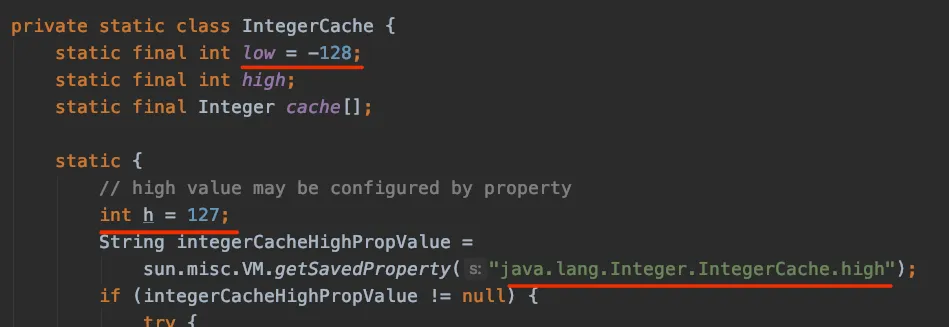

# 基础数据类型与封装类

## 基础数据类型

| 数据类型 | 说明         | 字节 |
| -------- | ------------ | ---- |
| byte     | 字节型       | 1    |
| short    | 短整型       | 2    |
| int      | 整型         | 4    |
| long     | 长整型       | 8    |
| float    | 单精度浮点型 | 4    |
| double   | 双精度浮点型 | 8    |
| char     | 字符型       | 2    |
| boolean  | 布尔型       | 1    |

整型 字面值 默认是 int<br />浮点型字面值 默认是 double 双精度浮点型，末尾加 f 或 F 表示单精度浮点值。例如：1.24f

声明时   float a = 1.24f  末尾不加单精度后缀会报错

```java
// 1.23 * 10^5
double number = 1.23E5
float num = 1.23e5f
// 0.2
double de = .2
```

## 为什么基础类型要有封装类

- Java 是面相对象语言，对象是 Java 的基础操作单元
- 传递处理数据需要使用对象类型，比如 ArrayList、HashMap 只能存储对象类型

Integer 与 int 主要区别：

- Integer 初始值 null， int 为 0
- Integer 存储在堆内存，int 直接存储在栈空间
- Integer 对象封装了很多的方法和属性，使用更灵活

## 整型缓存

Integer 默认 -128 到 127，最大值可通过 java.lang.Integer.IntegerCache.high 设置<br />


<br /> 其他整型（byte、short、int、long）也有缓存，范围都是-128 到 127，但是上限无法设置
