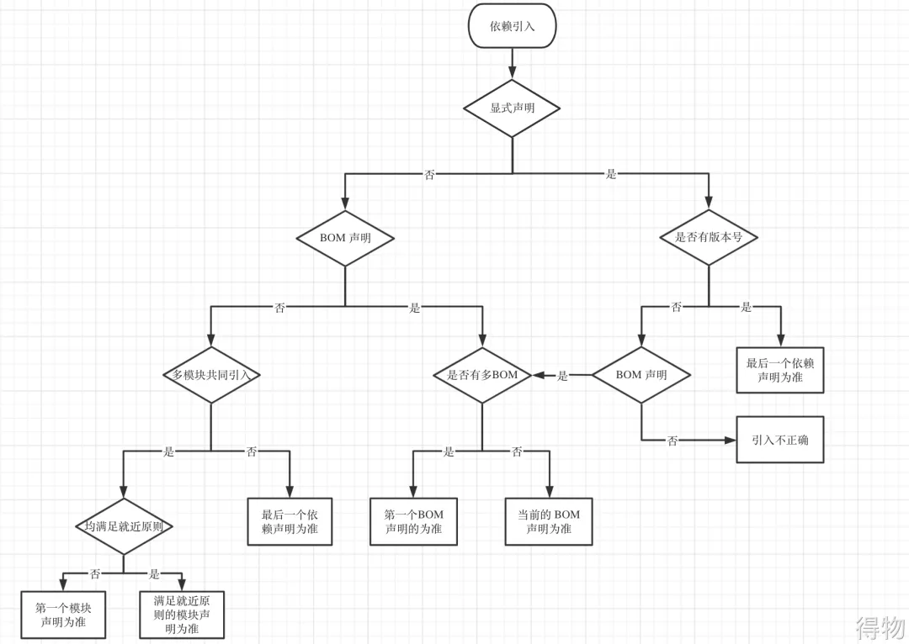

# Maven 依赖管理

## 环境准备

### 官方资源

[https://maven.apache.org/what-is-maven.html](https://maven.apache.org/what-is-maven.html)

### 安装 Maven

- Maven 下载：[https://maven.apache.org/docs/history.html](https://maven.apache.org/docs/history.html)
- 解压到指定目录后，配置环境变量

```shell
# maven
M3_HOME=/your path/apache-maven-your version/bin
export PATH=${PATH}:${M3_HOME}
```

- `source` 后，执行 `mvn -v` 检查

### settings.xml 配置

- 位置在 maven 路径 `/conf` 目录下

#### 仓库配置

- 本地仓库：依赖缓存位置， mac os 默认 `~/.m2/repository`

```shell
<settings>
  <localRepository>/path/to/custom/local/repo</localRepository>
</settings>
```

- 中央仓库：Maven 默认的公共仓库，无需配置，默认 [https://repo.maven.apache.org/maven2](https://repo.maven.apache.org/maven2)
- 镜像仓库：
  - 若配置了 <mirrorOf>central</mirrorOf>，镜像仓会覆盖中心仓
  - 若配置了 <mirrorOf>\*</mirrorOf>，则所有远程仓库请求均被镜像替代
  - 私服直接配置为镜像仓库即可，可通过私服服务配置镜像仓，相当于代理

```xml
<mirrors>
  <!-- 阿里云镜像替换中央仓库 -->
  <mirror>
    <id>aliyun</id>
    <url>https://maven.aliyun.com/repository/public</url>
    <mirrorOf>central</mirrorOf>
  </mirror>
</mirrors>
```

#### 依赖查找顺序

本地 -> 私服 -> 远程

#### IDEA 关联 Maven 配置

- IDEA 的 Settings 搜索 Maven，让 Maven home path 为 `/your path/apache-maven-your version`
- User settings file: 设置为自己的 settings.xml 路径

## pom.xml 标签

### 项目基本信息

```xml
<!-- 定义 POM 模型的版本。常用的版本是 4.0.0 -->
<modelVersion>4.0.0</modelVersion>
<!-- 坐标 -->
<groupId>com.example</groupId>
<artifactId>parent-project</artifactId>
<version>1.0.0</version>
<packaging>pom</packaging>
<!-- 项目的名称 -->
<name>My Project</name>
<!-- 项目的描述信息 -->
<description>This is a sample project</description>
<!-- 项目的主页 URL -->
<url>http://www.example.com</url>
```

### 定义引用属性 properties

- `<properties>` 模块允许你定义一些键值对，这些键值对可以在项目的任何地方被引用。属性的值可以是任何字符串，包括版本号、文件路径、配置参数等。
- 在项目的其他部分，可以通过 `${属性名}` 的方式引用这些属性。
- 属性不被引用，就没有实际作用

```xml
<properties>
    <maven.compiler.source>17</maven.compiler.source>
    <spring.version>5.3.8</spring.version>
    <junit.version>4.13.2</junit.version>
    <project.build.sourceEncoding>UTF-8</project.build.sourceEncoding>
</properties>
```

### 依赖管理 dependency

#### 坐标

坐标：maven 中的坐标用于描述仓库中资源的位置

组成：

- groupld：组织名称(通常是域名反写，如：`org.mybatis`)。
- artifactld：资源的名称(通常是项目或模块名称)
- version：版本号
- packaging：打包方式，取值有如下三种
  - jar：jar 包，默认是 jar，java 工程
  - war：war 包，web 工程
  - pom：父资源，表明使用 maven 分模块管理，只生成一个 pom.xml

可在 maven 仓库网站搜索复制坐标

- [https://mvnrepository.com/](https://mvnrepository.com/)

#### 依赖范围 `<scope>`

限制其引用范围：编译、测试、运行

- compile：默认，全引用。
- provided：运行环境已经有了，不在运行中再次导入
- runtime：仅在运行和测试，不在编译路径中。
- test：仅测试
- system：被系统提供，用于添加本地依赖，移植性差不推荐。
- import：仅在 `<dependencyManagement>` 中使用，用于在一个 pom 中导入另外一个 pom 定义的依赖列表

#### 可选依赖 `<optional>`

- 标记为 true 时，依赖不会传递给用户，只在当前模块编译使用

#### 排除间接依赖

```xml
<dependency>
    <groupId>org.springframework.boot</groupId>
    <artifactId>spring-boot-starter-web</artifactId>
    <version>2.7.0</version>
    <exclusions>
        <exclusion>
            <groupId>org.springframework.boot</groupId>
            <artifactId>spring-boot-starter-tomcat</artifactId>
        </exclusion>
    </exclusions>
</dependency>
```

### 模块管理 modules

- `<modules>` 模块是一个列表，包含项目的子模块名称。
- 每个子模块通常是一个独立的 Maven 项目，有自己的 pom.xml 文件。
- 父模块的 pom.xml 文件通过 `<modules>` 模块声明这些子模块。

目录

```plain
parent-project/
├── pom.xml           # 父模块的 pom.xml
├── only4fun-api/
│   └── pom.xml       # 子模块1的 pom.xml
└── only4fun-web/
    └── pom.xml       # 子模块2的 pom.xml
```

父模块

- 父模块的 `<packaging>` 必须是 pom，父模块本身不生成任何可执行的工件，只用于管理子模块
- 父模块 执行了 `mvn install` 安装在本地，才会被子模块找到坐标

```xml
<!-- 父模块中声明子模块 -->
<modules>
    <module>only4fun-api</module>
    <module>only4fun-web</module>
</modules>
```

子模块

- 子模块的 pom.xml 文件中需要通过 `<parent>` 模块声明其父模块
- `<parent>` 模块中需要指定父模块的 groupId、artifactId 和 version
- 子模块可以依赖其他子模块，Maven 会根据依赖关系自动调整构建顺序。
- 子模块可以继承父模块中的配置，如依赖管理、插件配置等。
- 子模块可以独立构建和部署，便于团队协作。
  - 子模块独立打包命令：`mvn package -pl [子模块名称] -am`
    - pl 子模块名称：指定要打包的子模块名称。
    - am：自动构建依赖的模块。

```xml
<!-- 继承父模块 -->
<parent>
    <!-- 坐标信息与父模块的坐标一致 -->
    <groupId>com.example</groupId>
    <artifactId>parent-project</artifactId>
    <version>1.0.0</version>
</parent>
```

### 继承父模块中的依赖

父模块

```xml
<!-- 直接引入依赖，不推荐 -->
<dependencies>
    <dependency>
        <groupId>junit</groupId>
        <artifactId>junit</artifactId>
        <version>4.13.2</version>
        <scope>test</scope>
    </dependency>
</dependencies>

<!-- 集中管理依赖，只做版本控制，子模块显示声明就不会引入 -->
<dependencyManagement>
    <dependencies>
        <dependency>
            <groupId>org.springframework</groupId>
            <artifactId>spring-core</artifactId>
            <version>.53.8</version>
        </dependency>
    </dependencies>
</dependencyManagement>
```

子模块

```xml
<!-- 继承父模块的直接依赖 -->
<dependencies>
    <dependency>
        <groupId>junit</groupId>
        <artifactId>junit</artifactId>
    </dependency>

    <!-- 使用父模块管理的依赖 -->
    <dependency>
        <groupId>org.springframework</groupId>
        <artifactId>spring-core</artifactId>
    </dependency>
</dependencies>
```

### 构建配置 build

简单配置，其他配置可以通过构建命令指定

- `<version>` maven 插件版本选最高稳定版
- `<release>` 是简化标签，相当于同时设置了 `<source>`（源代码版本） 和 `<target>`（字节码版本），建议显示指定
- `<encoding>` 指定源文件的字符编码，默认值是本机的编码

```xml
<build>
    <plugins>
        <plugin>
            <groupId>org.apache.maven.plugins</groupId>
            <artifactId>maven-compiler-plugin</artifactId>
            <version>3.11.0</version>
            <configuration>
                <release>17</release>
                <encoding>UTF-8</encoding>
            </configuration>
        </plugin>
    </plugins>
</build>
```

#### 将 java 目录下的 xml 文件打包

- `resource/` 目录下的 xml 文件会被自动打包，但是 `java/` 目录下不会
- 如果要将 `java/` 目录下的 xml 文件打包，需要配置打包资源位置

```xml
<resources>
  <resource>
    <!--设置资源所在目录-->
    <directory>src/main/java</directory>
    <includes>
      <!--设置包含的资源类型-->
      <include>**/*.xml</include>
    </includes>
  </resource>
</resources>
```

## Maven 常用命令

全部命令查看官方文档：[https://maven.apache.org/plugins/index.html](https://maven.apache.org/plugins/index.html)

- 构建相关的命令必须在 pom.xml 所在的目录中使用

| 命令            | 描述                                     |
| --------------- | ---------------------------------------- |
| mvn compile     | 编译项目，生成 target 目录下的字节码文件 |
| **mvn package** | 打包，生成 jar 或 war 包                 |
| mvn clean       | 删除 target                              |
| mvn install     | 打包，上传到 maven 本地仓库              |
| mvn deploy      | 打包，上传到 maven 私服仓库              |
| mvn site        | 生成站点                                 |
| mvn test        | 执行测试                                 |

## 如何解决版本冲突

[https://developer.volcengine.com/articles/7322139186604851238](https://developer.volcengine.com/articles/7322139186604851238)

### 依赖传递原则

A 依赖 B，B 依赖 C，C 能否传递到 A 取决于依赖范围

- B 依赖 C ，只有使用 compile 范围时可以传递
- 设置了 `<optional>true</optinal>`，不能传递
- 依赖冲突时，依赖已经存在，也会终止传递

### Maven 自动选择原则

- 短路优先原则
  - A -> B -> C -> D v1
  - A -> B -> D v2
  - 则 A -> D v2
- 路径长度相同时，在 `<dependences>` 标签中，先声明的优先
  - A -> B -> C v1
  - A -> B -> C v2
  - 则 A -> C v1

### 解决方案

参考：[https://developer.volcengine.com/articles/7322139186604851238](https://developer.volcengine.com/articles/7322139186604851238)

- 根据短路优先原则，在整个项目的父 pom 中统一显示指定版本是最优解
- 在父模块中声明工程所需要的依赖项 groupId、artifactId、version, 在子模块中只需要声明 groupId 和 artifactId 就可以了
- 定期进行依赖分析 `mvn dependency:analyze` 处理以下依赖：
  - Used undeclared dependencies：已经使用了但是未定义的依赖 。此类依赖一般是由依赖传递机制引入进来，在代码中也直接使用过。
  - Unused declared dependencies：未使用但引入的依赖 。此类依赖并未直接在代码中使用，也不代表运行期间没有使用



### 对于模块开发

- 依赖库尽量 `<optional>true</optional>` ，除非这个核心依赖是想让用户引用的依赖
- 使用 `maven-shade-plugin`
  - 该插件将所有依赖都打到一个 jar 包，并且重命名依赖的包路径，避免类名冲突

## Maven 私服 Nexus

下载解压安装：[https://help.sonatype.com/en/download.html](https://help.sonatype.com/en/download.html)

配置 settings 文件示例：

- 如果没有密码可以就不用配置 `<servers>`

```xml
<settings xmlns="http://maven.apache.org/SETTINGS/1.0.0"
          xmlns:xsi="http://www.w3.org/2001/XMLSchema-instance"
          xsi:schemaLocation="http://maven.apache.org/SETTINGS/1.0.0
                          https://maven.apache.org/xsd/settings-1.0.0.xsd">
    <mirrors>
        <!--私服配置-->
        <mirror>
            <id>MyRepository</id>
            <mirrorOf>*</mirrorOf>
            <name>MyRepository</name>
            <url>http://localhost:8081/repository/MyRepository/</url>
        </mirror>
    </mirrors>
    <servers>
        <server>
            <id>MyRepository</id>
            <username>用户名</username>
            <password>密码</password>
        </server>
    </servers>
</settings>
```

将项目上传到私服：

- pom 文件配置私服地址，私服地址可在私服管理页面复制
- 注意这里 id 要和 settings 文件里配置的 id 一致
- 执行 `mvn deploy` 即可上传

```xml
<distributionManagement>
    <repository>
        <id>MyRepository</id>
        <url>http://localhost:8081/repository/MyRepository/</url>
    </repository>
    <snapshotRepository>
        <id>MyRepository-snapshots</id>
        <url>http://localhost:8081/repository/MyRepository-snapshots/</url>
    </snapshotRepository>
</distributionManagement>
```
