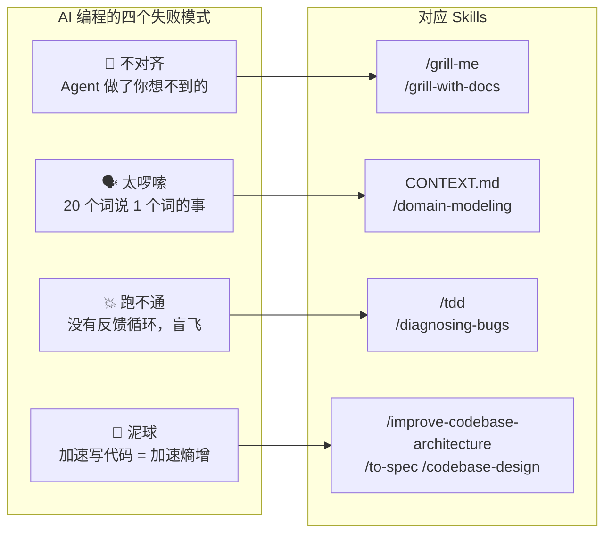
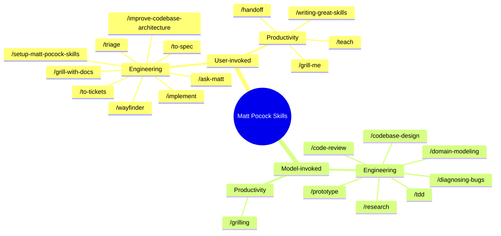
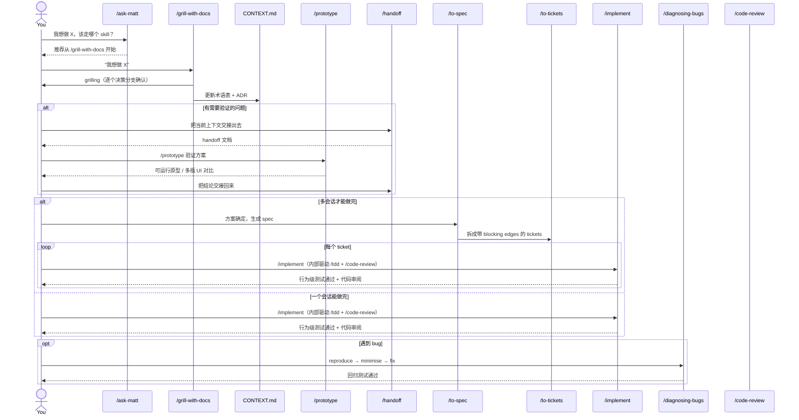
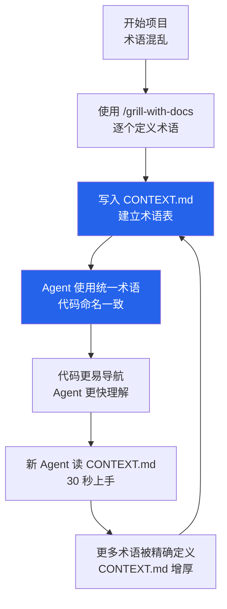

# Matt Pocock Skills：让 AI 编程回归工程本质的组合技

> 仓库地址：<https://github.com/mattpocock/skills>
> 订阅更新：<https://www.aihero.dev/s/skills-newsletter>

先说结论：**这不是又一个 prompt 集合，也不是 vibe coding 的加速器。Matt Pocock 的 skills 是一套用工程纪律对抗 AI 编程熵增的组合拳。**

它的核心假设很简单：AI 没有消灭软件工程的复杂性，只是把它转移了——从"写代码"转移到了"对齐需求、控制质量、维护架构"。如果你不做任何改变，AI 加速的不是你的产出，而是你的技术债务。

这套 skills 的设计初衷，就是把《程序员修炼之道》和《软件设计哲学》里沉淀了几十年的原则，压缩成 agent 能直接执行的工作流。最近仓库做了一次较大的结构整理：skill 不再按"Engineering / Productivity / Misc"这种功能领域划分，而是按**谁来调用**分成 **User-invoked**（用户显式触发，负责编排）和 **Model-invoked**（agent 自动选用，负责具体纪律）两类。主线也收敛成一条清晰的 **Idea → Ship** 流程。

---

## 一、四个失败模式：AI 编程的真正瓶颈

Matt 在 README 里开宗明义地列出了四个失败模式。理解它们是使用这套 skills 的前提，因为**每个 skill 都是针对特定失败模式的解药**。



### 1. 不对齐（The Agent Didn't Do What I Want）

> "No-one knows exactly what they want"
> —— David Thomas & Andrew Hunt, 《程序员修炼之道》

这是软件工程最古老的问题，AI 时代没有自动消失。你对着 agent 描述需求，它点头称是，写完一看——完全不是你想要的。

**解法不是把 prompt 写得更长，而是先做一场 grilling session。** `/grill-me` 和 `/grill-with-docs` 的作用，就是逼 agent 在写第一行代码之前，把每个决策分支都问清楚。

### 2. 太啰嗦（The Agent Is Way Too Verbose）

Agent 被丢进项目时，它不懂你的业务术语。它不知道你管这叫 "materialization cascade"，于是每次都要说"当课程里的一个 lesson 在 section 中被赋予文件系统位置时的问题"。20 个词，本来 1 个词就能搞定。

**解法是建立共享语言。** `/grill-with-docs` 会边 grilling 边维护 `CONTEXT.md`——一个项目术语表；`/domain-modeling` 则把维护这套语言变成一种主动纪律。一旦定义清楚，agent 和你用同一套语言说话，token 消耗下降，命名一致性上升。

### 3. 跑不通（The Code Doesn't Work）

Agent 没有眼睛。它看不到浏览器报错，跑不了测试，给不了反馈。它生成代码，然后"希望它能跑"。

**解法是给它反馈循环。** `/tdd` 强制 red-green-refactor 循环，`/diagnosing-bugs`（注意不是旧的 `/diagnose`）把 debug 变成结构化流程。Agent 不再盲飞，而是有明确的 pass/fail 信号指引每一步。

### 4. 泥球（We Built A Ball Of Mud）

AI 写代码的速度是人类的几倍，于是代码腐烂的速度也是几倍。三个月后，你面对的是一个 agent 也改不动的泥球。

**解法是持续投资设计。** `/improve-codebase-architecture` 每几天跑一次，像请了一个常驻架构师。`/to-spec` 在动手前先问你会碰哪些模块，`/codebase-design` 提供 deep module、seam、adapter 等统一词汇，让设计讨论不再含糊。

---

## 二、30 秒安装：从仓库到可用

```bash
npx skills@latest add mattpocock/skills
```

安装器会引导你做两件事：

1. **挑选你想要的 skills**，以及要安装到哪些 coding agent（Claude Code、Codex 等）上。务必勾选 `/setup-matt-pocock-skills`。
2. 在你的仓库里运行 `/setup-matt-pocock-skills`，它会进一步问你：
   - **Issue tracker** —— GitHub Issues / Linear / 本地 markdown（`.scratch/`）
   - **Triage label** 命名 —— 默认是 `needs-triage`、`ready-for-agent` 等，可映射到你现有标签
   - **Domain docs 布局** —— 单上下文（一个 `CONTEXT.md`）还是多上下文（monorepo，用 `CONTEXT-MAP.md`）

安装完成后，仓库里会多出：

```
AGENTS.md（或 CLAUDE.md）
├── ## Agent skills
│   ├── Issue tracker
│   ├── Triage labels
│   └── Domain docs
docs/agents/
├── issue-tracker.md
├── triage-labels.md
└── domain.md
```

**这是基础设施，跑一遍就行。** 之后所有 engineering skills 都会读取这些配置，知道你的 issue 存在哪、标签怎么叫、上下文文档在哪。

---

## 三、技能全景图：User-invoked vs Model-invoked

现在整套 skills 按**调用者**分成两类，而不是按功能领域分。这个划分很关键：

- **User-invoked**：只能你手动触发，职责是**编排**——决定下一步走哪个 skill。
- **Model-invoked**：可以由你触发，也可以由 agent 在合适时自动调用，职责是**具体纪律**——执行某个可复用的工程原则。

一条规则：user-invoked skill 可以调用 model-invoked skill，但不会调用另一个 user-invoked skill。



注意一个关键设计：**这些 skill 是组合用的，不是单独用的。** 就像你不会只用锤子盖房子，你也不会只靠 `/tdd` 做工程。

---

## 四、核心工作流：Idea → Ship 的主流程

更新后的 Matt Pocock Skills 有一条最常用主线，它把几乎所有 engineering skill 串了起来：



### 阶段 1：入口 —— `/ask-matt`

如果你忘了该用哪个 skill，先问 `/ask-matt`。它相当于整个仓库的路由器，会根据你的情况推荐下一步：

- 有代码库、想加功能 → `/grill-with-docs`
- 没有代码库、先梳理想法 → `/grill-me`
- 一堆 bug/需求要分类 → `/triage`
- 碰到棘手 bug → `/diagnosing-bugs`
- 项目太大、方向不清 → `/wayfinder`

### 阶段 2：对齐 —— `/grill-with-docs`

这是整个工作流里最重要的一步，也是大多数人跳过的那步。

当你说"我想加个搜索功能"，agent 直接开写是灾难。`/grill-with-docs` 会把它变成一场结构化面试：

- Agent 先复述它理解的需求，标出所有假设
- 逐个决策分支提问（每次最多 3 个关键问题）
- 遇到模糊术语，立刻要求精确定义
- 精确定义的术语实时写入 `CONTEXT.md`
- 重大且不可逆的决策，提议写入 `docs/adr/`

**示例对话片段：**

> **你**："用户搜索需要支持拼音和模糊匹配。"
>
> **Agent**："你用了'用户'这个词。在 CONTEXT.md 里，'用户'对应的是 `Customer`（下单的人）还是 `User`（系统账号）？拼音匹配是指商品标题的拼音，还是用户输入的拼音？"
>
> **你**："是 `Customer` 搜索商品标题的拼音。"
>
> **Agent**："[实时写入 CONTEXT.md] `Customer`: 在本系统中指下单的终端消费者，区别于后台 `User`..."

这个环节的价值在第三、第四次对话时开始复利：agent 不再重复解释基本概念，代码命名自动对齐业务语言，新加入的 agent 读一遍 `CONTEXT.md` 就能跟上节奏。

### 阶段 3：验证 —— `/prototype`

如果方案涉及不确定的技术选型或交互设计，不要直接开写生产代码。`/prototype` 会做两件事之一：

- **终端原型**：一个可运行的 CLI 程序，验证状态机或业务逻辑
- **UI 变体**：在同一个路由下挂载多个完全不同的 UI 方案，你可以 toggle 对比

如果验证需要跨会话，用 `/handoff` 把当前上下文交接出去，验证完再把结论交接回来。**关键原则：原型是 throwaway 的。** 验证完就扔，不心疼。

### 阶段 4：规划 —— `/to-spec` + `/to-tickets`

对齐完成、方案验证后，用 `/to-spec` 把对话上下文合成为一份 spec（你可以把它理解为 PRD）。它不会重新采访你，而是基于已经讨论过的内容生成：

- Problem Statement
- Solution
- 大量细化的 User Stories
- Implementation Decisions（模块边界、接口设计、测试 seam）
- Testing Decisions
- Out of Scope

`/to-tickets` 再把 spec 拆成**垂直切片**（tracer-bullet vertical slices），并且明确标出每个 ticket 的 **blocking edges**——哪些 ticket 必须先完成。在真实 tracker 上这些会映射成阻塞链接；本地 markdown tracker 则是一份带依赖关系的 `tickets.md`。

### 阶段 5：实现 —— `/implement`

`/implement` 是新版 workflow 里变化最大的一个 skill。它不再让你手动按 `/tdd` 一步步来，而是作为 orchestrator：

1. 读取 spec 或 tickets
2. 在预定义好的 seam 上驱动 `/tdd`：red → green → refactor
3. 跑类型检查和单测，最后跑完整测试套件
4. 用 `/code-review` 做两轴审阅（Standards + Spec）
5. 提交到当前分支

**核心纪律：垂直切片，不是水平切片。**

```
❌ 水平切片（错误）：
   RED:   写完全部测试
   GREEN: 写完全部实现
   REFACTOR: 一起重构

✅ 垂直切片（正确）：
   RED→GREEN→REFACTOR: 测试 1 + 实现 1
   RED→GREEN→REFACTOR: 测试 2 + 实现 2
   RED→GREEN→REFACTOR: 测试 3 + 实现 3
```

`/tdd` 要求 agent：

1. **先确认接口** —— public API 长什么样，行为是什么
2. **写一个测试** —— 只测试一个行为，通过 public interface
3. **写最小实现** —— 刚好让测试通过
4. **重构** —— 提取 deep module，消除重复

**什么是 deep module？** 小接口，大实现。调用者知道得少，模块内部处理得多。这是 John Ousterhout 在《A Philosophy of Software Design》里的核心概念，被 `/tdd`、 `/improve-codebase-architecture` 和 `/codebase-design` 反复强化。

### 阶段 6：审阅 —— `/code-review`

`/code-review` 是新增的重要模型调用 skill。它从某个固定点（commit、branch、tag）开始 review diff，沿两个轴并行进行：

- **Standards**：是否符合仓库的编码标准，并叠加 Fowler 的 smell baseline（如 Mysterious Name、Duplicated Code、Feature Envy 等）
- **Spec**：是否忠实实现了原始 issue / spec

两个轴各开一个 sub-agent 并行跑，避免互相污染上下文，最后汇总结果。

### 阶段 7：排障 —— `/diagnosing-bugs`

遇到 hard bug 时，不要随机改代码碰运气。`/diagnosing-bugs` 强制执行六阶段循环：

| 阶段 | 核心动作 | 纪律 |
|------|---------|------|
| 1. 建立反馈环 | 构造可自动运行的 repro | 没有 loop 就不进入下一阶段 |
| 2. 复现 | 确认 loop 输出的是用户描述的问题 | 不是"类似"的问题 |
| 3. 假设 | 生成 3-5 个可证伪的假设 | 不能陈述预测的假设 = vibe |
| 4. 仪器 | 一次只改一个变量 | 优先 debugger，拒绝"log everything" |
| 5. 修复 + 回归测试 | 先写回归测试，再修 | 没有 correct seam 是架构发现 |
| 6. 清理 + 复盘 | 删除所有 `[DEBUG-...]` 标记 | 追问：什么能预防这个 bug？ |

最被低估的是 Phase 1：**构造反馈环**。`/diagnosing-bugs` 列出了 10 种构造 loop 的方式，从 failing test 到 HITL bash script。有了 2 秒内给出 pass/fail 的确定性 loop，bug 已经解决了 90%。

### 阶段 8：维护 —— `/improve-codebase-architecture`

建议每两三天在活跃项目上运行一次。它会：

1. 读取 `CONTEXT.md` 和 `docs/adr/`
2. 用 Explore agent 遍历代码库
3. 寻找**浅模块**（interface 和 implementation 复杂度接近）
4. 生成一份带 Before/After 图表的 HTML 报告
5. 对每个候选重构给出 `Strong` / `Worth exploring` / `Speculative` 评级

**关键概念：deletion test。** 想象删掉这个模块，复杂度是消失了（说明它是 pass-through），还是分散到了 N 个调用方（说明它确实在承担职责）？后者才是 deep module。

---

## 五、新加入的核心技能

除了主线里的技能，还有几个值得单独拎出来：

### `/wayfinder`：大雾中的地图

当你面对一个"太大了，一个会话装不下"的需求——比如全新项目、大型重构——`/grill-with-docs` 已经不够用了。`/wayfinder` 会先在 issue tracker 上画一张**共享地图**（shared map），把大雾切成一个个 investigation ticket，每个 ticket 解决一个决策，而不是交付一段代码。等地图把路探清楚，再交接回 `/to-spec` 或 `/implement`。

### `/research`：把调研交给后台 agent

需要查官方文档、API 行为、源码实现？`/research` 会启动一个后台 sub-agent，让它去读一手资料，并把结论写成带引用的 Markdown 文件。你可以继续做别的事，等它汇报。

### `/domain-modeling` 与 `/codebase-design`：词汇层

这两个是 model-invoked 的**词汇层** skill：

- `/domain-modeling` 维护领域语言：挑战模糊术语、消解一词多义、把不可逆决策写入 ADR。
- `/codebase-design` 提供 deep-module 词汇：module、interface、depth、seam、adapter、leverage、locality。

它们通常被 `/grill-with-docs`、`/tdd`、`/improve-codebase-architecture` 自动调用；你也可以在"词不对"或"接口设计拿不准"时直接触发。

### `/teach` 与 `/writing-great-skills`：Productivity 新成员

- `/teach`：把当前目录当作一个有状态的教学生工作区，分多次会话教用户一个新概念或技能。
- `/writing-great-skills`：教你如何写出好的 skill 文件，关注可预测的结构和术语。

---

## 六、三个高价值使用场景

### 场景 A：从零开始一个新功能（完整闭环）

```
你：/ask-matt "我要加一个订单导出功能，支持 CSV 和 Excel，
              数据量可能到 50 万行，不能卡死前端。"

→ /ask-matt 推荐：/grill-with-docs

你：/grill-with-docs
     "我要加一个订单导出功能，支持 CSV 和 Excel，
      数据量可能到 50 万行，不能卡死前端。"

→ agent grilling，确认：
  - "导出"是异步还是同步？→ 异步
  - "不卡死前端"具体指标？→ 点击后 100ms 内响应，后台生成
  - 文件存储？→ 临时 S3，24h 过期
  - CSV/Excel 库已有？→ 无，需要引入

→ 术语写入 CONTEXT.md：
  **ExportJob**: 异步生成订单导出文件的后台任务
  _Avoid_: batch download, export task

→ /prototype（验证 Excel 生成性能）
→ /to-spec（生成 spec，发布到 GitHub Issues）
→ /to-tickets（拆成 4 个垂直切片，标 blocking edges）
→ /implement（逐个切片：/tdd + /code-review）
→ /improve-codebase-architecture（周五下午跑一遍）
```

### 场景 B：接手 legacy 代码改 bug

```
你：/diagnosing-bugs
     "这个接口偶发 500，大约 1% 概率，
      错误是 KeyError: 'user_id'，
      只在生产环境出现，本地复现不了。"

→ Phase 1：构造反馈环
  - 捕获生产环境的 HAR / 日志
  - 写一个 replay harness，用真实 payload 跑隔离代码
  - 把 1% 的 flake 提升到 50%（加并发、减延迟）

→ Phase 3：3 个假设
  1. Nginx 头转换偶尔失败 → 预测：直接访问会 100% 复现
  2. 上游服务偶尔不传头 → 预测：日志里会有特定 trace
  3. 大小写敏感问题 → 预测：小写头有时不存在

→ Phase 5：修复 + 回归测试
  - 先写测试：mock 无头请求 → 应 401
  - 修复：兼容 user_id / X-User-Id / 缺失
  - 跑回归 loop，确认 1% 不再出现

→ /improve-codebase-architecture
  - 发现：auth 中间件没有统一 seam
  - 建议：提取 AuthAdapter，已有 2 处调用 → 值得做
```

### 场景 C：长对话交接（`/handoff`）

当你和一个 agent 聊了 50 轮，上下文快满了，或者需要换模型：

```
你：/handoff

→ agent 把当前会话压缩成一份 handoff 文档：
   - 已完成什么
   - 当前阻塞点
   - 下一步推荐动作
   - 相关文件和决策记录

→ 新开会话，把 handoff 文档丢给新 agent，
   它能在 30 秒内接上进度。
```

---

## 七、隐藏杀手：CONTEXT.md 的飞轮效应

很多人把 mattpocock/skills 当成功能清单来用，却忽略了它最深的设计——**共享语言**。



**CONTEXT.md 的规则：**

- 只包含项目**特有**的业务术语，不包含通用编程概念
- 每个术语：一句话定义 + `_Avoid_` 列表（禁用同义词）
- 要 opinionated：同一概念多个词时，选一个最好的，其他的列为 avoid

**ADR（Architecture Decision Record）的规则：**

只有当三个条件同时满足时才写：

1. **难以逆转** —— 改主意成本很高
2. **没有上下文会令人困惑** —— 未来读者会问"为什么这样"
3. **真实权衡的结果** —— 有其他可行方案，你选了其中一个

这意味着 ADR 不是日记，不是文档，而是**防止未来重复讨论同一问题的 lock file**。

---

## 八、如何组合出你自己的工作流

Matt 的设计哲学是：**小、可组合、可 hack。** 你不需要用全部 skills，也不需要按固定顺序。但建议遵循以下原则：

| 原则 | 说明 |
|------|------|
| **Always grill first** | 任何超过 20 行代码的改动，先用 `/grill-me` 或 `/grill-with-docs` |
| **One vertical slice at a time** | 用 `/implement` / `/tdd` 时，拒绝"先写所有测试"的诱惑 |
| **Feedback loop before hypothesis** | 用 `/diagnosing-bugs` 时，没有 repro 就不猜测 |
| **Invest in design every few days** | 活跃项目每 2-3 天跑一遍 `/improve-codebase-architecture` |
| **Context is code** | 把 `CONTEXT.md` 和 `docs/adr/` 当成代码一样维护，review 时过一遍 |
| **Use `/code-review` before merge** | 让两个 sub-agent 并行审 Standards 和 Spec，避免视角污染 |

**最小可用工作流（如果你只想试一个）：**

```
1. /setup-matt-pocock-skills（一次）
2. /grill-with-docs（每次新功能）
3. /implement（编码时）
```

这三步就能解决 80% 的"AI 写的东西没法用"问题。

---

## 九、总结

Matt Pocock 的 skills 之所以有价值，不是因为它让 AI 写得更快，而是因为它让 AI 写得更对。

| vibe coding | mattpocock/skills |
|-------------|-------------------|
| 说完需求就转身 | 先 grilling 对齐 |
| Agent 猜你的术语 | 共建 CONTEXT.md |
| 写完再测试 | red-green-refactor + /code-review |
| 碰到 bug 随机改 | 结构化 diagnosing-bugs |
| 代码自然腐烂 | 主动 improve architecture |
| 一次性的魔法 | 可复利的工程纪律 |

如果你已经在用 Claude Code、Codex 或其他 agent 做实际开发，花一个下午配置这套 skills，然后坚持用一个星期。最大的变化可能不是代码质量本身，而是你和 agent 之间的**对话质量**——从"你猜我要什么"变成"我们一起把问题想清楚"。

那才是 senior engineer 的工作方式，不管写代码的是人还是 AI。
