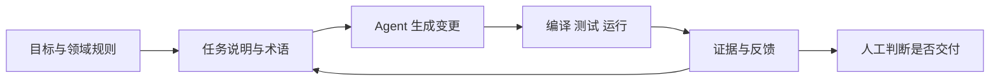

以前用高级语言开发，我们很少关心一条 Java 语句最后变成了哪些机器指令。编译器接走了这部分工作，人开始把精力放在类型、对象、接口和业务模型上。

现在用 AI 写代码，我有一种相似的感觉。人给出目标和约束，agent 读项目、改文件、跑测试，再把结果交回来。我们操作的对象又往上抬了一层，从代码语句变成了意图、领域规则和验收条件。

所以我愿意把 AI 看成一门更高级的编程语言。

这只是一个工程上的类比。Java、Go 这类语言有确定的语法和语义，同一份代码交给同一个编译器，结果大体可预期。自然语言容许省略和歧义，模型还会根据上下文猜测。它有时猜得很准，有时会给出一份结构完整、方向却偏了的实现。传统编译器会在语法错误时停下来，agent 更可能沿着一个合理猜测继续干活。

抽象层升高以后，软件工程没有退出。需求、设计、测试和交付仍在，只是更多工作发生在写代码之前和生成代码之后。

## 先分清 Vibe Coding 和 AI Coding

Vibe Coding 现在经常被用来泛指 AI 写代码，它最初的意思更窄。

Simon Willison 沿用 Andrej Karpathy 的定义，把 Vibe Coding 解释为不再阅读模型生成的代码，只看运行效果，把报错继续交给模型处理。这种方式很适合一次性脚本、周末原型和低风险试验。生产代码需要另一套要求。开发者要读变更、跑测试，还要能向别人解释系统怎样工作。

Martin Fowler 把后一种工作方式称为 agentic programming。人可能不再逐行敲代码，仍然要对软件的行为和实现负责。Kent Beck 在用 AI 编写 B+ Tree 时也保留了 TDD、复杂度控制和设计判断。他的前两次尝试积累了太多复杂度，agent 最后无法继续。后续尝试缩小了目标范围，他也更早介入设计，不再让 agent 一直往前写。

标题沿用大家熟悉的 Vibe Coding。涉及需要长期维护的项目时，本文说的是认真交付软件的 AI Coding。

## AI 接走了编码，意图需要有人说清楚

高级语言把机器指令藏到了编译器后面，开发者仍要准确表达程序。AI 又藏掉了一部分代码细节，表达准确反而更重要了。

一句“给订单加个退款功能”足够让 agent 开始工作，也足够让它走错方向。它不知道退款由谁发起，不知道支付渠道能否部分退款，也不知道重复回调会不会重复记账。项目里的旧接口、状态机和审计要求，都可能被一句过于宽松的需求漏掉。

一份能工作的任务说明至少要回答下面这些问题。

| 部分 | 要说清楚的内容 |
| --- | --- |
| 目标 | 哪个用户在什么情况下需要完成什么事 |
| 现状 | 相关代码、数据和既有流程在哪里 |
| 约束 | 哪些接口不能改，性能、安全和兼容边界是什么 |
| 领域规则 | 哪些状态允许转换，哪些条件始终成立 |
| 验收 | 用什么测试、页面行为、日志或指标判断完成 |
| 变更范围 | 允许修改哪些模块，哪些内容明确留到以后 |

任务说明不靠长度取胜。好的任务说明会减少猜测，差的长 prompt 只是把模糊的话重复几遍。关键约束应该能被代码、测试或运行结果验证。

OpenAI 介绍 Codex 工程实践时提到，团队的主要工作逐渐变成设计环境、描述意图和建立反馈循环。早期进展慢，原因在于环境没有说清，agent 缺少工具、抽象和项目结构。后来他们把设计、实现、审查和测试拆成可执行的环节，agent 才能承担更完整的任务。

这条经验和传统软件工程很接近。需求要能落到验收条件，设计给实现划出边界。代码进入项目以后，测试指出偏差，版本控制留下变化过程。AI 提高了生成速度，这些约束也要跟上。

## 专业术语是压缩过的工程知识

和 agent 沟通时，掌握专业术语很有用。一个准确术语可以同时带出定义、边界和一组成熟方案。

比如“重复消息不能重复扣款”已经说明了业务目标。再补上 at-least-once delivery、幂等键和事务边界，agent 才知道重复从哪里来，应该在哪一层消除，哪些写入需要一起成功。只说“做一下防重”，它可能在内存里放一个布尔值，也可能随手加一把分布式锁，两种实现看起来都像完成了需求。

术语也会被用错。“最终一致性”不能替代可接受延迟、失败补偿和用户看到的中间状态。“微服务”也不能说明服务该怎样拆。开发者需要知道一个词解决什么问题，有哪些前提，会增加什么成本。懂到这个程度，术语才会帮 agent 缩小解空间。

领域里的专业术语更重要。同一个项目里，“客户”“账户”“订单”“任务”分别指什么，必须保持稳定。领域驱动设计把这叫作通用语言。人和 agent 共用同一套词，数据库字段、类名、接口和文档才不容易各说各话。

## 软件工程理论会变得更显眼

AI 很擅长补齐样板代码，熟悉主流框架，也能快速尝试几个方案。它不替团队决定需求优先级，不承担线上事故的后果，也不知道一个看似多余的兼容分支为什么已经保留了三年。

软件工程原来处理的就是这些问题。需求工程和领域建模把目标、概念说清，架构设计控制变化范围。实现进入代码库以后，测试和可观测性提供反馈，发布工程再把风险限制在可恢复的范围里。AI 能生成其中许多产物，仍需要有人判断它们是否服务于同一个目标。

Addy Osmani 在总结自己的 AI Coding 工作流时，仍然坚持设计、测试、版本控制和代码审查。他发现模型看到测试失败或 lint 结果后，会主动修正实现。Kent Beck 也把循环、擅自增加功能、删除测试当作 agent 偏航的信号。两人的工具和项目不同，依赖的反馈都很朴素。

描述给出方向，术语减少歧义。测试提供硬反馈，让错误尽早暴露。缺少这些条件，agent 很可能快速产出一大批需要返工的代码。

已有的 [Vibe Coding 提示词实践](/ai-workflow/10-vibe-coding-prompt-engineering/) 讲任务怎样写得更具体，[Matt Pocock Skills 拆解](/ai-workflow/11-mattpocock-skills-deep-dive/) 讲怎样把术语、规格、TDD 和诊断流程固化成可执行的 Skills。这篇只补一个认识。我们少写了很多语法，仍然要理解自己正在建什么。

## 附录 专业术语索引

下面这份索引不追求教科书式定义。它记录的是和 agent 讨论一个工程任务时，每个词能帮我们说清什么。

### 需求与设计

| 术语 | 简明定义 | 什么时候用 |
| --- | --- | --- |
| Acceptance Criteria | 判断需求完成的可观察条件 | 把“做好了”改成能测试的结果 |
| Invariant | 系统运行中始终要成立的规则 | 定义金额、状态和权限不能破坏的条件 |
| Ubiquitous Language | 团队在代码和交流中共同使用的领域语言 | 统一业务名词和代码命名 |
| Bounded Context | 一套领域模型保持明确含义的边界 | 处理同名概念在不同业务中的差异 |
| Contract | 调用双方对输入、输出、错误和兼容性的约定 | 设计 API、事件和模块接口 |
| Idempotency | 同一业务请求重复执行时不产生额外业务结果 | 处理重试、重复回调和消息重复消费 |
| Transaction Boundary | 需要一起提交或一起回滚的一组操作 | 划定数据一致性的范围 |
| Eventual Consistency | 允许短暂不一致，并按规则收敛到一致状态 | 设计异步流程和跨服务协作 |
| Backpressure | 下游处理不过来时限制上游继续输入 | 保护队列、流式任务和推理服务 |

### 质量与交付

| 术语 | 简明定义 | 什么时候用 |
| --- | --- | --- |
| Unit Test | 隔离验证一个较小逻辑单元 | 快速检查分支和边界条件 |
| Integration Test | 验证多个真实组件能否正确协作 | 检查数据库、消息队列和外部服务接入 |
| Contract Test | 验证接口提供方和使用方仍遵守同一约定 | 防止 API 或事件格式升级后互相不兼容 |
| End-to-End Test | 从用户入口走完一条完整业务流程 | 验证关键流程能够交付 |
| Property-Based Test | 生成大量输入，检查始终成立的性质 | 验证解析器、状态机和复杂数据规则 |
| Observability | 通过日志、指标和追踪信息判断系统内部状态 | 排查线上问题和验证运行结果 |
| Feature Flag | 用运行时开关控制功能是否生效 | 分离代码部署和功能开放 |
| Canary Release | 先让少量实例或流量使用新版本 | 控制发布风险并观察真实指标 |
| Rollback | 让代码、配置或数据回到可工作的状态 | 设计发布失败后的恢复动作 |
| SLO | 团队承诺追踪的服务质量目标 | 明确可用性、延迟和错误率要求 |

### AI Coding

这组术语以 Codex、Claude Code 这类可以读写代码库并调用工具的 coding agent 为语境。不同产品对 System Prompt、Skill 和 Harness 的文件结构与优先级定义并不相同，表里只保留它们共同的工程含义。

| 术语 | 简明定义 | 什么时候用 |
| --- | --- | --- |
| Context Window | 模型一次处理能够容纳的上下文范围 | 决定放入哪些代码、文档和历史信息 |
| System Prompt | 应用在会话中提供的高优先级行为约束 | 放项目规则、角色边界和输出要求 |
| Tool Calling | 模型按结构化参数请求外部工具执行动作 | 让 agent 读文件、查数据和调用服务 |
| Agent Loop | 模型读取结果、决定下一步并继续调用工具的循环 | 理解 agent 怎样完成多步任务 |
| MCP | 连接 AI 应用与外部工具、数据源的开放协议 | 接入数据库、浏览器和业务系统 |
| Skill | coding agent 中可复用的任务说明、参考材料和执行资源 | 固化团队反复使用的工作方法 |
| Harness | 包围模型的上下文、工具、权限和反馈系统 | 提高 agent 执行复杂任务的稳定性 |
| Guardrail | 在输入、工具或输出层强制执行的限制 | 阻止越权操作和不合规结果 |
| Sandbox | 隔离代码执行范围和权限的环境 | 运行未知代码或低信任任务 |
| Eval | 用固定任务和判定标准反复测量 agent 表现 | 比较模型、提示词和工具链变化 |
| Checkpoint | 保存可恢复、可审查的中间状态 | 支持长任务续跑、回退和人工确认 |

项目还需要自己的领域术语表。每个词写一句定义，补上不能混用的同义词，再链接到对应代码或业务文档。这个文件可以叫 `CONTEXT.md`、`GLOSSARY.md`，也可以放进现有项目说明。文件名不重要，agent 能找到并持续使用才有价值。

## 参考资料

- [Simon Willison 对 Vibe Coding 的定义](https://simonwillison.net/2025/Mar/19/vibe-coding/)
- [Martin Fowler 对 Agentic Programming 的说明](https://martinfowler.com/bliki/AgenticProgramming.html)
- [Kent Beck 的 Augmented Coding 实践](https://newsletter.kentbeck.com/p/augmented-coding-beyond-the-vibes)
- [Addy Osmani 的 AI Coding 工作流](https://addyosmani.com/blog/ai-coding-workflow/)
- [OpenAI 的 Codex Harness Engineering 实践](https://openai.com/index/harness-engineering/)
