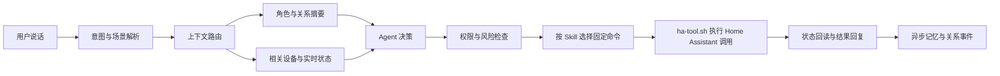

我想写的是一套可以迁移到不同 Agent 项目的上下文工程方法。家庭助手正好能把问题讲具体，我会用它作为贯穿全文的实操案例。

这个助手能陪用户聊天，也要连接 Home Assistant 控制家里的灯、空调和其他设备。每个助手有自己的 MBTI 与角色设定，用户相处久了，好感度还会变化。

这三件事放在一起以后，上下文工程就有了明确的工程约束。

用户说一句“有点冷”，助手要知道当前房间、温度和可用设备，也要保留自己的说话方式。它还得判断用户是在随口抱怨，还是希望它打开空调。设备执行失败时，它不能只说一句“好的”。好感度再高，也不能替用户解锁门锁或关闭报警。

我现在更愿意这样定义家庭助手的上下文工程。每一轮只组装完成当前任务所需的家庭状态、角色状态、关系状态和安全规则，执行后再用外部状态证明结果。上下文少了会猜错，多了会变慢，也会把稳定人格淹没在设备列表和聊天记录里。

## 先把当前实现说清楚

现有代码已经有三个基础部分。

Home Assistant 和 Agent 运行在同一台设备上。我给家庭助手做了一个专用 Skill，里面只告诉 AI 什么时候查询设备、怎样选择命令、参数怎么传，以及遇到缺失设备和控制失败时怎样回复。真正的 Home Assistant 调用都交给固定的 `ha-tool.sh`。脚本负责读取 token、拼鉴权头、构造 REST 请求、重试和写日志，AI 不需要临时写 `curl`，更不能自己生成一段控制脚本。

角色资料由服务端生成。MBTI、背景、语气和角色核心设定会拼成 `SOUL.md`，插件按角色版本拉取资料，写入独立的 Agent 工作目录。版本没有变化时可以跳过重复同步。

好感度已经留下了事件表、分数和角色关系记录等结构，服务端也有增减分能力。当前对外上下文里的旧好感度字段已经废弃并固定为 0，MBTI 与关系等级的旧覆盖逻辑也曾被临时关闭。这说明好感度还没有形成稳定的在线流程。文章后面写的是我准备怎样把它重新接起来，不会把未完成部分写成已经上线。

## 四类上下文不能混在一起

家庭助手每轮需要的信息，变化速度差得很大。

| 上下文 | 典型内容 | 更新方式 |
| --- | --- | --- |
| 家庭状态 | 设备、房间、温度、开关状态、在线情况 | 秒级变化，按场景读取或订阅 |
| 角色状态 | 名字、MBTI、背景、说话习惯、边界 | 很少变化，按版本缓存 |
| 关系状态 | 好感度等级、近期关系事件、称呼偏好 | 缓慢变化，事件驱动 |
| 本轮状态 | 用户原话、当前意图、候选设备、执行结果 | 只服务当前请求 |

如果每轮都把完整 `SOUL.md`、全部设备、几十轮聊天和好感度历史塞给模型，成本会很快上去。更麻烦的是注意力会互相争抢。模型可能记住用户喜欢被温柔回应，却漏掉目标灯已经离线。

我的处理方式是给四类信息不同的生命周期。稳定角色放在可缓存的固定前缀。家庭状态留在本地快照里，只取与当前场景有关的部分。关系状态只提供当前等级和少量近期变化。本轮执行结果用完就结束，值得长期保留的内容再异步进入记忆。

## Home Assistant 先从全量列表改成相关状态

现在的 Skill 会先调用一次 `list` 发现全部实体。同一轮里不再重复读取，作为原型已经够用。设备增加以后，这个方法会把大量传感器、属性和无关状态送进模型。

我准备在 Agent 与 Home Assistant 之间增加一个轻量索引。它只保存设备识别需要的信息。

```json
{
  "entity_id": "light.living_room_main",
  "domain": "light",
  "area": "living_room",
  "name": "客厅主灯",
  "aliases": ["客厅灯", "主灯"],
  "capabilities": ["turn_on", "turn_off", "brightness"],
  "risk": "low"
}
```

Home Assistant 的 WebSocket API 可以订阅状态变化。我可以在本地维护实体快照，设备上下线或状态变化时增量更新。用户说“把客厅灯调暗一点”，系统先在索引里解析房间、设备类型和动作，只给模型候选实体与当前亮度。没有候选项时再扩大搜索范围。

这比反复请求 `/api/states` 更省调用，也更容易评测实体解析是否正确。设备状态仍以 Home Assistant 为准，本地快照要保留更新时间，过期或断线后主动回源。

## Skill 约束调用，脚本封装执行

这是我在项目里已经采用的一层上下文工程。Skill 保存调用知识，脚本保存执行细节。AI 只需要在 `list`、`state` 和 `call` 之间选择，再填写 domain、service、entity ID 与可选参数。同一轮查过的实体列表可以继续用，不必反复读取。token、配置路径、API 地址和日志路径都不会进入对话上下文。

相比让 AI 现场拼命令，这种做法更稳，也更省。脚本可以单独写测试，接口失败时有固定错误，调用日志也能回放。Home Assistant 的鉴权方式或配置路径发生变化，只改脚本即可，Skill 的使用方式可以继续保持稳定。

现有封装还可以继续变窄。通用 `call` 仍然要求模型理解 Home Assistant 的 domain、service 与 payload。我可以继续在同一份脚本里增加面向家庭动作的子命令，也可以在插件里提供等价的类型化工具。

我更倾向于在插件里做一层类型明确的工具。

```text
home.get_state
home.light_set
home.climate_set_temperature
home.cover_move
home.scene_activate
home.wait_for_state
```

`home.light_set` 只接受灯、开关状态和合法亮度。`home.climate_set_temperature` 检查设备能力与温度范围。工具内部再翻译成 Home Assistant 的服务调用，token 仍由固定执行层管理。AI 的工作继续限制在选择动作和填写参数，不会退回到自己写脚本。

这套 Skill 加脚本的方案只服务当前家庭助手时已经够直接。等手机端、云端 Agent 或其他运行时都需要同一套能力，再考虑抽成 MCP Server。MCP 解决多个调用方复用同一批工具的问题，不能替代脚本内部的参数校验、权限检查和执行日志。

控制成功也需要重新定义。Home Assistant 官方文档说明，修改 `/api/states` 只会改变 Home Assistant 内的状态表示，不会控制真实设备。真实控制要调用 `/api/services/<domain>/<service>`。服务调用返回成功以后，我还会读取目标实体，或等待对应的 `state_changed` 事件。最终记录至少包含用户意图、目标实体、调用参数、API 结果和 Home Assistant 确认状态。

这里还要承认一层限制。有些设备没有物理反馈，有些集成会乐观地更新状态。此时 `state=off` 只证明 Home Assistant 认为设备已经关闭。评测记录要分开 API 接受、Home Assistant 状态匹配和物理反馈可确认三种结果。门锁、报警等高风险设备不能拿前两层代替最后一层。

## 角色感由 MBTI 提供方向，不接管决策

我使用 MBTI 是为了快速建立角色差异，不拿它诊断用户，也不会把十六型人格的整套说明每轮发给模型。

服务端已经把 MBTI、背景和语气拼进角色资料。下一步可以把会影响对话的部分编译成少量行为参数。

```yaml
persona_version: 7
mbti: ISFJ
response_style:
  warmth: high
  initiative: medium
  directness: medium
  humor: low
  preferred_length: short
```

这些参数只决定怎样回应。同一个“打开客厅灯”，有的角色会简短确认，有的角色会多关心一句。实体选择、权限检查、危险动作确认和执行验证走同一套确定规则，不随人格变化。

角色资料有版本号很重要。更新 MBTI 或背景后，插件只在版本变化时刷新 `SOUL.md`。模型请求里的稳定部分顺序也保持不变，更容易命中 Prompt Cache。动态设备状态和用户原话放在后面，避免每轮都破坏稳定前缀。

## 好感度应该是一套可解释的关系状态

好感度最容易做成一个不断涨跌的数字，最后既不真实，也很难调试。

我会保留分数用于内部计算，产品行为主要读取关系阶段。一次变化必须来自可识别事件，并带上来源、幂等键和时间。重复投递同一条消息不能加两次分，短时间反复触发同类事件也要限频。

```json
{
  "event_id": "evt_01",
  "user_id": "user_01",
  "mate_id": "mate_07",
  "type": "user_kept_promise",
  "delta": null,
  "source_turn_id": "turn_892",
  "created_at": "event_time",
  "reason": "matched_rule_id"
}
```

这里的 `delta` 由规则表计算，示例不放虚构分值。关系阶段跨过阈值以后再变化，回落时使用不同阈值，避免分数在边界附近让角色来回变脸。

好感度可以影响称呼、主动关心的频率、愿意分享多少角色背景，也可以解锁新的对话内容。它不应该改变家庭权限，更不能让基础功能变得难用。用户还需要能查看大致关系状态、关闭这套机制或清除记录。关系系统如果只能偷偷计算，出问题时很难解释，也容易给人被操控的感觉。

事件识别可以先用确定规则处理明确情况，模糊对话再交给小模型异步分类。模型只能提交候选事件，服务端负责去重、限频和结算。家庭控制不必等待好感度计算完成。

## 一次请求实际怎样走

下面这条路径是我希望逐步收敛到的结构。



“把卧室灯关掉”可以直接解析成低风险、可逆的明确动作。系统找到卧室灯，读当前状态，执行后等待它变成 `off`，角色再用自己的语气回复。

“我有点冷”缺少明确动作。系统读取当前房间的温度与可用温控设备，结合用户过去明确保存的偏好决定询问还是建议。它不能为了表现积极，随便关闭窗帘或打开一台与降温无关的设备。

“帮我把家里处理一下，我要出门了”会涉及多个设备。已有的离家场景可以作为一个经过用户确认的固定动作。没有场景时，Agent 先给出计划，让用户确认高风险项，随后逐项执行并报告失败设备。

“你别烦我”只影响对话节奏和可能的关系事件，不触发家庭控制。语气和设备动作在这里必须分开。

## 优化前后要按家庭任务比较

我不会只比较一句回复听起来顺不顺。家庭助手要同时评测语言、工具和真实状态。

评测集可以从线上脱敏日志与真实失败中持续补充，至少覆盖这些场景。

| 场景 | 重点检查 |
| --- | --- |
| 明确控制 | 意图、实体和参数是否正确 |
| 模糊空间 | “这里”“客厅”能否解析到正确区域 |
| 状态查询 | 是否只读状态，没有误触发控制 |
| 设备离线 | 是否诚实报告，停止无效重试 |
| 高风险动作 | 是否要求确认并遵守权限 |
| 普通聊天 | 是否保持角色感且不误调用设备 |
| 关系变化 | 事件是否可解释、去重并正确跨级 |
| 多轮纠正 | 用户改选落地灯后能否更新目标 |

每条用例保存相同字段，优化前后跑同一批输入。

```json
{
  "case_id": "bedroom-light-correction",
  "variant": "context-router-v2",
  "intent_correct": null,
  "entity_top1_correct": null,
  "tool_arguments_correct": null,
  "unsafe_action": null,
  "final_state_verified": null,
  "persona_consistent": null,
  "relationship_event_correct": null,
  "input_tokens": null,
  "tool_calls": null,
  "latency_ms": null,
  "human_rework_minutes": null
}
```

`null` 表示等待真实运行结果，不用演示数字冒充收益。涉及真实设备的用例，先在影子模式里只生成动作计划，不执行控制。计划稳定后开放只读查询，再灰度低风险动作。门锁、车库门、报警和隐私设备单独验收。

我会重点看几个结果。实体解析准确率决定它有没有控制错设备，最终状态确认率决定它有没有只报成功，危险动作率必须接近零。角色一致性和关系事件准确率用来判断陪伴部分，token、调用数、延迟与人工复查时间一起看成本。

## 成本从少读、少猜和少重试里降下来

家庭助手的成本优化有不少步骤可以交给普通代码。

- 设备索引、别名匹配、能力校验和权限检查都先确定性处理。
- WebSocket 维护本地状态，模型只收到相关实体和新变化。
- 角色资料按版本缓存，好感度只传当前阶段与必要事件。
- 明确设备命令使用短路径，复杂对话再调用更强模型。
- 关系事件异步结算，不阻塞设备控制与语音回复。
- 工具失败返回结构化原因，限制重试次数，避免 Agent 循环试错。

一次请求最终送进模型的内容可以很小。

```yaml
request:
  text: 把这里调暗一点
  room: living_room
persona:
  version: 7
  style: warm_short
relationship:
  stage: familiar
home:
  candidates:
    - entity_id: light.living_room_main
      state: on
      brightness: current_value
      capabilities: [brightness]
policy:
  confirmation_required: false
```

模型不需要知道全部设备，也不用读取所有好感度事件。它只要在当前候选和规则内做决定。

## 哪些东西值得自己做

这个项目里，我会优先做四个小组件。

实体索引负责同步 Home Assistant 注册表、房间、别名和能力。上下文路由器根据本轮意图取相关状态。家庭工具层执行类型化动作并回读结果。评测记录器把输入、上下文版本、工具调用、最终状态和成本写进同一条 trace。

MBTI 编译器与关系状态机可以晚一点做。前者把角色资料编译成稳定的行为参数，后者管理事件、分数、阶段和审计。两者都不能绕过家庭工具层的权限。

这些组件以后也能迁到车载助手、机器人和客服 Agent。能泛化的部分是四类上下文、风险检查、外部状态验证与评测记录。Home Assistant 的 entity、MBTI 的字段和家庭场景仍留在项目适配层。复制一份万能 Prompt 到新项目，通常只会把旧项目的假设一起复制过去。

## 我准备按这个顺序落地

第一步先补 trace，不改现有控制逻辑。把每次读取的实体数、输入 token、工具调用、目标状态和人工纠正记下来，得到当前基线。

随后建立实体索引与 WebSocket 状态快照，先替换全量设备上下文。再沿用 Skill 加固定脚本的边界，把通用 `call` 逐步收窄成家庭动作，加入风险等级、确认和状态回读。

MBTI 资料继续沿用现有版本同步，逐步改成稳定行为参数。好感度先在影子模式里识别事件，和人工标注比较，准确以后再写入关系状态。

做到这里，我才能认真比较优化前后。好的结果应该让助手控制得更准，角色更稳定，关系变化有来由，同时减少无关设备、重复人格说明和无效工具调用。账单下降只是其中一项，人不用反复纠正它才算真的省下来。

## 参考资料

- [Home Assistant REST API](https://developers.home-assistant.io/docs/api/rest/)
- [Home Assistant WebSocket API](https://developers.home-assistant.io/docs/api/websocket/)
- [Home Assistant 鉴权 API](https://developers.home-assistant.io/docs/auth_api/)
- [OpenAI 评测最佳实践](https://developers.openai.com/api/docs/guides/evaluation-best-practices)
- [OpenAI Prompt Caching](https://developers.openai.com/api/docs/guides/prompt-caching)
- [Anthropic 关于 Agent 上下文工程的实践](https://www.anthropic.com/engineering/effective-context-engineering-for-ai-agents)
