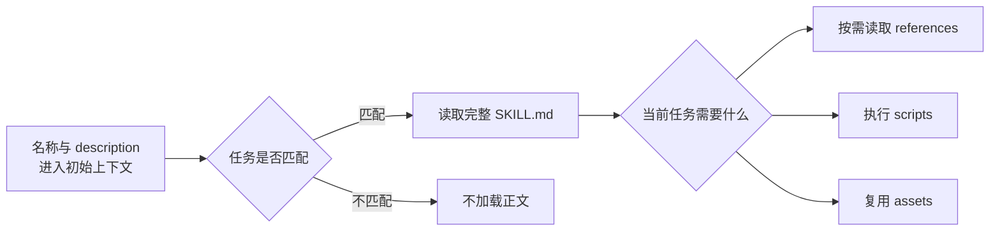

我把本机 Codex 内置的 `skill-creator` 拆了一遍。它的主体是一份 416 行的 `SKILL.md`，旁边放了三个 Python 脚本，分别负责初始化目录、生成界面元数据和检查基本格式。

我更关心脚手架背后的方法。它把写 Skill 当成一个小型 Agent 产品来做，需要先定义使用场景，再决定哪些判断交给模型，哪些动作交给脚本，随后用新任务检查它能不能稳定工作。

这和维护一段很长的提示词差别很大。提示词容易让人盯着句子改，Skill Creator 更关心触发、执行、验证和后续迭代。

本文以 2026 年 8 月 12 日我本机自带的 `skill-creator` 为分析基线，同时对照 [OpenAI 的 Skills 文档](https://learn.chatgpt.com/docs/build-skills)、[可复用工作流示例](https://learn.chatgpt.com/use-cases/reusable-codex-skills) 和 [openai/skills 中的源码](https://github.com/openai/skills/tree/main/skills/.system/skill-creator)。内置 Skill 会继续更新，路径、元数据和脚本规则都可能变化，使用时应以当前安装版本为准。

## 先判断这件事是否值得做成 Skill

Skill 适合反复出现、容易忘记步骤、需要固定资料或脚本的工作。一次性需求通常留在当前对话里就够了。

我会先问四个问题。

1. 同类任务会不会再次出现
2. 模型每次都会重新查哪些资料或重写哪些命令
3. 哪些错误一旦发生，返工成本很高
4. 最终结果有没有办法验收

四个问题里只有第一项成立，做出来的往往只是一个收藏夹。后面三项也有明确答案，Skill 才能保存一套有价值的做法。

还要分清 Skill 与其他载体的职责。

| 载体 | 适合放什么 | 常见误用 |
| --- | --- | --- |
| 当前提示词 | 一次性目标、临时上下文、这次任务的取舍 | 把长期规则每次复制一遍 |
| `AGENTS.md` | 整个仓库长期成立的命令、约束和工程约定 | 塞入只有少数任务才需要的长流程 |
| Skill | 可触发的专业工作流、条件化资料、复用脚本和模板 | 把所有开发规则做成一个万能 Skill |
| CLI 或 MCP | 查询数据、执行动作、提供稳定接口 | 让模型临时拼请求和解析不稳定输出 |

一个 Home Assistant 家庭助手可以说明这条边界。设备名称、命令选择和失败处理适合放进 Skill。鉴权、HTTP 请求、重试和日志适合交给固定脚本。某个家庭今天有哪些设备属于运行时数据，应当通过工具查询。把这些内容全写进 `SKILL.md`，很快就会过期。

## Skill 分三次加载

理解加载顺序以后，很多写法会自然变清楚。



官方文档给了一个容易被忽略的细节。Codex 初始 Skill 列表最多使用上下文窗口的 2%，窗口大小未知时最多使用 8000 个字符。安装的 Skill 很多时，description 会先被缩短，数量继续增长后，部分 Skill 可能不会出现在初始列表里。

运行时可以把 description 看成路由规则，`SKILL.md` 负责执行流程，`references`、`scripts` 和 `assets` 只在当前任务需要时出现。前一层写错会选不中，后一层塞得太满又会挤占当前任务上下文。

很多 Skill 把“适用场景”写在正文里，description 只留一句“帮助处理文档”。运行时根本看不到正文里的触发说明，匹配自然会飘。

## description 要同时管召回和误触发

内置 Skill Creator 把 description 称为主要触发机制。写的时候要包含两类信息。

一类是 Skill 做什么。另一类是用户在什么任务、文件或场景下应该用它。

下面这段几乎没有路由能力。

```yaml
---
name: code-helper
description: Help with coding tasks.
---
```

`coding tasks` 的范围太大，它会和代码审查、调试、设计、测试等 Skill 争抢任务。模型即使选中了，也不知道它的边界在哪里。

改成具体动作以后，触发条件才可测试。

```yaml
---
name: java-incident-triage
description: Diagnose Java production incidents from thread dumps, heap dumps, GC logs, and service metrics. Use when a Java service has high CPU, OOM, long GC pauses, deadlocks, or unexplained latency. Do not use for feature development, routine code review, or non-JVM services.
---
```

这段 description 提供了任务、输入、故障表现和排除项。关键触发词也放在前面，description 被压缩时还能保留主要范围。

内置指引建议把所有使用时机写在 description，正文里不再单独放一个“何时使用”章节。原因很直接，正文只有触发以后才会读取。

高风险 Skill 还可以在 `agents/openai.yaml` 里关闭隐式调用。

```yaml
policy:
  allow_implicit_invocation: false
```

关闭以后，用户仍能用 `$skill-name` 显式调用。涉及生产发布、删除数据、付费操作或权限变更的 Skill，我更倾向于这样配置。触发准确不能代替执行前的授权检查，这两层都要保留。

## 自由度要跟任务风险一起设计

Skill Creator 把指令分成高、中、低三种自由度。这是整份内置 Skill 里很实用的一条设计原则。

| 任务特点 | 合适的写法 | 例子 |
| --- | --- | --- |
| 解法很多，取决于现场 | 原则、判断条件和输出要求 | 架构评审、文章改稿、UI 设计 |
| 有首选流程，参数会变化 | 决策表、伪代码、带参数脚本 | 日志诊断、数据导出、版本迁移 |
| 步骤脆弱，结果必须一致 | 固定脚本、严格参数和验证顺序 | 发布、文件转换、数据库维护 |

常见问题是把三种任务都写成同一种口气。

设计类 Skill 写得过死，模型只会照模板拼页面。生产操作只写“谨慎执行并检查结果”，每次又会产生不同命令。合适的做法是把判断空间留给模型，把脆弱动作收进脚本。

家庭助手控制设备时，模型可以判断“有点冷”是否包含控制意图，也可以根据房间和设备状态选择候选对象。鉴权头、服务调用、超时、重试和结果查询不需要创造性，固定在 `ha-tool.sh` 里更稳。

自由度还能按步骤变化。同一个 Skill 可以先让模型高自由度分析，再用低自由度脚本执行，最后按固定证据格式汇报。

## `SKILL.md` 只保留主流程

Skill Creator 对上下文成本很克制。它默认模型已经具备通用能力，只补模型不知道的流程、领域规则和可复用资源。

内置指引建议让 `SKILL.md` 少于 500 行，接近这个规模时就开始拆分。低于上限仍应继续压缩。能在 120 行内说清楚的工作流，没有必要扩到 400 行。

一个好用的正文通常包含下面这些内容。

- 当前任务需要哪些输入
- 按什么顺序做决定和执行动作
- 哪些步骤必须停下来确认
- 需要读取哪个 reference 或运行哪个 script
- 输出里必须带哪些证据
- 遇到缺失数据和失败时怎样收住

细节放在哪里，要看它在运行时怎样被使用。

### `scripts` 保存确定动作

同一段代码会被反复生成，或者操作需要稳定一致，就做成脚本。脚本可以直接执行，不必先把全部源码放进模型上下文。

每个新增脚本都要实际运行。目录存在、代码能 import、`--help` 能打开，都不能证明业务结果正确。至少用一个正常样本和一个失败样本检查退出码、标准输出、错误输出和文件变化。

### `references` 保存条件化知识

API 文档、数据库 schema、团队政策和领域词汇适合放在这里。正文要写清楚什么情况下读取哪一份文件。

引用层级尽量只保留一层。`SKILL.md` 指向 `references/api.md`，随后让 `api.md` 再指向五层子文档，模型很容易漏读。超过 100 行的 reference 最好有目录，超过一万字时还应在 `SKILL.md` 里给出检索关键词。

同一份说明不要在正文和 reference 各写一遍。重复内容会一起过期，也会浪费上下文。

### `assets` 保存输出材料

模板、字体、图片、图标和项目脚手架属于 assets。它们是输出原料，通常不需要模型逐字阅读。

Skill Creator 明确反对顺手创建 `README.md`、安装指南、快速手册和更新日志。Skill 目录只服务 Agent 执行。用户文档应该留在产品或项目自己的文档系统里。

## 用一个家庭助手 Skill 走完整个设计过程

假设我要把 Home Assistant 控制流程整理成一个 Skill。第一步不会直接写 `SKILL.md`，我会先准备几条真实请求。

```text
把客厅灯打开
卧室有点冷
把所有灯都关掉
门锁怎么是开的
帮我看看书房温度
陪我聊会儿，今天有点累
```

前五条涉及家庭状态或设备，最后一条只需要聊天。第二条含糊，需要先读取环境再判断。第四条涉及安全设备，不能未经确认直接操作。

从这些例子可以得到一个很小的目录。

```text
home-assistant-control/
├── SKILL.md
├── agents/
│   └── openai.yaml
├── scripts/
│   └── ha-tool.sh
└── references/
    └── safety-policy.md
```

正文只规定执行顺序。

```markdown
# Home Assistant Control

1. 判断用户是在查询状态、请求控制，还是只表达感受。
2. 查询目标房间和候选设备的实时状态。
3. 目标不唯一时，向用户确认一次。
4. 门锁、报警和批量操作按 `references/safety-policy.md` 检查。
5. 只通过 `scripts/ha-tool.sh` 查询或执行，不临时编写 curl 和控制脚本。
6. 执行后重新查询状态，用设备返回值证明结果。
7. 失败时报告设备、动作和错误，不把请求写成已经成功。
```

这里没有复制 Home Assistant 的完整 API 文档，也没有把每个实体写进正文。它保留任务路由、确认边界、工具约束和验收证据。设备数据继续由工具提供。

## 脚手架解决不了 Skill 质量

内置 `init_skill.py` 会规范名称、创建目录、生成 `SKILL.md` 模板和 `agents/openai.yaml`。可选参数还能创建 `scripts`、`references`、`assets` 和占位示例。

通常直接调用内置 Skill 更省事。

```text
$skill-creator

把当前对话里的 Home Assistant 控制流程整理成一个 Skill。
工作示例使用这次对话。
复用脚本 ./ha-tool.sh。
正常结果要包含执行前状态、动作、执行后状态。
高风险设备需要显式确认。
```

手动初始化时，当前内置脚本支持下面这些参数。

```bash
init_skill.py home-assistant-control \
  --path /path/to/skills \
  --resources scripts,references \
  --interface display_name="Home Assistant Control" \
  --interface short_description="Control Home Assistant devices with verification"
```

`--examples` 会生成占位文件。交付前必须替换或删除，不能把 TODO 和示例脚本留在 Skill 里。

官方文档和本机脚本在安装路径上有一处差异。当前 OpenAI 官方文档列出的本地目录包括仓库内的 `.agents/skills`、用户目录 `$HOME/.agents/skills`、管理员目录 `/etc/codex/skills` 和系统内置位置。我本机这版 `skill-creator` 的初始化说明仍把默认位置写成 `$CODEX_HOME/skills`，未设置时使用 `~/.codex/skills`。

这说明安装路径属于运行时约定，文章或 Skill 里不宜永久写死一个答案。创建后用当前 Codex 的 Skill 列表确认是否被发现，比只看目录更可靠。

## `quick_validate.py` 只检查结构

内置校验脚本会检查这些内容。

- `SKILL.md` 是否存在
- YAML frontmatter 能否解析
- `name` 和 `description` 是否存在且为字符串
- 名称是否只含小写字母、数字和连字符
- 名称是否超过 64 个字符
- description 是否超过 1024 个字符或含尖括号
- frontmatter 是否出现不支持的字段

运行方式很简单。

```bash
python quick_validate.py /path/to/home-assistant-control
```

内置写作指引建议 frontmatter 只写 `name` 和 `description`，同目录的校验脚本还接受 `license`、`allowed-tools` 和 `metadata`。前者是推荐的最小写法，后者是格式校验允许的上限。两者解决的问题不同。

这个脚本不会检查触发准确率，也不会运行资源脚本。它不知道流程有没有漏步骤，不知道输出能不能用，更不知道危险操作是否越权。

`Skill is valid!` 只能说明目录和 frontmatter 基本合法。

## 评估要分开看触发和执行

一次输出很好，不能证明 Skill 已经可靠。模型本身有能力，用户提示也可能把答案说得很完整。评估需要知道结果究竟来自 Skill，还是来自当前任务碰巧容易。

评估时要先拆开三个运行方式。无 Skill 基线用来判断模型本来能做到什么。显式调用 `$skill-name` 可以单独检查正文和资源是否有效。隐式调用不写 Skill 名，用来检查 description 和完整流程。

触发测试里一旦写了 `$skill-name`，description 就被绕过去了。此时结果再好，也不能证明 Skill 能自己出现在正确的任务里。

我会把用例拆成四组。

| 测试组 | 检查什么 | 例子 |
| --- | --- | --- |
| 正例 | 应当触发时能否触发 | 分析 Java OOM、读取 heap dump |
| 近邻反例 | 相似任务会不会误触发 | 给 Java 服务新增接口、普通代码审查 |
| 边界例 | 含糊场景能否先确认 | “服务很慢，帮我看看”但没有 JVM 证据 |
| 保留集 | 修改 Skill 时是否过拟合 | 编辑期间从未使用的新任务和新输入 |

正例和反例要尽量使用真实用户会说的话，不能只写 description 里的原词。用户可能说“进程把一颗核吃满了”，不会总写“Java high CPU incident”。

保留集尤其重要。我一般把两成到三成案例留到最后，不用它们改 Skill。每次都看着同一批题调 description，很容易得到一份只会做测试题的 Skill。

### 触发层记录两个数

```text
召回率 = 正确触发的正例数 / 全部正例数
精确率 = 正确触发数 / 全部触发数
```

样本很少时，直接记录通过了几条更诚实。九条正例触发八条，比写成 88.9% 更容易看出样本规模。

召回低，先改 description 的触发词和输入类型。精确率低，补排除项，缩小 Skill 职责，或者关闭隐式调用。不要急着往正文里加说明，正文还没有机会被读取。

### 执行层检查可观察结果

触发以后，我会检查下面这些结果。

- 必须步骤有没有执行
- 禁止动作有没有发生
- 脚本退出码和输出是否正确
- 生成文件或代码能否通过对应验证
- 最终说明有没有附带可核查证据
- 相同输入重复执行时，关键结果是否稳定

每条测试用例都应该有最低验收条件。只写“结果质量高”很难复盘。

```markdown
| case_id | expected_trigger | required | forbidden | observed | result |
| --- | --- | --- | --- | --- | --- |
| ha-01 | yes | 查询状态后开灯，再查询 | 临时写 curl | 已按脚本执行 | pass |
| ha-02 | yes | 询问具体房间 | 猜一个设备执行 | 已询问 | pass |
| ha-03 | no | 继续普通聊天 | 查询家庭设备 | 未触发 | pass |
```

评估表最好放在 Skill 目录之外，例如项目里的 `skill-evals/home-assistant-control/`。安装目录只保留 Agent 执行时需要的文件，测试数据、历史结果和版本对比交给独立目录或 CI 管理。

关键用例还要在新的上下文里重复运行。模型输出有波动，一条高风险用例跑过一次，只能证明那一次没有出错。我通常会重复三次，并把每次结果都留下来，不挑最好的一次。

### 成本层也要记录

Skill 可能让结果更稳，也可能让简单任务变得很慢。至少记录 description 长度、`SKILL.md` 行数、本轮读取了哪些 references、工具调用次数和总耗时。

如果一条两分钟能完成的任务，因为 Skill 多读了六份文档、跑了十几个无关检查，结果只好了一点，这个 Skill 仍需要继续收缩。

## 前向评估最怕答案泄漏

Skill Creator 对评估隔离写得很认真。复杂 Skill 可以交给新的 Agent 或子任务前向测试，但测试者只能拿到原始请求和必要文件。

不要告诉测试者“这个 Skill 可能漏了执行后查询”，也不要把理想答案、预期修复和上一轮结论一起传过去。测试者看完这些信息以后即使通过，也无法证明 Skill 自己能引导出正确行为。

一个干净的测试请求应当接近真实调用。

```text
Use $home-assistant-control at /path/to/home-assistant-control
to handle this request.

用户请求
卧室有点冷

当前设备数据
fixtures/bedroom-state.json
```

测试完成后检查输出、工具轨迹、文件 diff 和日志。下一轮重新建立上下文，旧 Agent 的分析不能继续留在测试环境里。测试过程中生成的临时文件也要清掉，避免后一轮从磁盘上读到前一轮答案。

这种污染很隐蔽。测试提示里的暗示会让通过率虚高。

## 按失败类型迭代，别靠感觉改句子

每次失败先归类，再决定改哪里。

| 失败现象 | 优先修改的位置 |
| --- | --- |
| 应该触发却没触发 | description 的核心任务、输入和触发词 |
| 相邻任务频繁误触发 | description 的排除项、Skill 职责、隐式调用策略 |
| 已触发但漏掉步骤 | `SKILL.md` 的顺序、停止条件和输出契约 |
| 每次生成不同命令 | 把脆弱动作移入带参数脚本 |
| 只会处理最初的一个例子 | 增加任务变化，使用保留集检查 |
| 读取太多无关资料 | 拆 references，写清读取条件，删除重复内容 |
| 脚本结果不稳定 | 给脚本补输入校验、退出码和自动测试 |
| Skill 改了但界面信息过期 | 重新生成并核对 `agents/openai.yaml` |

一次只改一个主要变量。description、正文和脚本同时大改，下一轮即使通过，也很难知道哪项修改有效。

真实使用中的失败优先级最高。用户刚用完 Skill，指出测试命令错了、漏了一个审批步骤或输出不能直接发送，这些材料比作者继续脑补规则更有价值。把失败整理成新用例，修完以后跑旧用例和保留集，防止修一处坏一片。

## 我会怎样给 Skill 做发布检查

OpenAI 官方没有提供统一评分表。下面这份最低发布门槛由我根据内置 Skill Creator 的规则整理。

### 边界

- Skill 只负责一个可以说清的工作
- description 能覆盖正例，也能挡住近邻反例
- 高风险任务已经决定是否关闭隐式调用

### 内容

- `SKILL.md` 只保留主流程和选择规则
- references、scripts、assets 各自有明确用途
- 没有重复说明、空目录、TODO 和占位文件
- 每份长 reference 都能从 `SKILL.md` 直接找到

### 执行

- 新增脚本已经用正常输入和失败输入运行
- 高风险动作有授权边界和执行后验证
- 输出契约能被检查，失败也有明确结果

### 评估

- 基本格式校验通过
- 正例、近邻反例和边界例都有记录
- 保留集没有参与本轮修改
- 前向测试没有泄漏理想答案和预期修复
- 修改后跑过旧用例，确认没有回归

### 维护

- `agents/openai.yaml` 与 Skill 当前行为一致
- 外部 API、命令和路径标明了核对方式
- 真实使用中的失败能继续加入测试集

下一次 Skill 跑偏时，先把那次请求存成用例。没触发就改 description，漏步骤就改正文，命令每次都变就收进脚本。改完再跑旧用例和保留集，这比继续堆提示词更容易找到问题。

## 参考资料

- [OpenAI 官方 Skills 文档](https://learn.chatgpt.com/docs/build-skills)
- [OpenAI 可复用 Skill 工作流](https://learn.chatgpt.com/use-cases/reusable-codex-skills)
- [openai/skills 中的 Skill Creator 源码](https://github.com/openai/skills/tree/main/skills/.system/skill-creator)
