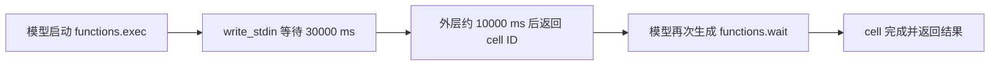

最近我用 Codex 连续做了一个 Skill 项目。任务从产品调研一路走到实现、评测、提交和推送，中间跑过不少需要等待的命令。session 越来越长以后，我开始留意一个很朴素的问题。命令还在运行，为什么模型隔一会儿就要出来看一眼。

网上有一份处理办法，建议把空 `write_stdin` 和 `functions.wait` 的等待时间统一拉到三分钟以上，并称 Token 消耗能下降约四分之一。我没有直接照抄这个数字。我把本地 session 的 JSONL 拆开，又对照了当前工具契约和 OpenAI Docs。

这次样本确实存在密集唤醒。固定快照里有 176 个模型回合只发出了 `wait`，它们占全部模型回合的 33.7%。这份数据能证明等待方式有优化空间，还不能证明改完一定节省 25%。长等待也不能无条件套在所有任务上。

## 我从 session 里看到了什么

我分析的是同一条长期任务在 2026 年 8 月 14 日 10 时 24 分之前的记录。文件来自 Codex Desktop，版本是 `0.147.0-alpha.6.5`，模型是 `gpt-5.6-sol`，reasoning effort 为 `xhigh`。

| 项目 | 数量 |
| --- | --- |
| `functions.exec` 外层 JavaScript 调用 | 335 |
| 包含 `write_stdin` 的调用 | 186 |
| 空 `write_stdin` 轮询 | 186 |
| 空轮询等待时间 | 全部为 30000 ms |
| 外层返回 `Script running with cell ID` | 176 |
| 随后发出的 `functions.wait` | 176 |
| 以有效 `// @exec` 开头的调用 | 0 |

这里最要紧的是后三行。内层 `write_stdin` 愿意等 30 秒，外层 `functions.exec` 没有设置更长的等待时间。当前工具契约给外层的默认值是 10 秒。外层先返回以后，模型收到一次 `Script running with cell ID`，随后再调用 `functions.wait` 等同一个 JavaScript cell。

一次原本可以留在工具内部的等待，变成了两次模型参与。



OpenAI 官方文档里，相近的机制叫 [Programmatic Tool Calling](https://developers.openai.com/api/docs/guides/tools-programmatic-tool-calling)。GPT-5.6 可以在托管运行时里写 JavaScript，调用符合条件的工具，并在代码里处理结果。官方同时要求用同一批代表性任务比较任务成功率、完整性、总 Token、延迟、成本、调用数和重试次数。少几次调用只有在结果仍然合格时才算改进。

## 176 次 wait 花掉了多少 Token

session 的 `token_count` 事件提供了每个模型回合的 `last_token_usage`。我的统计脚本把发出 `wait` 的模型回合单独聚合，算的是模型决定调用 `wait` 时产生的 Token。它没有把等待前后的所有消耗都归给轮询。

| 口径 | 全部回合 | wait 回合 | 占比 |
| --- | --- | --- | --- |
| 模型回合 | 523 | 176 | 33.7% |
| 输入 Token | 69,749,450 | 24,758,623 | 35.5% |
| 缓存输入 Token | 68,767,232 | 24,622,080 | 35.8% |
| 未缓存输入 Token | 982,218 | 136,543 | 13.9% |
| 输出 Token | 116,995 | 5,586 | 4.8% |
| reasoning 输出 Token | 37,645 | 124 | 0.3% |

这些数字很容易被读大。35.5% 是输入 Token 口径，其中绝大部分命中了缓存。它不能直接换算成账单，也不能全部当成可以消除的浪费。模型仍要在任务完成、报错或需要输入时接手。

未缓存输入占比更接近这次诊断的实际分量，数值是 13.9%。重复唤醒依然存在，只是影响没有“总输入 Token 的三分之一”听起来那么夸张。

这也解释了我为什么不采用固定的 25% 说法。要得到这个结论，至少要在相同任务、相同模型和相同上下文下跑优化前后的多次样本，再比较质量、Token 和耗时。我现在只有一条长 session 的诊断数据，没有成对实验。

## 我最后写进全局 AGENTS.md 的规则

我保留了长等待的方向，删掉了无条件的 `MUST`。当前全局规则如下。

```markdown
## 长任务等待

- 不要为了汇报“仍在运行”而轮询。
- 对无需中间输出和交互的长任务，在更高优先级的响应要求允许时，空 `write_stdin` 和 `functions.wait` 优先单次等待 `180000` 到 `300000 ms`；返回仍在运行后再继续长等。
- 需要查看进度或可能请求输入时使用 `30000` 到 `60000 ms`；发送输入的非空 `write_stdin` 不适用长等待。
- `functions.exec` 包含嵌套等待时，外层 `yield_time_ms` 至少比最长嵌套等待多 `30000 ms`，避免外层先返回。例如嵌套等待 `300000 ms` 时，首行使用 `// @exec: {"yield_time_ms": 330000}`。
- 任务结束后立即停止轮询。等待调用会在任务提前完成时提前返回。
```

这段配置处理两个问题。外层 pragma 让 JavaScript cell 覆盖住内层等待，减少中途返回。更长的空轮询则减少命令仍在运行时的检查次数。

三到五分钟只适合安静运行、不会请求输入的任务。开发服务器、交互式安装器和需要持续观察进度的命令仍应使用较短等待。非空 `write_stdin` 正在发送输入，也要保持及时。上层若要求每隔一分钟提供进度，响应要求继续优先。

等待调用会在任务提前完成时提前返回。把上限设成 300 秒，不代表每次都要坐满 300 秒。

## 怎样分析自己的 session

我把聚合逻辑放在 `scripts/analyze-codex-session.mjs`。脚本会读取整个 JSONL，只输出环境、调用数量和 Token 聚合，不打印用户消息、工具参数或命令输出。

```bash
node scripts/analyze-codex-session.mjs \
  /path/to/rollout-session.jsonl
```

为了固定本次文章使用的快照，我增加了一个时间截止参数。

```bash
node scripts/analyze-codex-session.mjs \
  /path/to/rollout-session.jsonl \
  --before 2026-08-14T02:24:56.706Z
```

输出里的 `waitShare` 分开记录全部输入、未缓存输入、输出和 reasoning。分析其他版本时要先检查 JSONL 字段有没有变化。session 文件可能包含提示词、源码、命令输出和本地路径，不要把原文件直接上传到公开仓库。

## AGENTS.md 什么时候生效

[OpenAI Docs](https://learn.chatgpt.com/docs/agent-configuration/agents-md) 说明，Codex 会在每次 run 开始时构建一次指令链，TUI 通常按每个新会话计算。全局目录若存在非空的 `AGENTS.override.md`，同层的 `AGENTS.md` 会被忽略。项目目录里的文件随后按路径向下拼接，离当前目录更近的规则排在后面。

我修改的是 `~/.codex/AGENTS.md`，当时没有全局 override。新任务会读取它，已经运行中的任务不会因此重建指令链。官方排障说明建议在规则陈旧时重启 Codex 或开始新的 run，没有说明 compact 会重新加载 `AGENTS.md`。

## 下一次要怎样验证

现有记录足以把双层等待列为优化对象。按照当前工具契约，给外层 `functions.exec` 更长的等待时间应当能避开同类中途返回。安静任务使用更长的空轮询，也会减少检查次数。这两项仍要放进新 session 验证。

我会准备一组固定长任务，分别跑原配置和新配置，记录成功率、总耗时、各类 Token 与人工介入次数。每组需要多次运行，失败和需要输入的任务也要保留。这份规则依赖当前 Codex 工具契约，版本更新后还要重新看 schema 和 session。数据通过以后，节省比例才有资格写进标题。

## 参考资料

- [OpenAI Docs 的 AGENTS.md 加载规则](https://learn.chatgpt.com/docs/agent-configuration/agents-md)
- [OpenAI 的 Programmatic Tool Calling 指南](https://developers.openai.com/api/docs/guides/tools-programmatic-tool-calling)
- [OpenAI 的 GPT-5.6 模型与评测建议](https://developers.openai.com/api/docs/guides/latest-model)
