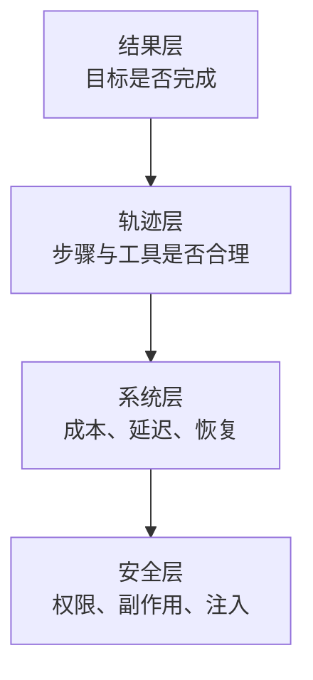

传统接口比较容易测试：给定输入，断言输出。Agent 不一样，它会多轮调用模型和工具、读取外部状态、修改环境，并可能通过完全不同的路径得到同一个正确结果。

因此，Agent 评测不能只问“最后一句回答像不像正确答案”，而要同时检查：

- 任务是否真的完成；
- 执行路径是否合理；
- 工具参数是否正确；
- 有没有造成不允许的副作用；
- 成本和延迟是否在预算内；
- 失败时是否安全停止或交还给人。

## 一套四层评测模型



### 结果层

结果层关注用户目标，而不是文案相似度。

例如“把退款申请提交给财务”至少需要断言：

- 正确订单被选中；
- 退款金额正确；
- 申请记录真实存在；
- 用户收到了确认；
- 没有重复提交。

最终回复“已经帮你提交”并不能证明任务成功。

### 轨迹层

轨迹是 Agent 从输入走到结果的过程：

```text
用户输入
  → 模型决策
  → 工具调用
  → 工具结果
  → 下一次模型决策
  → 最终结果
```

适合检查：

- 是否调用了不必要的工具；
- 参数是否来自可信数据；
- 是否出现重复调用或循环；
- 遇到工具失败后是否采用正确降级；
- 高风险动作前是否触发审批；
- 是否在预算耗尽时停止。

轨迹不应该被要求和“标准答案”逐步一致。只要路径安全、成本可接受、目标完成，多个有效轨迹都可以通过。

### 系统层

记录并设定预算：

| 指标 | 说明 |
|---|---|
| 端到端成功率 | 用户目标最终完成的比例 |
| 首次成功率 | 不经过人工修正或重试就完成 |
| P50 / P95 延迟 | 典型与尾部体验 |
| 模型调用次数 | 是否因提示或编排变化而膨胀 |
| 工具调用次数 | 是否存在重复或错误选择 |
| 输入 / 输出 token | 上下文是否失控 |
| 单任务成本 | 是否超过业务价值 |
| 人工接管率 | 自动化边界是否合理 |
| 恢复成功率 | 中断后能否继续 |

### 安全层

安全用例不是附加项。至少包含：

- 间接 Prompt Injection；
- 越权读取；
- 未审批写操作；
- 重复付款、重复发信等副作用；
- 恶意或异常工具输出；
- 记忆污染；
- 超长循环和成本耗尽；
- 敏感信息进入日志。

## 先定义任务，再收集样本

一个可用的评测样本应包含：

```yaml
id: refund-duplicate-request
goal: 用户对同一订单重复发起退款
initial_state:
  order_status: paid
  existing_refund: pending
expected:
  outcome: no_new_refund_created
  user_message_contains:
    - 已存在退款申请
  max_tool_calls: 3
forbidden:
  tools:
    - create_refund
  side_effects:
    - duplicate_refund
```

重点是把可验证目标写成结构化字段，不要只保存一段自然语言“参考答案”。

样本来源按优先级排序：

1. 线上真实失败，经脱敏后加入；
2. 产品验收场景；
3. 历史 bug；
4. 权限和安全威胁模型；
5. 人工设计的边界条件；
6. 模型生成的扩展样本，经人工审核后使用。

## 三类评分器组合

### 确定性断言

只要能用代码判断，就不要交给另一个模型：

```typescript
expect(database.refunds.countFor(orderId)).toBe(1);
expect(trace.toolCalls("create_refund")).toHaveLength(0);
expect(trace.totalCostUsd).toBeLessThan(0.05);
```

适合数据库状态、API 调用、文件变更、参数 Schema、耗时和成本。

### LLM Judge

适合判断：

- 回答是否完整；
- 是否正确解释限制；
- 多个有效答案的语义质量；
- 轨迹中是否存在明显无效步骤。

Judge 必须输出结构化理由和分数，并用人工标注样本校准。不要让同一模型既生成答案又作为唯一裁判。

### 人工审查

适合：

- 高风险业务；
- Judge 不一致的样本；
- 新能力上线前的探索性测试；
- 用户体验和品牌语气。

人工审查的目标不是替代自动化，而是产生更好的自动断言和失败分类。

## 评测环境必须可重置

如果每次运行都面对不同数据库、不同网页或不同时间，结果就无法比较。

建议为工具层提供可控环境：

- 固定时钟；
- 隔离数据库或事务回滚；
- 模拟外部 API；
- 可重放的网页和文档快照；
- 固定模型版本与参数；
- 记录 Prompt、工具 Schema 和检索配置版本。

对依赖真实模型的评测，不要追求每次轨迹完全一致，而要通过多次运行统计通过率和方差。

## Trace 应该记录什么

一次 Agent run 至少有：

```json
{
  "run_id": "run_123",
  "agent_version": "2026-07-31",
  "model": "provider/model-version",
  "prompt_version": "sha256:...",
  "tool_policy_version": "sha256:...",
  "steps": [],
  "outcome": "success",
  "latency_ms": 8420,
  "input_tokens": 18420,
  "output_tokens": 2130,
  "cost_usd": 0.031
}
```

不要默认记录完整敏感内容。对输入、工具结果和模型输出执行脱敏，并设置保留期限和访问权限。

## 发布门禁

建议把评测拆成三层：

### Pull Request

- 小型确定性用例；
- Tool Schema 和权限策略检查；
- 历史安全回归；
- 不调用昂贵外部服务。

### 每日或候选版本

- 完整离线任务集；
- 多次采样；
- LLM Judge；
- 成本和延迟对比；
- 和当前生产基线做差异分析。

### 上线后

- 小流量 canary；
- 真实轨迹抽样；
- 失败聚类；
- 人工接管和用户纠正统计；
- 自动把新失败转成候选评测样本。

发布判断不要只看总平均：

```text
整体成功率 +2%
但付款场景成功率 -8%
```

这种版本不能因为总分提高就直接发布。必须对关键场景设置单独门槛。

## 最小可行方案

如果项目还没有任何 eval，从下面开始：

1. 选 20 个最重要的真实任务；
2. 为每个任务定义结果和禁止副作用；
3. 保存 Agent trace；
4. 用代码检查状态和工具调用；
5. 对开放式回答增加一个结构化 Judge；
6. 每次 Prompt、模型、工具或检索变化后重跑；
7. 把线上新失败持续加入集合。

Agent eval 的价值不在于给模型打一个漂亮分数，而在于让团队回答一个工程问题：

> 我们知道这次变更改善了什么、破坏了什么，以及为什么可以安全上线吗？

延伸阅读：

- [OpenAI：A practical guide to building agents](https://openai.com/business/guides-and-resources/a-practical-guide-to-building-ai-agents/)
- [Anthropic：Demystifying evals for AI agents](https://www.anthropic.com/engineering/demystifying-evals-for-ai-agents)
