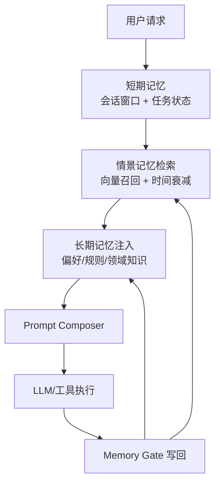

很多团队把 Agent 做成了“高配聊天框”：Demo 很顺，线上一跑就失忆。跨会话后忘约束、忘偏好、忘失败教训，最后靠人工兜底。

问题不在模型参数量，而在系统设计：**没有记忆架构，就没有稳定 Agent**。

在生产环境里，记忆不是“多存点聊天记录”，而是一套可治理的基础设施：

- 什么该记、什么不该记
- 记在哪里、多久失效
- 什么时候检索、怎么注入上下文
- 如何防止脏记忆污染决策

本文按“短期 → 情景 → 长期”三层拆解，并给出一套能直接进生产的落地方案。

---

## 一、先统一概念：Agent 的三层记忆

| 层次 | 作用 | 典型存储 | 生命周期 | 访问频率 |
|------|------|---------|---------|---------|
| **短期记忆（Working Memory）** | 保持当前任务连续性 | 会话上下文 + scratchpad | 分钟级 | 极高 |
| **情景记忆（Episodic Memory）** | 记录“发生过什么” | 向量库 + 时间索引 | 天/周级 | 高 |
| **长期记忆（Semantic Memory）** | 抽象稳定知识与偏好 | 结构化库（KV/图谱/文档） | 月/年级 | 中 |

可以把它理解成：

```text
当前脑内思路（短期） → 最近经历（情景） → 长期认知（长期）
```



多数系统失败的根因是“把三层混成一层”：所有东西都塞向量库，最后检索变慢、噪声变高、决策变差、成本失控。

---

## 二、短期记忆：保证 Agent 在当前任务里不失忆

短期记忆要解决的问题是：**让多轮任务始终围绕同一目标前进**。

### 1) 组成建议

短期记忆建议拆成三段，而不是一条无穷长对话：

1. **最近对话窗口**（最近 6~12 轮原文）
2. **任务状态**（JSON：目标、当前步骤、待办、失败次数）
3. **执行草稿 scratchpad**（模型中间推理摘要，避免全量暴露 CoT）

示例结构：

```json
{
  "goal": "完成用户的周报自动生成",
  "currentStep": "收集本周 PR 合并记录",
  "constraints": ["必须中文输出", "不得泄露内部仓库地址"],
  "attempts": 2,
  "lastError": "GitHub API rate limit",
  "nextAction": "切换 GraphQL 批量查询并加缓存"
}
```

### 2) 必做机制：上下文压缩

上下文窗口再大也会满。生产里应固定采用：

- 最近 N 轮保留原文（保证细节）
- 更早历史做层级摘要（保证连续性）
- 每轮结束后异步压缩，不阻塞主链路

一个实用经验：压缩不是“越短越好”，而是保留**决策状态**，如约束、未完成项、失败原因。

### 3) 失败保护

短期记忆最怕循环发散。建议直接上三个硬阈值：

- `max_steps_per_task`：单任务最大步骤
- `max_retries_per_action`：同动作最大重试次数
- `token_budget_per_task`：单任务 token 预算

超过阈值就切人工或降级，不要让 Agent 无限自旋。线上事故大多不是“模型答错”，而是“系统没刹车”。

---

## 三、情景记忆：让 Agent 记住“发生过的事”

情景记忆关注的是事件和上下文，例如：

- 用户上周要求“所有代码示例必须 TypeScript”
- 上次调用某内部 API 因权限 403 失败
- 某个项目在周一合并过重大改动

这层最适合“语义检索 + 时间信号”。

### 1) 数据模型建议

每条情景记忆至少包含：

```json
{
  "eventId": "evt_20260305_001",
  "userId": "u_123",
  "content": "用户偏好 PR 说明先结论后细节",
  "embedding": "...",
  "timestamp": "2026-03-05T10:12:00Z",
  "source": "chat|tool|system",
  "importance": 0.82,
  "ttlDays": 30
}
```

### 2) 检索排序不要只看相似度

线上效果更稳定的排序通常是：

\[
Score = \alpha \cdot Similarity + \beta \cdot Recency + \gamma \cdot Importance
\]

其中：

- `Similarity`：语义相关度
- `Recency`：时间衰减后的新鲜度
- `Importance`：由规则或模型打分（如“偏好/约束/失败经验”更高）

只看向量相似度会导致“很像但过期”的记忆被反复召回。

### 3) 写入策略：不是所有对话都入库

推荐做一层 **Memory Gate（记忆门控）**：

- 仅当命中以下类型才写入：偏好、约束、决策、错误复盘、高价值事实
- 闲聊、寒暄、一次性噪声直接丢弃
- 对敏感字段先脱敏后入库

这一步会直接决定系统上限。门控做不好，后面再好的检索和模型都救不回来。

---

## 四、长期记忆：沉淀稳定知识，而不是堆聊天记录

长期记忆不追求“完整历史”，追求“稳定认知”。

典型内容：

- 用户长期偏好（语言、输出格式、风险偏好）
- 团队约定（编码规范、发布流程、审批规则）
- 领域知识（术语表、架构决策、故障处理 playbook）

### 1) 结构化优先

长期记忆建议优先结构化：

```json
{
  "userId": "u_123",
  "preferences": {
    "language": "zh-CN",
    "codeStyle": "readability-first",
    "reportStyle": "executive-summary-first"
  },
  "lastUpdated": "2026-03-05T10:00:00Z"
}
```

因为长期记忆经常用于决策前注入，结构化可以减少歧义与 prompt 膨胀。

### 2) “写入长期记忆”必须走提炼流程

建议每天/每周运行 consolidation job：

1. 从情景记忆里聚类高频主题
2. 提炼为稳定规则或偏好
3. 置信度低的不入长期层，仅保留在情景层
4. 变更要留版本（可回滚）

这样长期记忆会越来越“干净”，而不是变成另一个垃圾桶。

### 3) 冲突处理

当新旧记忆冲突时，常见策略：

- 用户显式声明 > 历史推断
- 新近稳定行为 > 早期偏好
- 关键业务规则永远最高优先级

并记录冲突日志，便于审计和回溯。

---

## 五、记忆注入链路：什么时候“拿出来用”

只有存储还不够，关键是注入时机和注入顺序。推荐链路：

```text
用户请求
  → 任务分类器
  → 短期记忆加载（当前任务状态）
  → 情景检索（Top-K + rerank）
  → 长期偏好注入（结构化规则）
  → Prompt Composer 组装上下文
  → LLM 推理 / 工具执行
  → 记忆门控写回
```

### Prompt Composer 的两个原则

1. **按优先级拼接**：系统规则 > 长期偏好 > 当前任务状态 > 检索证据
2. **证据引用化**：把检索记忆以“证据片段”形式注入，避免模型把记忆当硬事实乱扩展

---

## 六、工程落地中的四个高频坑

### 坑 1：把“历史聊天”当记忆系统

结果是上下文越来越长、成本越来越高、质量反而下降。  
记忆系统的核心是“提炼与选择”，不是“囤积”。

### 坑 2：没有遗忘机制

没有 TTL、没有衰减、没有清理任务，系统几个月后几乎必坏。  
记忆系统要像缓存系统一样设计生命周期。

### 坑 3：跨用户污染

多租户场景下一定要做租户隔离键（`tenant_id + user_id`），并在检索层强约束。  
这是安全红线，不是优化项。

### 坑 4：缺少评估闭环

你必须持续回答三件事，否则系统会在“看起来可用”中慢慢退化：

- 召回的记忆是否相关？
- 注入后答案是否更好？
- 成本是否可接受？

没有评估，记忆系统一定会腐化，只是时间早晚问题。

---

## 七、可执行的最小可用方案（MVP）

如果你今天就要上线一个“有记忆”的 Agent，建议从这套最小方案开始：

1. **短期层**：最近 8 轮对话 + 任务状态 JSON
2. **情景层**：向量库（仅写入偏好/约束/失败经验），TTL 30 天
3. **长期层**：一个结构化用户偏好表（语言、风格、风险等级）
4. **检索排序**：相似度 + 时间衰减
5. **治理**：敏感信息脱敏、用户可删除记忆、每周清理过期数据

这套方案足够覆盖 80% 的业务场景，重点是：复杂度可控、可迭代、可回滚。

---

## 八、结语

Agent 的上限，不只取决于模型能力，更取决于它有没有“可治理记忆”。

短期记忆保证当下任务不跑偏，情景记忆让系统能复用经验，长期记忆让 Agent 形成稳定风格与决策框架。三层分离、按需检索、持续提炼，才是生产级记忆系统的正确打开方式。

下一步如果你想继续深入，可以接着做两件事：

- 给记忆系统加可观测性（命中率、注入收益、污染率）
- 给高风险记忆加审批流（尤其是会影响外部动作的偏好与规则）

一句话：**记忆系统不是增强项，而是生产级 Agent 的地基。**
