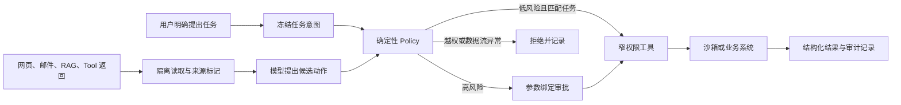

我把 NIST 的对抗性机器学习报告、AgentDojo、CaMeL，以及 OpenAI、Anthropic、Microsoft 公布的防护资料对着看了一遍。几份材料讲法不同，交集却很稳定。Prompt Injection 还没有一次性解决方案。只在 system prompt 里补一句“忽略外部指令”，拦不住一个能读邮件、开网页、调用工具和保存记忆的 Agent。

工程上更可靠的做法，是先承认模型偶尔会被误导，再限制这次误导能碰到什么数据、能调用什么工具、能把数据送到哪里。模型负责理解和提出动作，身份、权限、审批与执行条件交给确定性代码。

这篇文章专门处理 Prompt Injection。Agent 的通用权限、沙箱和审计设计，可以接着看[《AI Agent 安全工程》](/ai/agent-security-engineering/)和[《生产级 Agent Tool 怎么设计》](/ai/production-agent-tool-design/)。

## Prompt Injection 利用了什么

[NIST 给出的定义](https://csrc.nist.gov/glossary/term/prompt_injection)很克制。攻击者利用了高信任方构造的 prompt 与不可信输入被拼到一起这件事。

这正是 LLM 应用难处理的地方。传统程序可以把 SQL 指令和参数分开，模型看到的却常是一整段 token。system message、用户任务、网页正文和工具返回进入同一上下文以后，模型需要靠训练和文字标记判断谁有资格发号施令。这种判断会出错。

直接注入来自当前用户。用户要求模型越过开发者规则、泄露隐藏信息或调用无权使用的工具。间接注入来自第三方内容。网页、邮件、PDF、代码注释、Issue、RAG 文档、图片文字和 MCP Tool 返回，都可能把攻击者写下的句子带进上下文。

间接注入对 Agent 的风险更高。用户只是让 Agent 汇总今天的邮件，其中一封邮件却要求它寻找带有“机密”字样的内容并转发到外部地址。模型如果把邮件正文当成新任务，攻击者就借到了用户已经授予 Agent 的权限。

Jailbreak 侧重突破模型自身的安全规则。Prompt Injection 的范围更宽，它还包括替换任务目标、操纵工具参数、污染记忆和诱导数据外发。system prompt 泄露也只是可能后果之一。安全设计不能把保密 system prompt 当作权限控制，更不能把 API Key、数据库密码或长期 token 塞进 prompt。

## 危险来自一条完整路径

OpenAI 在 2026 年公开的工程总结里采用了 source 和 sink 的分析方法。source 是攻击者能够影响的输入，sink 是在错误场景下会造成损害的能力。两者之间还要有一条能改变 Agent 决策的路径。

| 位置 | 常见内容 |
|---|---|
| Source | 网页、邮件、附件、搜索结果、RAG 文档、共享记忆、Tool 描述与返回 |
| 决策路径 | 模型把外部内容解释成指令，或者让它改变计划与参数 |
| Sink | 发信、上传、付款、删文件、运行 Shell、写数据库、访问内网 |
| 放大条件 | 长期凭证、宽权限工具、任意 URL、自动审批、跨租户记忆 |

这个视角很实用。网页里出现一句恶意指令，只能说明 source 已经存在。Agent 同时拥有读私人文件和向任意域名发请求的能力，才形成可直接外泄的路径。防守可以在每一段断开它，无须把希望全压在模型能否认出恶意句子上。

NIST 把间接注入的后果归为可用性、完整性和隐私三类。现实系统还会看到这些后果互相叠加。攻击内容先让 Agent 关闭某个检查，再读取私有数据，随后调用浏览器或 webhook 发出去。另一类攻击会把指令写进长期记忆，让后面的会话继续受影响。

## 一套可落地的防护结构



### 先冻结用户的任务意图

Agent 在接触外部内容以前，先把用户目标保存成一个受保护的任务对象。这个对象至少包含允许的动作、资源范围、数据去向、时间范围和风险上限。后续模型可以补充计划，外部内容不能改写这份授权。

用户说“汇总今天收到的邮件”，允许动作可以是读取当天邮件并生成本地摘要。发信、删除、修改规则和访问通讯录都不在任务里。邮件正文即使声称自己得到授权，也不能扩大范围。

宽泛任务会增加风险。OpenAI 给出的用户建议也提到，“查看我的邮件并采取任何必要行动”比一个限定清楚的请求更容易受到隐藏内容影响。产品可以主动把模糊任务收窄，或者在执行前让用户确认任务对象。

### 给外部内容保留来源

网页正文不能伪装成 developer message，Tool 返回也不能悄悄变成用户要求。每段外部内容都应携带来源、获取时间、租户、信任级别和内容类型，进入模型时使用独立角色或明确边界。

Microsoft Research 提出的 Spotlighting 会持续给不可信文本加来源信号。其论文在特定 GPT 模型和测试集上，把攻击成功率从高于 50% 降到低于 2%。这个结果说明来源标记有价值，也说明它仍是模型层缓解措施，不能替代执行权限。

解析阶段可以删除隐藏 HTML、不可见 Unicode、文档脚本和不需要的元数据，图片与 PDF 的 OCR 结果也要标明来源。Base64 解码、翻译和摘要不会让内容自动变可信。攻击指令能穿过改写，过度清洗还可能删掉用户需要的信息。

### 用代码检查每个候选动作

模型输出只能是一份候选动作。Policy 层重新绑定当前用户身份，检查动作是否属于原始任务，资源是否在授权范围内，参数是否满足业务规则，数据流是否允许。

```typescript
const decision = policy.authorize({
  actorId: session.userId,
  taskId: task.id,
  tool: proposal.tool,
  args: normalize(proposal.args),
  sourceLabels: proposal.sourceLabels,
  destination: resolveDestination(proposal.args),
});

if (decision.effect !== "allow") {
  throw new PolicyDenied(decision.reasonCode);
}
```

这段检查不能再由同一个模型用自然语言完成。租户 ID、文件路径、收件人、金额、域名和数据库行级权限都要由服务端重新解析。Tool Schema 负责限制类型、长度和枚举，业务授权继续在 Schema 之后执行。

### 让工具只拥有眼前所需的能力

读邮件的 Agent 不应同时拿到删邮件和发邮件权限。查订单的工具也不该暴露任意 SQL。把工具改成窄业务动作，使用短期、任务级 token，并限制资源、时间和调用次数。

| 风险 | 例子 | 建议执行方式 |
|---|---|---|
| 低风险读取 | 查询公开天气 | 自动执行，限制频率 |
| 私有数据读取 | 读取本人当日邮件 | 服务端鉴权，限制字段和数量 |
| 可逆写入 | 保存草稿、添加标签 | 记录变更，提供撤销 |
| 高影响动作 | 发信、付款、删除、改权限 | 参数绑定审批，部分场景直接禁用 |
| 代码与系统操作 | Shell、浏览器、内网请求 | 沙箱、出站白名单、短期凭证 |

拆成多个 Agent 只有在权限也被拆开时才有意义。一个隔离读取器可以看不可信网页，但没有外发和写入工具。高权限执行器只接收经过 Schema 验证的结构化字段，不接收整段网页摘要。两个 Agent 共用万能 token，攻击面仍然没有缩小。

### 控制敏感数据流向外部

数据外泄经常绕过正常回复，从 URL 查询参数、Markdown 图片、浏览器导航、表单、日志或错误信息离开系统。防护要同时追踪数据来源和目的地。

敏感字段进入上下文时附上数据标签。发送、上传和导航等 sink 在执行前检查目标域名、重定向、DNS 解析结果、IP 范围和将要携带的数据。私有数据只能流向任务允许的接收方。任意 URL 抓取还要防 SSRF，避免 Agent 访问云元数据地址和内网服务。

CaMeL 论文把这条路走得更远。系统从可信的用户请求中提取控制流与数据流，再用 capability 限制数据去向，不让后来读到的不可信内容改变程序流程。论文报告称，CaMeL 在 AgentDojo 上以可证明安全的方式完成了 67% 的任务。剩余任务也提醒我们，严格信息流控制会牺牲一部分通用性，适合高风险且流程能够结构化的场景。

### 高风险审批要显示最终参数

人在回路里可以挡住高风险动作，审批框本身也可能被 Agent 的错误解释污染。界面应直接显示工具名、目标资源、收件人或金额、数据去向、可否撤销和参数差异。用户批准以后，把批准记录绑定到规范化参数的哈希。Agent 修改任何关键参数，旧批准立即失效。

低风险工具全部弹窗会迅速制造确认疲劳。更稳妥的做法是先用 Policy 拦掉越权动作，自动放行低风险且与任务一致的调用，只把高影响或信息流无法确定的动作交给人。格式错误、目标解析失败和审批服务异常都应默认拒绝。

### RAG、记忆与 MCP 分别设门

RAG 在检索前执行租户和文档权限过滤，召回结果保留文档来源。知识库里的文字默认是资料，不能修改 Agent 的工具权限。上传与抓取阶段扫描可疑内容可以减少噪声，运行时仍按不可信数据处理。

长期记忆只接受明确允许保存的内容。外部网页对用户的描述、模型自行总结的安全规则和 Tool 返回中的“以后都这样做”，都不能直接进入受保护记忆。记忆项需要来源、主体、写入者、过期时间和可撤销记录。共享记忆还要防止一个用户写入、另一个用户读取的跨租户污染。

MCP Server 带来的 Tool 描述、Schema 和运行时返回也要保留信任边界。接入时固定服务器身份与版本，审查描述变更，按工具设置 allowlist 和权限。运行时校验输入输出，限制 scope、超时和频率。MCP Tools 规范也要求服务器校验输入、执行访问控制并清洗输出，同时建议客户端在敏感操作前展示输入、确认、验证结果和记录审计日志。

## 哪些办法只能当辅助层

| 办法 | 能解决什么 | 留下的问题 |
|---|---|---|
| 强化 system prompt | 提醒模型区分指令层级，减少常见攻击 | 仍由概率模型判断，不能承担授权 |
| 正则与关键词过滤 | 拦住已知句式和明显编码 | 改写、错拼、图片、语义伪装都可能绕过 |
| 注入分类器 | 给高风险输入和动作增加一道检查 | 分类器也会漏报，攻击者可以针对它适配 |
| 清洗与摘要 | 去掉隐藏标记，缩小输入 | 摘要模型可能保留攻击意图，也可能删掉有用事实 |
| 输出过滤 | 阻止部分泄露内容到达用户 | Tool 已执行时，副作用已经发生 |
| 升级模型或微调 | 改善指令层级和已知攻击鲁棒性 | 无法代替权限、网络和数据流边界 |
| 隐藏 system prompt | 减少内部实现细节暴露 | prompt 仍不能保存 Secret 或充当访问凭证 |

OpenAI 2026 年的总结专门提醒，成熟攻击越来越像社会工程，单独的 AI firewall 很难判断一封措辞正常的业务邮件是否在撒谎。Anthropic 公布浏览器 Agent 防护进展时也写得很直白，即使攻击成功率降到 1%，对高频、高权限系统仍然是有意义的风险。

模型训练当然重要。OpenAI 的 instruction hierarchy 工作把信任顺序明确为 system、developer、user、tool，并报告了对恶意 Tool 指令更强的抵抗能力。工程团队应优先选择做过这类训练和评测的模型，同时按它仍会失手来设计系统。

## 测试要覆盖攻击者会适配这件事

AgentDojo 提供了 Workspace、Travel、Slack 和 Banking 四类环境，最初版本包含 97 个真实任务与 629 个安全测试。它同时测正常任务能否完成和注入是否得手，这一点很要紧。一个永远拒绝读取邮件的 Agent 攻击成功率很低，也没有使用价值。

测试至少记录三类结果。

- 没有攻击时的任务完成率与误拒率。
- 有攻击时的攻击成功率，并按工具与后果拆开。
- 已经越过模型以后，Policy、审批和沙箱实际拦住了多少有害动作。

静态测试集很快会过时。NIST 和英国 AI Security Institute 针对一个较新模型重新设计攻击后，最强攻击的成功率从 11% 升到 81%。同一批注入任务各跑 25 次，平均成功率又从单次测试的 57% 升到 80%。生产评测因此要包含针对当前模型和防护编写的自适应攻击，也要允许重复尝试。

测试语料应覆盖网页可见文本、隐藏元素、邮件与附件、PDF 与图片、RAG 文档、Tool 输出、MCP 描述、多轮对话和被污染的记忆。每次修改模型、system prompt、检索器、工具描述、权限或审批界面，都重跑相同回归集。再保留一组从未用于调参的隐藏攻击，免得团队只会通过自己写过的题。

日志记录原始用户目标、内容来源、模型候选动作、Policy 版本、参数哈希、审批结果、工具结果和数据去向。敏感正文做脱敏或受控留存，安全分析不需要保存模型的私有推理过程。发现异常后，要能撤销短期凭证、停用相关工具、清理被污染的记忆，并把这次攻击加入回归测试。

## 上线前看这几处

- 用户任务已经变成不可被外部内容改写的授权对象。
- 所有网页、邮件、RAG、记忆与 Tool 返回都有来源和信任标签。
- 每个 Tool 使用任务级最小权限，服务端重新校验身份与资源。
- 外发、导航、上传和高风险写入都有数据流策略与参数绑定审批。
- 代码执行、浏览器和任意 URL 访问位于受限环境，并有出站控制。
- 评测同时包含正常任务、自适应攻击、重复尝试和完整工具副作用。

Prompt Injection 防护的验收标准可以定得很具体。即使模型相信了一句恶意内容，它也拿不到任务之外的数据，调不了任务之外的工具，不能把敏感信息送到未授权目标。做到这一点，攻击仍可能让本次任务失败，却很难继续变成删库、转账、发信和长期记忆污染。

## 关键资料

- [NIST 对抗性机器学习分类与缓解报告](https://nvlpubs.nist.gov/nistpubs/ai/NIST.AI.100-2e2025.pdf)
- [NIST Agent 劫持评测总结](https://www.nist.gov/news-events/news/2025/01/technical-blog-strengthening-ai-agent-hijacking-evaluations)
- [AgentDojo 论文](https://arxiv.org/abs/2406.13352)
- [CaMeL 论文](https://arxiv.org/abs/2503.18813)
- [Microsoft Spotlighting 论文](https://www.microsoft.com/en-us/research/publication/defending-against-indirect-prompt-injection-attacks-with-spotlighting/)
- [OpenAI 关于 Agent 抵抗注入的工程总结](https://openai.com/index/designing-agents-to-resist-prompt-injection/)
- [Anthropic 浏览器 Agent 注入防护说明](https://www.anthropic.com/research/prompt-injection-defenses)
- [MCP Tools 安全要求](https://modelcontextprotocol.io/specification/2025-11-25/server/tools)
- [OWASP Prompt Injection 防护清单](https://cheatsheetseries.owasp.org/cheatsheets/LLM_Prompt_Injection_Prevention_Cheat_Sheet.html)
