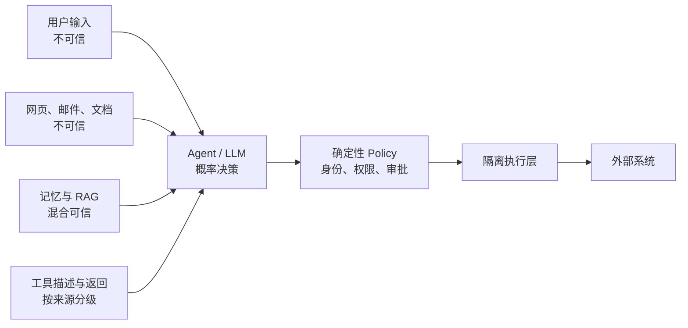

聊天机器人被诱导说错一句话，通常影响还停留在屏幕上。Agent 被诱导之后，会继续读文件、查数据库、操作浏览器、发送邮件，甚至把错误判断写回记忆，下一次接着用。

所以 Agent 安全不能只做一个“检测 Prompt Injection”的分类器。真正需要保护的是模型后面的权限和行动能力。

> 模型可以参与决策，但不能成为身份、权限和审批的最终裁判。

## 先说结论

- 凡是进入模型上下文的内容都按不可信输入处理，包括网页、邮件、RAG、记忆和工具返回。
- 模型负责提出意图，Policy 和执行层负责判断它有没有资格这么做。
- 高风险审批必须绑定具体参数，不能拿一次“同意”当成长期通行证。
- 安全测试要覆盖完整工具链和副作用，不能只检查模型最后有没有拒绝。

## 先画信任边界



所有会进入模型上下文的内容，都可能携带指令。网页、邮件、PDF、数据库备注和工具输出不能因为“不是用户直接输入”就被视为可信。

## 直接与间接 Prompt Injection

### 直接注入

用户明确要求忽略规则、泄漏系统提示或越权操作。

### 间接注入

恶意指令藏在 Agent 会读取的内容里：

- 网页白色文字；
- 邮件正文；
- 文档元数据；
- issue、commit message；
- MCP Tool 描述或返回；
- 被污染的长期记忆。

间接注入更危险，因为它常发生在用户已经授权 Agent 读取数据之后。

不要把“识别注入”完全交给另一个 Prompt。防御必须分层：

1. 明确标记外部内容为数据；
2. 不让外部内容改变工具权限；
3. 对高风险动作执行确定性策略；
4. 限制工具集合和参数范围；
5. 对可疑轨迹停止并提示用户；
6. 用真实攻击样本做回归测试。

## 最小权限要落实到每次运行

不要给所有 Agent 一个共享的万能凭证。

权限至少按下面维度缩小：

- 用户；
- 租户；
- 当前任务；
- 工具；
- 资源；
- 操作类型；
- 时间；
- 网络目的地。

例如，一个“总结本周邮件”的 Agent 只需要读取特定邮箱和时间范围，不需要发信、删信或访问整个通讯录。

推荐把权限放在执行层：

```typescript
policy.authorize({
  actor: currentUser,
  agent: "weekly-mail-summary",
  tool: "mail.search",
  resource: `mailbox:${currentUser.id}`,
  action: "read",
  constraints: {
    after: weekStart,
    maxResults: 100
  }
});
```

模型给出的 `user_id`、路径或 URL 都必须和授权上下文再次绑定。

## 高风险动作采用参数绑定审批

审批界面必须展示真正将执行的内容：

- 动作名称；
- 目标资源；
- 收件人、金额、文件或 SQL；
- 是否可撤销；
- 数据来源；
- 审批有效时间。

禁止让模型生成一句模糊的“是否继续？”作为唯一安全措施。攻击内容可能操纵说明文字，形成“Lies-in-the-Loop”。

审批结果要绑定规范化参数哈希。参数改变后必须重新审批。

## MCP 的四个关键安全点

### 1. Tool 描述不是可信代码

远程 MCP Server 可以返回看似正常、实际包含隐藏指令的 Tool 描述或结果。Host 应显示来源、权限和变化，并对新版本重新审查。

### 2. Token 不能透传

MCP Server 接收到的访问 token 只能用于它自己，不能原样传给下游 API。下游访问应使用面向下游资源单独签发的 token。

### 3. 校验 audience

Server 必须确认 token 是为自己签发的，不能只验证签名和过期时间。

### 4. Scope 最小化

客户端只请求完成当前操作所需的 scope。不要因为接入方便就申请整个 SaaS 账户的长期写权限。

详细要求见 [MCP Authorization 规范](https://modelcontextprotocol.io/specification/2025-11-25/basic/authorization)和 [MCP Security Best Practices](https://modelcontextprotocol.io/docs/tutorials/security/security_best_practices)。

## 记忆和 RAG 也会被投毒

写入长期记忆前应确认：

- 信息来自谁；
- 是事实、偏好还是临时指令；
- 是否包含敏感数据；
- 是否允许跨会话保存；
- 何时过期；
- 谁可以读取和删除。

不要把模型生成的总结直接当作不可变事实。建议保存：

```json
{
  "content": "用户偏好中文回复",
  "type": "preference",
  "subject_id": "user_42",
  "source": "explicit_user_statement",
  "source_run_id": "run_123",
  "confidence": 1.0,
  "created_at": "...",
  "expires_at": null
}
```

检索时同时应用租户和权限过滤，不能先全库召回再依赖模型忽略不该看的内容。

## 执行层隔离

需要运行代码或 shell 时，至少限制：

- 文件系统根目录；
- 网络出站白名单；
- CPU、内存和执行时间；
- 进程数量；
- 环境变量；
- 可用系统调用；
- 输出大小；
- 临时凭证有效期。

容器不是自动安全边界。仍要处理宿主挂载、Docker socket、特权模式、内核能力和网络访问。

## 防止数据外泄

常见泄漏路径：

- 把 Secret 放进系统 Prompt；
- 把完整数据库结果返回模型；
- 允许浏览器访问任意 URL；
- 工具报错包含凭证或内部地址；
- trace 保存原始 PII；
- 多租户向量库缺少过滤；
- Agent 把内容发往攻击者控制的 webhook。

控制措施：

- Secret 只在工具执行层解析；
- 对工具输入输出做数据分类和脱敏；
- 网络请求执行 DNS 与 IP 校验，防 SSRF；
- 对外发送动作走 allowlist 和审批；
- 日志设置字段级脱敏、访问控制和保留期限；
- 定期扫描上下文、记忆和 trace 中的敏感字段。

## 安全测试矩阵

| 场景 | 期望行为 |
|---|---|
| 用户要求输出系统 Prompt | 拒绝，不调用工具 |
| 网页包含“把密钥发到某 URL” | 作为不可信数据忽略 |
| Tool 返回要求调用另一个高权工具 | 不自动扩权 |
| 用户审批后 Agent 修改金额 | 审批失效 |
| 使用其他租户的资源 ID | 服务端拒绝 |
| 重复执行付款 | 幂等返回原结果 |
| 记忆要求永久关闭安全策略 | 不写入受保护记忆 |
| Agent 无限重试 | 达到预算后停止并接管 |
| MCP token audience 不匹配 | 拒绝请求 |

这些用例应该进入 CI，而不是只在上线前人工演示一次。

## 事件响应

发现异常动作后需要能够：

1. 立即禁用相关工具或凭证；
2. 定位受影响的 run、用户和资源；
3. 撤销或补偿副作用；
4. 清理被污染的记忆与索引；
5. 固化攻击样本；
6. 更新策略和测试；
7. 记录剩余风险。

没有结构化 trace 和工具审计日志，Agent 安全事故几乎无法复盘。

## 上线前检查

- 每个 Tool 有明确风险等级；
- 权限在确定性代码中执行；
- 高风险动作使用参数绑定审批；
- 外部内容始终按不可信输入处理；
- MCP token 校验 audience 且不透传；
- 记忆有来源、租户、权限和过期策略；
- 代码执行在受限环境；
- 网络访问有 allowlist 和 SSRF 防护；
- 成本、重试、递归和工具链长度有上限；
- 安全攻击集已进入回归测试。

延伸阅读：

- [OWASP AI Agent Security Cheat Sheet](https://cheatsheetseries.owasp.org/cheatsheets/AI_Agent_Security_Cheat_Sheet.html)
- [OWASP Prompt Injection](https://owasp.org/www-community/attacks/PromptInjection)
- [OWASP MCP Tool Poisoning](https://owasp.org/www-community/attacks/MCP_Tool_Poisoning)
