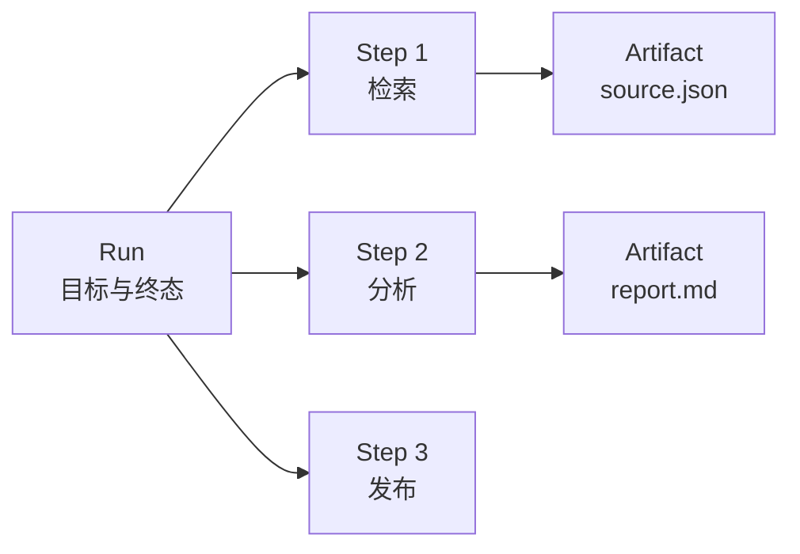

一个 Agent 连续跑十分钟，在演示里只是“多等一会儿”，到了生产里却会碰上进程重启、网络抖动、重复消息、用户取消和外部系统部分成功。很多长任务并不是模型推理失败，而是运行它的那条 `while` 循环没能活到最后。

只要任务可能跨越一次 HTTP 请求，就应该把它当成持久化任务，而不是一次更长的接口调用。

## 先说结论

- Run、Step 和 Artifact 分开保存，聊天记录不能代替任务状态。
- 每一步都要能重复执行，或者至少能确认上一次到底有没有成功。
- Checkpoint 要落到持久化存储；只存在进程内存里的“状态”不算恢复能力。
- `succeeded`、`failed`、`cancelled` 是终态，迟到消息不能把任务重新写活。

深度研究、批量文档、代码修改、多模态生成、跨系统审批和设备控制，看起来业务不同，底层面对的其实是同一组可靠性问题。

## 先把三种状态分开

### Run

一次用户目标的完整执行实例，例如“生成本周经营分析”。

### Step

Run 内一个可重试、可观察的步骤，例如“拉取订单”“生成图表”“发送审批”。

### Artifact

步骤产生的持久化成果，例如检索结果、JSON、文件、模型输出或报告。



不要把所有中间结果塞进一条任务记录或模型上下文。

## 一个可执行的状态机

Run 状态可以是：

```text
PENDING
RUNNING
WAITING_APPROVAL
WAITING_EXTERNAL
CANCEL_REQUESTED
SUCCEEDED
FAILED
CANCELLED
```

其中 `SUCCEEDED`、`FAILED`、`CANCELLED` 是终态。

允许的迁移必须由代码定义：

```text
PENDING → RUNNING
RUNNING → WAITING_APPROVAL
WAITING_APPROVAL → RUNNING
RUNNING → SUCCEEDED
RUNNING → FAILED
RUNNING → CANCEL_REQUESTED → CANCELLED
```

终态保护意味着：

- 已成功任务不能被迟到的失败消息改回 `FAILED`；
- 已取消任务不能因为 Worker 最后上报成功而复活；
- 每次迁移都使用版本号或条件更新；
- 终态后的重复消息只能被记录或忽略。

示例：

```sql
UPDATE agent_run
SET status = 'SUCCEEDED',
    version = version + 1,
    finished_at = now()
WHERE id = :run_id
  AND status = 'RUNNING'
  AND version = :expected_version;
```

受影响行数为 0 时，说明状态已变化，Worker 不能覆盖它。

## 队列只负责通知，数据库负责真相

消息可能：

- 重复投递；
- 延迟；
- 乱序；
- Worker 处理后尚未 ACK 就崩溃。

因此消息里只放稳定标识：

```json
{
  "run_id": "run_123",
  "step_id": "step_04",
  "attempt": 2
}
```

Worker 收到后从数据库读取最新状态，再决定是否执行。不要把队列消息当作唯一状态源。

## Lease 防止多个 Worker 同时执行

Worker 领取 Step 时写入租约：

```text
owner        = worker-7
lease_until  = now + 60s
attempt      = attempt + 1
```

执行过程中定期续约。Worker 崩溃后，租约到期，其他 Worker 才能接管。

领取必须是原子的：

```sql
UPDATE agent_step
SET owner = :worker,
    lease_until = :lease_until,
    attempt = attempt + 1
WHERE id = :step_id
  AND status IN ('PENDING', 'RUNNING')
  AND (lease_until IS NULL OR lease_until < now());
```

Lease 解决的是执行所有权，不自动解决副作用幂等。

## Checkpoint 应该保存什么

Checkpoint 不是完整聊天记录的定时复制，而是“恢复执行所需的最小确定状态”：

- 当前阶段；
- 已确认的输入；
- 已完成 Step；
- Artifact 引用；
- 工具调用结果；
- 剩余预算；
- 模型、Prompt 和工具版本；
- 下一步允许的动作；
- 待审批内容。

```json
{
  "run_id": "run_123",
  "checkpoint_version": 7,
  "phase": "analysis",
  "completed_steps": ["collect_sources", "deduplicate"],
  "artifacts": {
    "sources": "artifact://src_456"
  },
  "budget": {
    "remaining_tool_calls": 8,
    "remaining_cost_usd": 0.42
  }
}
```

恢复时从 Checkpoint 重新构建上下文，不依赖旧进程内对象。

## 不要承诺“Exactly Once”

在跨网络和外部系统时，严格的 exactly-once 通常不可得。更务实的目标是：

```text
至少一次投递
+ 幂等工具
+ 去重记录
+ 状态查询
+ 必要时补偿
= 业务上只产生一次可见结果
```

所有有副作用的 Step 都需要幂等键。超时后先查询真实状态，再决定是否重试。

## 重试要有边界

每个 Step 配置：

- 最大尝试次数；
- 总时间上限；
- 可重试错误集合；
- 退避策略；
- 单次模型和工具预算；
- 失败后的降级或人工接管。

```yaml
retry:
  max_attempts: 4
  initial_delay: 2s
  max_delay: 30s
  retryable:
    - RATE_LIMITED
    - DEPENDENCY_UNAVAILABLE
  non_retryable:
    - INVALID_ARGUMENT
    - PERMISSION_DENIED
```

不要让模型自行决定“再试一次”且没有上限。

## 取消是一条业务链路

用户点击取消后，不要只设置前端状态。

取消流程：

1. Run 进入 `CANCEL_REQUESTED`；
2. 不再调度新 Step；
3. 向正在运行的 Worker 发送取消信号；
4. 当前工具在安全点停止；
5. 释放 Lease 和临时资源；
6. 需要时执行补偿；
7. Run 进入 `CANCELLED`；
8. 保留已完成 Artifact 或按策略清理。

对无法中断的外部调用，应明确展示“取消请求已收到，等待当前操作结束”。

## 补偿不是数据库回滚

跨系统副作用无法放进一个本地事务。例如：

```text
创建文件成功
发送邮件成功
写审计记录失败
```

需要为可补偿动作设计反向操作：

- 创建草稿 → 删除草稿；
- 预占库存 → 释放库存；
- 临时上传 → 删除对象；
- 创建外部任务 → 请求取消。

有些动作无法补偿，例如邮件已经送达。这类动作应尽量放在流程末端，并使用审批和幂等保护。

## 人工接管

进入人工接管时保存：

- 为什么暂停；
- Agent 已完成什么；
- 失败发生在哪里；
- 建议的人类动作；
- 可继续执行的入口；
- 当前参数和证据。

人工处理后，不应该从头重跑，而是从明确 Checkpoint 继续。

## 可观测性

至少监控：

- Run 各状态数量和停留时间；
- Step 成功率、重试率和耗时；
- Lease 超时和重复领取；
- 终态冲突；
- 取消完成时间；
- 人工接管率；
- 每个 Run 的模型调用、工具调用和成本；
- 无进展循环。

对“RUNNING 超过阈值但没有新事件”的任务设置看门狗。

## 最小数据模型

```text
agent_run
  id, user_id, status, version
  goal, created_at, finished_at
  cancel_requested_at
  budget_json

agent_step
  id, run_id, type, status
  attempt, owner, lease_until
  input_artifact_id, output_artifact_id
  error_code, started_at, finished_at

agent_artifact
  id, run_id, kind, uri
  checksum, metadata_json

agent_event
  id, run_id, step_id, sequence
  type, payload_json, created_at
```

Event 用于审计和重放，Run/Step 表用于高效读取当前状态。

## 上线前故障演练

- 模型调用中途超时；
- Worker 在工具成功后、写结果前崩溃；
- 同一消息重复投递；
- 迟到消息试图覆盖终态；
- 审批等待数小时后恢复；
- 用户在步骤执行中取消；
- 外部系统返回未知状态；
- 数据库短暂不可用；
- Artifact 损坏或丢失；
- 预算耗尽。

如果系统只能在“所有组件都正常”时跑通，它还不是长任务 Runtime。
