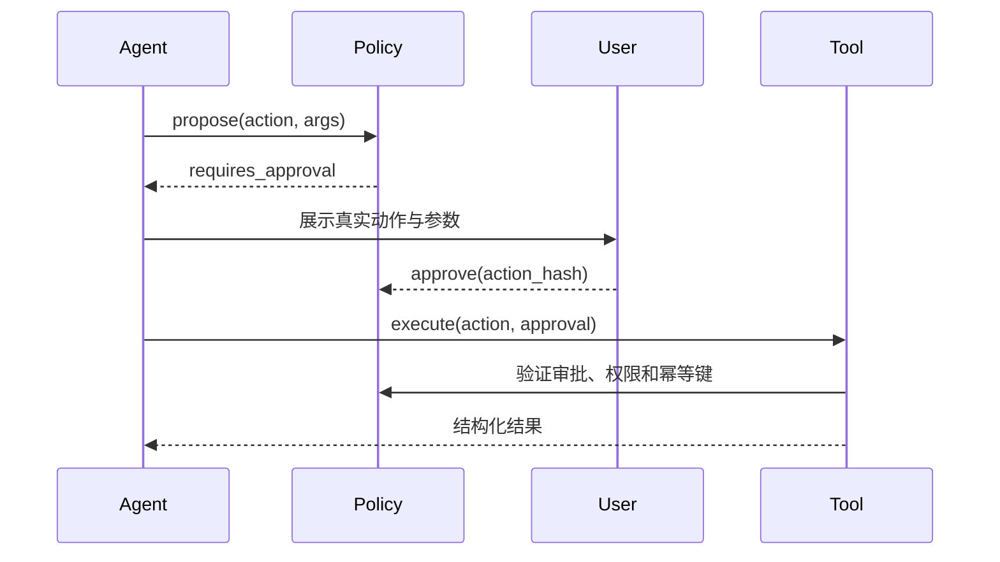

第一次把 Function Calling 跑通时很容易兴奋：模型选对了工具，参数也像模像样，返回结果还能继续推理。但把同一套东西接到退款、发信、数据库或设备控制上，问题立刻就变了。

Agent 最危险的能力不是生成错误文本，而是拿着错误参数调用一个真实系统。Tool 也不应该只是给 API 换一层 JSON Schema，它更像一条需要被权限、幂等和审计共同保护的业务通道。

## 先说结论

- Tool 应该表达业务意图，不应该把底层 API、SQL 或 Shell 原样暴露给模型。
- 身份、权限、审批和金额上限必须由确定性代码执行，Prompt 只能提醒，不能授权。
- 所有写操作都要先回答重复调用、超时未知和补偿恢复三个问题。
- 返回值只保留下一步决策需要的信息，完整原始结果放到可追溯的 Artifact。

生产级 Tool 的完整链路应该是：

```text
模型只能表达有限意图
  → 代码验证身份、权限和参数
  → 执行层控制副作用
  → 结果结构化返回
  → 全链路可审计、可重试、可恢复
```

## Tool 是受约束的业务接口

不要提供这样的工具：

```json
{
  "name": "run_sql",
  "parameters": {
    "sql": { "type": "string" }
  }
}
```

它把授权、SQL 安全、业务边界和资源控制全部交给了概率模型。

应该暴露业务意图：

```json
{
  "name": "list_customer_orders",
  "description": "读取当前已授权客户最近的订单，只读。",
  "parameters": {
    "type": "object",
    "properties": {
      "customer_id": {
        "type": "string",
        "description": "由当前会话授权上下文提供的客户 ID"
      },
      "limit": {
        "type": "integer",
        "minimum": 1,
        "maximum": 20
      }
    },
    "required": ["customer_id", "limit"],
    "additionalProperties": false
  }
}
```

即使 Schema 校验通过，服务端仍然必须确认 `customer_id` 属于当前授权主体。

## Schema 设计的七条规则

1. 工具只做一件事；
2. 名称使用明确动词和业务对象；
3. 枚举优于自由文本；
4. 数字、长度和数组大小都有上限；
5. 默认拒绝额外字段；
6. 区分 ID、展示名称和自然语言描述；
7. 描述包含适用条件，也包含禁止条件。

例如：

```json
{
  "name": "schedule_email",
  "description": "创建待审批的邮件草稿，不会直接发送。用户要求立即发送时也只能创建草稿。",
  "parameters": {
    "type": "object",
    "properties": {
      "recipient_id": { "type": "string" },
      "subject": { "type": "string", "maxLength": 120 },
      "body": { "type": "string", "maxLength": 10000 },
      "send_after": {
        "type": "string",
        "format": "date-time"
      }
    },
    "required": ["recipient_id", "subject", "body", "send_after"],
    "additionalProperties": false
  }
}
```

“只创建草稿”应该由工具实现保证，不能只写在 Prompt 里。

## 把工具按风险分级

| 等级 | 示例 | 默认策略 |
|---|---|---|
| R0 只读、低敏感 | 查询公开天气 | 自动执行 |
| R1 只读、含私有数据 | 查询本人订单 | 鉴权后执行，结果脱敏 |
| R2 可逆写入 | 创建草稿、添加标签 | 执行后明确回执，可撤销 |
| R3 高影响或难逆 | 发信、发布、删除、改权限 | 参数绑定审批 |
| R4 金融、法律、生产控制 | 付款、签约、生产 DDL | 强身份验证与人工确认，部分场景禁止 Agent 执行 |

审批不能是一个独立的布尔值：

```json
{ "approved": true }
```

它必须绑定具体动作、参数、用户和有效期：

```json
{
  "approval_id": "apr_123",
  "actor_id": "user_42",
  "tool": "send_email",
  "args_hash": "sha256:...",
  "expires_at": "2026-07-31T12:00:00Z"
}
```

如果 Agent 在审批后修改收件人或金额，旧审批必须失效。

## 幂等：避免模型重试制造重复副作用

模型、网络和队列都有可能重试。创建类 Tool 应接收或生成稳定的幂等键：

```http
POST /refunds
Idempotency-Key: run_123:step_4
```

服务端保存：

```text
幂等键 → 请求参数哈希 → 执行状态 → 最终结果
```

同一个幂等键再次到达时：

- 参数相同：返回第一次结果；
- 参数不同：拒绝；
- 第一次仍在执行：返回进行中；
- 第一次失败且允许重试：按明确策略重试。

不要用自然语言内容直接充当幂等键。

## 超时、重试和错误分类

不是所有错误都应该重试。

| 类型 | 示例 | 策略 |
|---|---|---|
| 参数错误 | 缺少字段、枚举非法 | 不重试，让模型修正一次 |
| 权限错误 | 403、资源不属于用户 | 不重试，不向模型泄漏细节 |
| 限流 | 429 | 读取 `Retry-After`，指数退避 |
| 短暂依赖失败 | 502、连接重置 | 有上限重试 |
| 业务冲突 | 已退款、版本冲突 | 重新读取状态后决策 |
| 未知执行结果 | 请求超时但服务端可能已成功 | 先按幂等键查询，不要盲目重发 |

建议统一错误结构：

```json
{
  "ok": false,
  "error": {
    "code": "REFUND_ALREADY_EXISTS",
    "category": "business_conflict",
    "retryable": false,
    "safe_message": "该订单已有退款申请",
    "correlation_id": "corr_456"
  }
}
```

不要把数据库堆栈、内部 URL 或密钥返回给模型。

## 输出也需要 Schema

工具返回无限长文本会污染上下文。输出应包含稳定字段：

```json
{
  "ok": true,
  "data": {
    "orders": [],
    "next_cursor": null
  },
  "meta": {
    "truncated": false,
    "source": "orders-service",
    "observed_at": "2026-07-31T10:00:00Z"
  }
}
```

对长列表使用分页，对文档使用摘要加引用，对二进制文件返回受控句柄或 URL，不要直接塞进上下文。

## 决策和执行分离

高风险工具使用两阶段流程：



Agent 负责提出计划，不负责给自己授权。

## 审计记录

每次调用至少记录：

- `run_id`、`step_id`；
- 用户和 Agent 身份；
- 工具版本；
- 参数哈希和脱敏参数；
- 权限策略版本；
- 审批 ID；
- 开始、结束和耗时；
- 幂等键；
- 结果类别；
- 外部系统 correlation ID。

日志中不要记录完整 token、密码、Cookie、原始身份证号或不必要的用户内容。

## 发布前测试

每个 Tool 至少覆盖：

- 合法最小参数；
- 边界值；
- 多余字段；
- 越权 ID；
- 重复请求；
- 超时后状态未知；
- 429 和 5xx；
- 输出过长；
- 审批过期；
- 审批参数被修改；
- Prompt Injection 诱导调用；
- 取消和补偿。

## 最终检查

在把一个工具交给模型之前，问六个问题：

1. 模型能否表达超出业务边界的参数？
2. 调用两次会不会产生重复副作用？
3. 超时后能否确认实际状态？
4. 权限是在服务端验证，还是只写在 Prompt？
5. 输出是否可能泄密或撑爆上下文？
6. 出事后能否通过日志还原谁在何时执行了什么？

如果其中一个问题没有答案，这个 Tool 还没有达到生产级。
