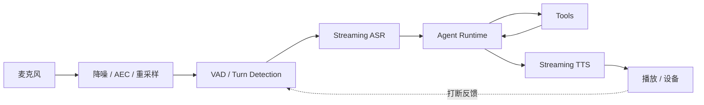

语音 Agent 不是给聊天接口前后各接一个 ASR 和 TTS。用户对“像不像在对话”的判断，主要来自：

- 多快开始回应；
- 会不会抢话；
- 能不能被打断；
- 弱网时是否持续可用；
- 工具执行期间是否给出正确反馈；
- 状态是否和屏幕、设备保持一致。

## 端到端链路



每一段都应独立记录时间戳，否则只能知道“很慢”，不知道慢在哪里。

## 延迟预算

一次自然回应可以拆成：

| 阶段 | 指标 |
|---|---|
| 用户停顿到 turn 结束 | endpointing latency |
| 最后一帧到 ASR final | ASR finalize latency |
| Agent 收到文本到首个输出 token | model time-to-first-token |
| 工具调用 | tool latency |
| 文本到首个音频包 | TTS time-to-first-audio |
| 网络和缓冲 | transport / jitter buffer |

真正影响体感的是：

```text
用户结束说话
  → 第一段可听回复到达
```

不要只记录模型总耗时。

## VAD 和 Turn Detection

VAD 判断“有没有人在说话”，Turn Detection 判断“一轮话是否说完”。两者不能完全等同。

停顿过短：

- 用户思考时被抢话；
- 中文逗号停顿被当作结束；
- ASR 只得到半句话。

停顿过长：

- Agent 迟迟不回应；
- 用户以为系统没听见；
- 对话节奏拖沓。

推荐组合：

- 音频 VAD 提供低延迟信号；
- ASR partial 提供语言信息；
- 标点、语义完整性和最大等待时间辅助判断；
- 用户按键或显式结束作为可靠兜底。

## ASR：Partial 和 Final 的职责不同

Partial transcript 适合：

- 实时字幕；
- 预热意图分类；
- 提前准备可能需要的上下文；
- 判断用户是否仍在说话。

不要基于每个 partial 直接执行有副作用工具。识别结果会反复修正：

```text
“帮我取消…”
“帮我取消明天的提醒”
“不要，改成后天”
```

高风险动作必须等待稳定 turn、参数确认和必要审批。

## Barge-in：打断是完整状态迁移

用户在 TTS 播放时重新说话，系统需要同时：

1. 检测用户语音；
2. 立即降低或停止本地播放；
3. 取消尚未播放的音频缓冲；
4. 通知服务端取消当前 TTS；
5. 尽可能取消仍在生成的模型输出；
6. 标记实际已经播放到哪里；
7. 把新一轮用户语音送入 ASR。

```text
SPEAKING → INTERRUPTING → LISTENING
```

只停止扬声器是不够的。服务端如果继续生成和计费，下一轮上下文还可能误以为整段话已经说给用户听。

## 对话状态机

建议显式建模：

```text
IDLE
CONNECTING
LISTENING
THINKING
CALLING_TOOL
SPEAKING
INTERRUPTING
RECONNECTING
ERROR
```

UI、音频层和服务端都围绕同一组状态和 session/version 更新。

迟到事件必须携带 turn ID：

```json
{
  "session_id": "voice_123",
  "turn_id": 18,
  "event": "tts.audio.delta",
  "sequence": 42
}
```

如果用户已经进入 turn 19，turn 18 的迟到音频不能继续播放。

## 工具调用期间说什么

工具超过一两秒时，完全沉默会让用户困惑。但也不要先说“已经完成”。

使用与实际状态一致的反馈：

```text
“我正在查询订单状态。”
“这个操作需要你的确认。”
“查询暂时失败，我还没有修改任何内容。”
```

工具结果返回后再给完成回执。

## 协议怎么选

| 链路 | 推荐 |
|---|---|
| 浏览器或移动端实时双向音频 | WebRTC |
| 服务端文本/事件流 | WebSocket 或 SSE |
| 设备控制与轻量状态同步 | MQTT |
| 内部服务调用 | HTTP/gRPC |

WebRTC 提供实时媒体、拥塞控制和抖动处理，但不替代业务状态机。MQTT 适合设备消息，但命令必须包含目标设备标识、版本、过期时间和幂等 ID。

音频媒体流与业务控制流可以分离：

```text
WebRTC：音频
WebSocket：turn、字幕、工具和 UI 事件
MQTT：设备动作与状态
```

## 弱网和重连

需要区分：

- 暂时抖动；
- 媒体断开；
- 控制通道断开；
- ASR/TTS Provider 断开；
- App 进入后台；
- 设备切换网络。

重连时不要直接创建新会话并丢弃旧状态。使用：

- 稳定 `session_id`；
- 单调递增 `turn_id` 和 `sequence`；
- 已确认事件游标；
- 短期音频缓冲；
- 服务端 session TTL；
- 明确的 resume / restart 响应。

如果无法安全续传，应告诉用户“连接已恢复，请重新说刚才一句”，不要偷偷拼接可能缺帧的音频。

## 音频工程细节

至少明确：

- 采样率和声道数；
- PCM、Opus 等编码；
- 帧长；
- 自动增益、降噪和回声消除；
- 浏览器是否处于安全上下文；
- 麦克风权限；
- 蓝牙设备切换；
- 扬声器回采对 VAD 的影响。

浏览器中首先检查：

```javascript
if (!window.isSecureContext) {
  throw new Error("麦克风需要 HTTPS 或 localhost 安全上下文");
}

const stream = await navigator.mediaDevices.getUserMedia({
  audio: {
    echoCancellation: true,
    noiseSuppression: true,
    autoGainControl: true
  }
});
```

模型或 WebSocket 之前就拿不到麦克风时，不要继续排查 ASR。

## 隐私和安全

- 麦克风开启状态始终可见；
- 录音、转写和长期保存分别征得同意；
- 原始音频设置最短保留期限；
- transcript 和 trace 做脱敏；
- 高风险动作需要视觉或语音确认；
- 不仅依靠声纹进行身份认证；
- 外部音频内容按不可信输入处理；
- 工具权限与文本 Agent 一样遵循最小化。

## 验收指标

至少覆盖：

- 首次连接成功率；
- 首音频延迟 P50/P95；
- ASR 字错率及业务实体准确率；
- turn 提前结束和过晚结束比例；
- 打断生效时间；
- 被打断后旧音频泄漏时长；
- 工具成功率与错误回执准确率；
- 重连恢复率；
- 单分钟成本；
- 不同设备、网络和噪声环境。

真实验收应使用：

- 安静室内；
- 背景电视或多人说话；
- 扬声器外放；
- 蓝牙耳机；
- 弱网和网络切换；
- 快速插话；
- 长停顿；
- 方言、数字、英文缩写和业务专有词。

## 最小落地顺序

1. 单设备半双工，先打通 ASR → Agent → TTS；
2. 增加可观测时间戳和 turn ID；
3. 实现本地与服务端一致的打断；
4. 接入工具和状态反馈；
5. 增加重连和 session 恢复；
6. 做噪声、弱网和多设备测试；
7. 最后再优化情绪、音色和更复杂的全双工体验。

语音 Agent 的“真人感”首先来自节奏、状态一致性和可打断性，而不是更夸张的角色 Prompt。
