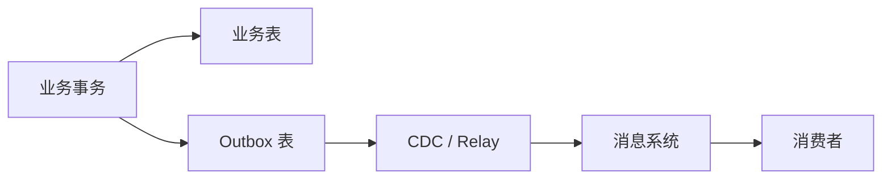

事件驱动架构在架构图上很漂亮：服务发布事件，下游各自消费，系统自然解耦。真正上线后，麻烦通常从四个问题开始：数据库已经提交但消息没发出去，消息重复了，顺序乱了，以及消费失败后没人知道该怎么恢复。

## 先说结论

- 业务表与 Outbox 记录写在同一个本地事务里，避免数据库和消息系统双写。
- 消息系统通常只能提供至少一次交付，消费者必须按业务语义实现幂等。
- 顺序不是全局开关，要先明确“哪个业务实体的哪些事件必须有序”。
- 能重放才算可恢复；重放前必须解决版本兼容和副作用重复执行。

## 双写为什么一定会留下窗口

下面两种顺序都存在故障窗口：

```text
先写数据库 → 再发消息
先发消息   → 再写数据库
```

第一种可能数据成功、消息丢失；第二种可能消息成功、数据库回滚。分布式事务可以协调，但往往带来更重的耦合与运行成本。

## Outbox 把两次写入放进一个本地事务

业务操作同时写业务表和 Outbox 表：

```sql
begin;

update orders
set status = 'PAID'
where id = :order_id;

insert into outbox_event (
  id, aggregate_type, aggregate_id,
  event_type, payload, created_at
) values (
  :event_id, 'order', :order_id,
  'OrderPaid', :payload, now()
);

commit;
```



Relay 可以轮询，也可以使用 CDC。Debezium Outbox Event Router 会捕获 Outbox 表变更并把聚合类型、聚合 ID 和 payload 路由成消息。

## 事件结构要支持追踪和演进

建议至少包含：

```json
{
  "eventId": "01J...",
  "eventType": "OrderPaid",
  "eventVersion": 2,
  "aggregateId": "order-123",
  "occurredAt": "2026-01-23T10:20:30Z",
  "traceId": "trace-456",
  "payload": {
    "orderId": "order-123",
    "amount": 19900,
    "currency": "CNY"
  }
}
```

`eventId` 用于幂等，`aggregateId` 用于分区与顺序，`eventVersion` 用于兼容演进。

## 消费者幂等不能只靠消息 ID

最小做法是在同一数据库事务里记录处理结果与已消费事件：

```sql
begin;

insert into consumed_event(event_id, consumer)
values (:event_id, 'invoice-service')
on conflict do nothing;

-- 只有 insert 成功时才执行业务更新

commit;
```

还要考虑业务幂等：

- “把状态设置为 PAID”天然比“余额加 100”更容易幂等；
- 外部支付、发信等副作用需要独立幂等键；
- 超时后状态未知时，先查询外部系统，不要直接重试。

## 顺序要缩小到业务实体

全局顺序昂贵且吞吐低。常见做法是用 `aggregateId` 作为分区键，让同一订单、账户或设备的事件进入同一分区。

即使分区内有序，消费者仍要处理：

- 旧版本事件迟到；
- 重放事件与实时事件交错；
- 单个坏消息阻塞整个分区。

可以在聚合上维护 `sequence` 或业务版本，拒绝倒退更新。

## 重试、死信和重放

失败大致分三类：

| 类型 | 处理方式 |
|---|---|
| 临时依赖故障 | 指数退避并限制次数 |
| 输入永久无效 | 进入隔离队列并告警 |
| 代码缺陷或版本不兼容 | 停止相关消费，修复后重放 |

死信队列不是消息坟场。每条隔离消息都应该保留失败原因、消费者版本、重试次数和恢复负责人。

## Schema 演进

- 优先新增可选字段；
- 不改变已有字段语义；
- 消费者先兼容新旧版本，再升级生产者；
- 事件保存业务事实，不保存某个消费者的页面模型；
- 长期保留的事件需要 Schema Registry 或等价契约检查。

## 上线前检查

- 业务写入与 Outbox 在同一事务；
- Relay 有延迟、积压和失败告警；
- 消费者有幂等记录；
- 分区键与业务顺序范围一致；
- 外部副作用有幂等键；
- 事件有版本和 Trace ID；
- 重放不会重复发信、扣款或推送；
- 死信有处理流程；
- 关键事件有端到端对账。

事件驱动不是“把同步调用换成消息”。它真正增加的是时间上的解耦，而你必须用幂等、可观测和重放能力把这段时间重新管起来。

延伸阅读：

- [Debezium：Outbox Event Router](https://debezium.io/documentation/reference/stable/transformations/outbox-event-router.html)
