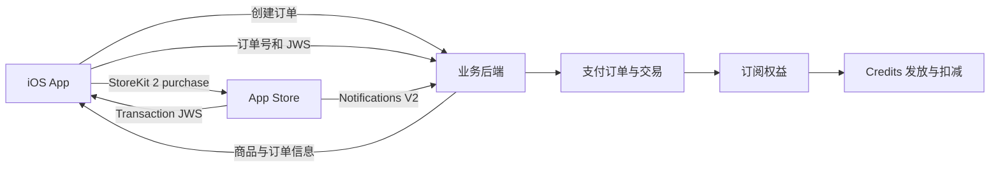
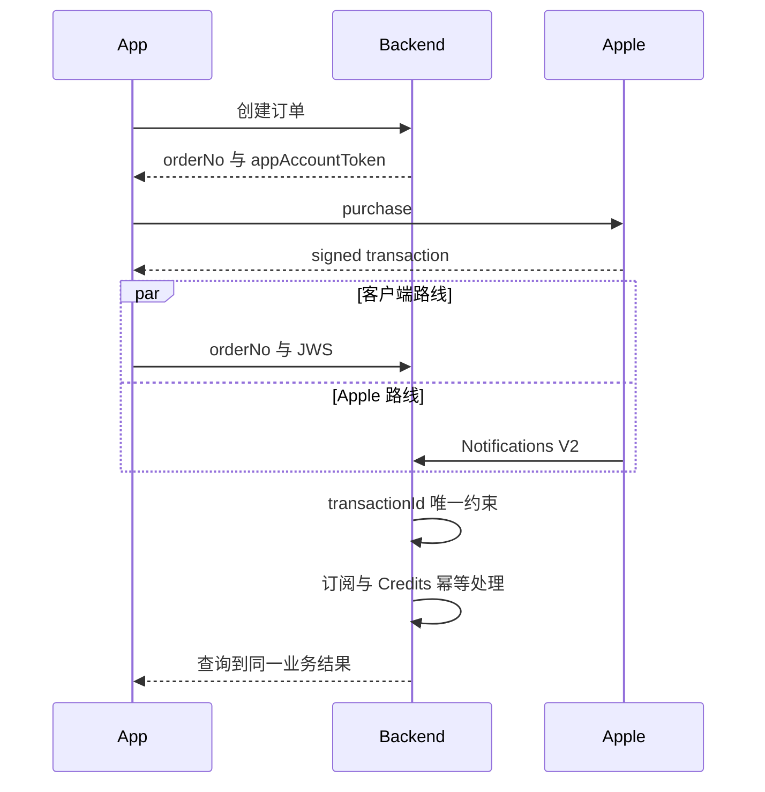

这篇文章可以直接当成一份开发输入。目标很明确，客户端和后端照着同一套约定实现，最后得到一套能处理真实购买、自动续费、套餐切换、退款、弱网、重复通知、多设备登录和 Credits 实时扣减的生产系统。

我重新核对了 Apple 当前的 StoreKit 2、App Store Server API、App Store Server Notifications V2、Sandbox、TestFlight 和审核文档。本文只讨论自动续期订阅，客户端以 Swift 和 StoreKit 2 为例，后端示例采用通用 REST、关系数据库和异步任务。语言可以替换，状态和约束不要随意删。

## 系统要保存的四类事实

一套订阅系统同时处理四件事。

| 事实 | 负责方 | 系统里的记录 |
| --- | --- | --- |
| 用户想购买哪个商品 | 业务后端 | 支付订单 |
| Apple 是否产生有效交易 | Apple | Apple 交易 |
| 用户当前有没有订阅权益 | 业务后端根据 Apple 状态计算 | 用户订阅 |
| 业务已经发了多少 Credits | Credits 服务 | 发放记录、余额和每日账单 |

支付订单不能证明 Apple 已扣款。Apple 交易也不能单独证明当前仍有权益，一笔去年到期的交易仍然可以通过签名验证。当前权益要结合交易到期时间、撤销信息、宽限期和最新续费状态计算。

客户端负责展示商品、发起购买、监听交易、上传签名和刷新界面。后端负责创建订单、验证 Apple 签名、接收服务端通知、维护订阅、发放 Credits、执行扣减和提供查询接口。后端保存最终业务状态，客户端不直接修改订阅或余额。



## 开发前先定清商品和权益

Apple 的商品结构会直接影响升级、降级和计费时间。App Store Connect 中，每个自动续期订阅都属于一个订阅组。同一订阅组内，用户同一时间只能拥有一个订阅。大多数 App 使用一个订阅组就够了。Apple 也把单订阅组作为多数应用的推荐做法，具体说明见 [自动续期订阅说明](https://developer.apple.com/app-store/subscriptions/)。

一个常见商品表可以这样设计。

| planCode | Apple Product ID | 等级 | 周期 | 每个权益周期发放 |
| --- | --- | --- | --- | --- |
| starter | com.example.starter.monthly | starter | 月 | 1000 Credits |
| pro | com.example.pro.monthly | pro | 月 | 3000 Credits |
| pro | com.example.pro.yearly | pro | 年 | 每月 3000 Credits |

Product ID 保存后不能修改。建议只用小写字母、数字和点，名字表达套餐与周期，环境差异放在 App 或 Bundle ID 上，不要让客户端临时拼接 Product ID。

订阅组内的等级由 Apple 决定套餐切换方式。等级 1 提供最多权益，数字越大，等级越低。Apple 当前规则如下。

| 用户操作 | Apple 生效时间 | 后端动作 |
| --- | --- | --- |
| 升到更高等级 | 立即生效，开启新计费周期 | 处理新交易，立即切套餐并发放升级权益 |
| 降到更低等级 | 下次续费生效 | 保持当前套餐，记录待生效商品 |
| 同等级同周期切换 | 立即生效 | 处理新交易并切换商品 |
| 同等级不同周期切换 | 下次续费生效 | 保持当前套餐，记录待生效商品 |

规则来自 Apple 的 [订阅等级说明](https://developer.apple.com/help/app-store-connect/reference/in-app-purchases-and-subscriptions/auto-renewable-subscription-information) 和 [订阅计费说明](https://developer.apple.com/documentation/storekit/handling-subscriptions-billing)。套餐等级一旦配错，后端无法把本应下月生效的降级强行改成立即生效。商品上线前要让产品、客户端、后端和 App Store Connect 操作人共同确认等级顺序。

Credits 也要先定成可执行规则。下面是一套完整的参考合同。

| 事项 | 规则 |
| --- | --- |
| 首次购买 | Apple 交易验证通过后立即发放 |
| 月付续费 | 每笔续费交易验证通过后发放一次 |
| 年付按月发放 | 首笔立即发放，后续按订阅锚点在 UTC 日期发放 |
| 升级 | 新套餐立即生效，按产品约定发整份或补差额 |
| 关闭自动续费 | 当前有效期内仍有权益，不清余额 |
| 订阅真正到期 | 下一次 UTC 零点清理订阅额度 |
| 宽限期 | 继续提供订阅服务，不重复发放 |
| 退款 | 记录退款，按产品规则撤销剩余额度，已消费部分不扣成负数 |
| 欢迎额度 | 与订阅额度分开，由后台配置并按用户幂等发放 |

Apple 审核规则写明，通过内购购买的 Credits 或游戏货币不能过期。若产品需要每月重置额度，界面和数据模型应把它定义为订阅期内的使用配额，别把它宣传成永久购买的余额。永久付费 Credits 和订阅配额应放进不同账户池。相关要求见 [App Review Guidelines 3.1.1](https://developer.apple.com/app-store/review/guidelines/)。

## App Store Connect 要完成的配置

代码开工前可以用 Xcode 的本地 StoreKit 配置文件。进入真实 Sandbox 联调以前，App Store Connect 至少要完成下面这些工作。

1. Account Holder 接受 Paid Apps Agreement，并补齐税务和收款信息。
2. 创建 App 记录，确认 Bundle ID 与客户端签名一致。
3. 创建订阅组，再创建每个自动续期商品。
4. 配置周期、等级、价格、销售地区和本地化名称。
5. 上传审核截图，补充审核备注和测试账号。
6. 在 Users and Access 的 Integrations 页面创建 In-App Purchase Key。
7. 配置 Production 与 Sandbox 的 App Store Server Notifications V2 地址。
8. 创建 Sandbox Apple Account，并配置需要测试的续费速度与异常场景。
9. 若产品决定支持 Billing Grace Period，先在 Sandbox 打开并验证，再打开 Production。

私钥只会提供一次下载机会。它只能放在服务器密钥目录或密钥管理服务，不能进入 Git、客户端包、前端环境变量和日志。Apple 当前的创建位置与权限要求见 [In-App Purchase Key 文档](https://developer.apple.com/documentation/appstoreserverapi/creating-api-keys-to-authorize-api-requests)。

后端通常需要这些配置。

```text
APPLE_IAP_ISSUER_ID
APPLE_IAP_KEY_ID
APPLE_IAP_PRIVATE_KEY_PATH
APPLE_IAP_BUNDLE_ID
APPLE_IAP_APPLE_ID
APPLE_IAP_ENV
APPLE_IAP_NOTIFICATION_PRODUCTION_URL
APPLE_IAP_NOTIFICATION_SANDBOX_URL
```

Production 验证器需要 Bundle ID、App Apple ID 和 Production 环境。Sandbox 没有 <code>appAppleId</code> 字段，验证器不能强行要求它。Production 和 Sandbox 使用独立入口与独立验证器，收到数据后仍要核对签名中的 <code>environment</code>。

第一组自动续期订阅必须和一个新 App 版本一起提交审核。后续同类型商品可以单独提交。Apple 的 [订阅提交流程](https://developer.apple.com/help/app-store-connect/manage-submissions-to-app-review/submit-an-in-app-purchase/) 列出了当前要求。

## 最小生产数据模型

支付与 Credits 不适合塞进一张用户表。下面这些表已经能支持初次购买、续费、套餐切换、通知重放、Credits 发放和每日账单。

### 商品表

<code>payment_product</code> 保存业务套餐和渠道商品的映射。

| 字段 | 用途 |
| --- | --- |
| id | 主键 |
| channel | APPLE，后续可增加 GOOGLE |
| app_key | 对应 Bundle ID 或业务 App |
| product_id | Apple Product ID |
| subscription_group_id | Apple 订阅组 |
| plan_code | 业务套餐代码 |
| plan_level | 业务展示等级 |
| duration | MONTH 或 YEAR |
| credits_amount | 每个业务权益周期额度 |
| enabled | 是否允许新购买 |
| version | 乐观锁 |
| deleted | 逻辑删除 |

数据库对 <code>channel, app_key, product_id</code> 建唯一约束。客户端只能购买后端返回且 <code>enabled</code> 为真的商品。

### 支付订单表

<code>payment_order</code> 保存业务购买意图和每次 Apple 扣款结果。

| 字段 | 用途 |
| --- | --- |
| order_no | 后端生成的订单号 |
| user_id | 业务用户 |
| channel | 支付渠道 |
| product_id | 目标商品 |
| request_id | 客户端本次点击的幂等键 |
| order_type | INITIAL、RENEWAL、CHANGE、RECOVERY |
| status | CREATED、PENDING、VERIFIED、FULFILLED、CANCELLED、FAILED |
| transaction_id | 对应 Apple 单笔交易 |
| original_transaction_id | 订阅链标识 |
| requested_environment | 创建订单时的预期环境，只用于诊断 |
| environment | Apple 验证后写入的权威环境 |
| amount_milliunits | Apple 返回的价格，仅用于运营展示 |
| currency | ISO 4217 货币代码 |
| failure_code | 失败分类 |
| created_at | UTC 创建时间 |

唯一约束至少包括 <code>order_no</code>、<code>user_id, request_id</code> 和非空的 <code>channel, environment, transaction_id</code>。初次购买订单由客户端请求创建。自动续费没有客户端点击，后端在验证续费交易后创建 <code>RENEWAL</code> 订单。客户端或订单中的预期环境不能授权 Sandbox，最终环境只取 Apple 签名。

Apple 提醒开发者不要用交易 JWS 中的价格与币种做财务确认，正式财务数据要以 App Store Connect 报表为准。JWS 中的金额适合客服查询和订单展示，详见 [JWSTransactionDecodedPayload](https://developer.apple.com/documentation/appstoreserverapi/jwstransactiondecodedpayload)。

### Apple 交易表

<code>apple_transaction</code> 每个环境中的 <code>transactionId</code> 只保存一行。

| 字段 | 用途 |
| --- | --- |
| transaction_id | Apple 单笔交易唯一标识 |
| original_transaction_id | 整条订阅链标识 |
| web_order_line_item_id | 跨设备续费事件标识 |
| app_account_token | 业务用户映射 UUID |
| product_id | 实际购买商品 |
| transaction_reason | PURCHASE 或 RENEWAL |
| purchase_date | Apple 购买时间 |
| original_purchase_date | 首次购买时间 |
| expires_date | 本交易权益到期时间 |
| revocation_date | 退款或撤销时间 |
| revocation_type | 全额、按比例退款或家庭共享撤销 |
| ownership_type | PURCHASED 或 FAMILY_SHARED |
| environment | Apple 环境 |
| signed_date | Apple 签名时间 |
| payload_hash | 原始 JWS 摘要 |

<code>environment, transaction_id</code> 是交易幂等键。<code>original_transaction_id</code> 是订阅链标识，不能拿它防止每月续费发放，因为同一条链的每次续费都应该产生新交易。

### Apple 通知表

<code>apple_notification_event</code> 保存每次 Notifications V2 投递。

| 字段 | 用途 |
| --- | --- |
| notification_uuid | Apple 通知唯一标识 |
| notification_type | 通知类型 |
| subtype | 通知子类型 |
| environment | Apple 环境 |
| signed_date | Apple 签名时间 |
| transaction_id | 解析出的交易 |
| original_transaction_id | 订阅链 |
| process_status | RECEIVED、PROCESSING、RETRY_WAIT、SUCCEEDED、DEAD |
| retry_count | 内部处理次数 |
| next_retry_at | 下次重试时间 |
| error_code | 标准错误分类 |
| signed_payload | 加密保存或按保留策略脱敏保存 |

<code>notification_uuid</code> 建唯一约束。原始 JWS 含有交易信息，不要写进普通应用日志。

### 用户订阅表

<code>user_subscription</code> 是当前状态投影，每条订阅链一行。

| 字段 | 用途 |
| --- | --- |
| user_id | 业务用户 |
| subscription_group_id | 订阅组 |
| environment | Apple 环境 |
| original_transaction_id | Apple 订阅链 |
| active_product_id | 当前生效商品 |
| pending_product_id | 下期将生效商品 |
| status | ACTIVE、GRACE、BILLING_RETRY、EXPIRED、REVOKED |
| auto_renew_enabled | 是否会自动续费 |
| expires_at | 当前权益结束时间 |
| grace_expires_at | 宽限期结束时间 |
| last_transaction_id | 最新交易 |
| last_signed_date | 已应用的最新 Apple 签名时间 |
| version | 乐观锁 |

对 <code>environment, original_transaction_id</code> 建唯一约束。是否自动续费和当前是否有权益必须分开。用户关闭自动续费以后，<code>auto_renew_enabled</code> 变为假，<code>status</code> 在已付周期结束前仍然是 <code>ACTIVE</code>。

### Credits 表

<code>credit_account</code> 保存整数余额，常见账户池有 <code>daily</code>、<code>subscription</code>、<code>bonus</code> 和 <code>paid</code>。每个账户带 <code>version</code>，扣减时用条件更新或行锁。

<code>credit_grant</code> 只记录发放、清理、人工调整和退款调整。消费不按每次调用写流水，避免高频对话把流水表撑大。

<code>credit_daily_bill_item</code> 按用户、UTC 日期、模块、计量项和费率版本累计。

| 字段 | 用途 |
| --- | --- |
| user_id | 业务用户 |
| usage_date_utc | UTC 账单日期 |
| module_code | LLM、ASR、TTS、AGORA 或其他模块 |
| metric_code | INPUT_TOKEN、OUTPUT_TOKEN、SECOND、CHARACTER、IMAGE |
| rate_version | 本次累计使用的费率版本 |
| raw_usage | 原始用量 |
| raw_credits | 尚未取整的 Credits |
| charged_credits | 已实时扣除的整数 Credits |
| finalized | 前一日账单是否已封账 |
| version | 乐观锁 |

<code>raw_usage</code> 和 <code>raw_credits</code> 使用 <code>DECIMAL(24,8)</code>，余额和最终扣减使用 <code>BIGINT</code>。原始费率经常按百万 token、千字符或秒换算，计算过程会产生小数。小数只存在于计量过程，用户余额始终是整数。

<code>credit_rate</code> 保存后台可修改的费率。每次用量进入时读取已经生效的最新版本，费率切换后新建一条账单项，旧数据保留旧版本，避免同一行里混用两种价格。

## 客户端和后端接口

下面是一组够用的接口。字段名可以按项目规范调整，语义应保持一致。

### 可购买商品

```http
GET /api/v1/subscriptions/products
Authorization: Bearer user-token
```

后端返回允许购买的 Product ID、套餐代码、业务权益和当前套餐关系。价格与本地化标题从 StoreKit 的 <code>Product</code> 读取，客户端不能展示后端硬编码价格。

### 创建购买订单

```http
POST /api/v1/subscriptions/orders
Idempotency-Key: 67d8b2fe-...
Content-Type: application/json

{
  "productId": "com.example.pro.monthly",
  "requestId": "67d8b2fe-..."
}
```

```json
{
  "orderNo": "PAY202608150001",
  "productId": "com.example.pro.monthly",
  "appAccountToken": "676a1b72-0b91-4f42-bf00-2177507d6c42",
  "status": "CREATED"
}
```

<code>requestId</code> 在用户每次有效点击购买时生成。一次点击的网络重试一直复用它。用户取消或订单终态以后再次点击，才生成新的 <code>requestId</code>。

### 提交 Apple 交易

```http
POST /api/v1/subscriptions/orders/PAY202608150001/apple-transaction
Content-Type: application/json

{
  "signedTransaction": "eyJ..."
}
```

后端只接受经过 JWS 验证且 Bundle ID、环境、商品、账号和订单关系都正确的交易。成功响应同时返回订单、订阅和 Credits 结果。

```json
{
  "orderStatus": "FULFILLED",
  "transactionId": "2000000123456789",
  "subscriptionStatus": "ACTIVE",
  "activeProductId": "com.example.pro.monthly",
  "expiresAt": "2026-09-15T08:00:00Z",
  "creditsBalance": 3000
}
```

接口必须幂等。同一订单和同一 JWS 重传时返回当前结果。同一 <code>transactionId</code> 被另一个用户或订单提交时返回账号冲突，并触发安全告警。

### 查询订单

```http
GET /api/v1/subscriptions/orders/PAY202608150001
```

客户端在提交超时、App 恢复和 <code>pending</code> 状态下查询这个接口。后端返回明确的业务状态，不能让客户端根据 HTTP 200 猜支付结果。

### 查询订阅与 Credits

```http
GET /api/v1/subscriptions/current
GET /api/v1/credits/balance
GET /api/v1/credits/grants?cursor=...
GET /api/v1/credits/daily-bills?cursor=...
```

历史列表使用服务端限制页大小的游标分页。<code>nextCursor</code> 应是经过签名的不透明字符串，里面可以包含排序时间和主键。客户端只回传游标，不解析它。

交易监听还需要一个不带订单号的入口。

```http
POST /api/v1/subscriptions/apple-transactions/observed
Content-Type: application/json

{
  "signedTransaction": "eyJ..."
}
```

它只接收当前登录客户端观察到的 Apple 交易。后端仍按签名中的 <code>appAccountToken</code> 确认业务账号，不能使用登录用户覆盖交易归属。

### Apple 通知

```http
POST /api/v1/iap/apple/notifications/production
POST /api/v1/iap/apple/notifications/sandbox
```

通知接口不使用业务用户登录态。它依靠 Apple JWS 签名鉴别来源，并限制请求体大小、Content Type 和速率。Production 与 Sandbox 数据进入同一套处理代码，环境和密钥配置分开。

### 统一业务错误

客户端按业务错误码更新界面，不解析后端异常文字。

| 错误码 | 客户端动作 |
| --- | --- |
| PRODUCT_UNAVAILABLE | 刷新商品并提示暂时不可购买 |
| ORDER_CONFLICT | 查询已有开放订单 |
| PURCHASE_PENDING | 显示等待状态 |
| TRANSACTION_INVALID | 不发权益，提示稍后重试或联系客服 |
| TRANSACTION_EXPIRED | 不把旧交易用于新订单 |
| ACCOUNT_CONFLICT | 提示切回原业务账号 |
| FULFILLMENT_PENDING | 保持处理中并查询订单 |
| CREDITS_EXHAUSTED | 停止新的付费调用并显示余额不足 |

## StoreKit 2 客户端实现

客户端启动后尽早创建一个长期存活的 <code>Transaction.updates</code> 监听任务。Apple 明确提醒，没有这个监听任务，App 可能漏掉在外部完成或延迟完成的交易。<code>updates</code> 还会在启动时发送未完成交易，详见 [Transaction.updates](https://developer.apple.com/documentation/storekit/transaction/updates)。

```swift
@MainActor
final class SubscriptionStore: ObservableObject {
    @Published private(set) var products: [Product] = []
    @Published private(set) var purchaseState: PurchaseState = .idle

    private let api: SubscriptionAPI
    private var updatesTask: Task<Void, Never>?

    init(api: SubscriptionAPI) {
        self.api = api
        updatesTask = observeTransactions()
    }

    deinit {
        updatesTask?.cancel()
    }

    private func observeTransactions() -> Task<Void, Never> {
        Task { [api] in
            for await verification in Transaction.updates {
                await Self.handle(verification, api: api)
            }
        }
    }
}
```

实际项目还要在 App 启动时遍历 <code>Transaction.unfinished</code>，把尚未提交成功的交易重新交给统一处理函数。界面上的当前权益可以读取 <code>Transaction.currentEntitlements</code> 做快速展示，服务器功能仍以后端订阅状态为准。Apple 对这三个入口的定义见 [Transaction](https://developer.apple.com/documentation/storekit/transaction)。

### 加载商品

客户端先从后端拿允许购买的 Product ID，再调用 StoreKit。

```swift
let catalog = try await api.fetchProducts()
let storeProducts = try await Product.products(for: catalog.map(\.productId))
```

最终展示集合取两边交集。后端允许但 StoreKit 没返回的商品不能显示购买按钮，要记录 Product ID、storefront、App 版本和环境，方便排查 App Store Connect 元数据或地区配置。

商品名称、周期和价格使用 StoreKit 本地化字段。业务权益说明来自后端。客户端不能自己计算本地货币价格，也不要把服务器配置的数字冒充 Apple 最终价格。

### 用户点击购买

购买按钮一次只允许一个任务执行。按钮进入加载状态以后先创建后端订单，订单创建成功才调用 StoreKit。

```swift
func purchase(product: Product) async {
    guard purchaseState.canStart else { return }
    purchaseState = .creatingOrder

    let requestId = UUID().uuidString

    do {
        let order = try await api.createOrder(
            productId: product.id,
            requestId: requestId
        )

        guard let token = UUID(uuidString: order.appAccountToken) else {
            purchaseState = .failed(.invalidOrder)
            return
        }

        purchaseState = .waitingForApple
        let result = try await product.purchase(options: [
            .appAccountToken(token)
        ])

        switch result {
        case .success(let verification):
            purchaseState = .verifying
            await submit(
                orderNo: order.orderNo,
                verification: verification
            )

        case .pending:
            purchaseState = .pending(order.orderNo)

        case .userCancelled:
            purchaseState = .cancelled
            await api.markClientCancelled(orderNo: order.orderNo)

        @unknown default:
            purchaseState = .failed(.unknownStoreKitResult)
        }
    } catch {
        purchaseState = mapPurchaseError(error)
    }
}
```

<code>appAccountToken</code> 使用后端生成并长期绑定业务账号的随机 UUID。不要直接把可预测的用户 ID、手机号或邮箱塞进去。Apple 会把同一个 UUID 放进交易和续费信息，后端因此可以把通知关联到业务用户，见 [appAccountToken](https://developer.apple.com/documentation/storekit/product/purchaseoption/appaccounttoken%28_%3A%29)。

### 处理购买结果

StoreKit 2 的购买结果有三条正常分支。

| 结果 | 客户端动作 | 后端状态 |
| --- | --- | --- |
| success | 上传 JWS，等待后端确认权益 | VERIFIED 或 FULFILLED |
| pending | 显示等待批准或付款处理，继续监听 updates | PENDING |
| userCancelled | 关闭加载态，不发权益 | CANCELLED 或超时关闭 |

<code>pending</code> 常见于 Ask to Buy、付款信息需要处理或购买被中断。后续成功交易会从 <code>Transaction.updates</code> 到达。客户端不能在 <code>pending</code> 后自动发起第二次购买。

成功结果里还分 <code>verified</code> 和 <code>unverified</code>。客户端不在本地直接发权益。它把 <code>jwsRepresentation</code> 交给后端，后端再用 Apple 官方 Server Library 验证。

```swift
private func submit(
    orderNo: String,
    verification: VerificationResult<Transaction>
) async {
    let signedTransaction = verification.jwsRepresentation

    do {
        let result = try await api.submitTransaction(
            orderNo: orderNo,
            signedTransaction: signedTransaction
        )

        guard result.orderStatus == "FULFILLED" else {
            purchaseState = .processing(orderNo)
            return
        }

        switch verification {
        case .verified(let transaction):
            await transaction.finish()
        case .unverified(let transaction, _):
            await transaction.finish()
        }

        purchaseState = .completed(result)
    } catch let error as APIError where error.isRetryable {
        savePendingUpload(orderNo, signedTransaction)
        purchaseState = .processing(orderNo)
    } catch {
        purchaseState = .failed(mapServerError(error))
    }
}
```

只有后端返回 <code>FULFILLED</code> 或明确的 <code>ALREADY_FULFILLED</code>，客户端才调用 <code>finish()</code>。临时网络失败保留交易，让 <code>unfinished</code> 和本地待上传记录继续重试。后端判定签名永久无效时，客户端不显示权益，可以结束本地处理并上报诊断，避免同一坏交易无限循环。Apple 要求 App 在完成内容或服务交付后结束交易，见 [finish](https://developer.apple.com/documentation/storekit/transaction/finish%28%29)。

本地待上传记录只保存 <code>orderNo</code>、<code>transactionId</code> 和 JWS，放进受保护存储。重试一直使用原订单和原 JWS。创建新订单以后不能拿旧 JWS 充当新购买。

### 统一处理更新交易

直接购买结果、<code>updates</code> 和 <code>unfinished</code> 最后都进入同一个函数。

```swift
static func handle(
    _ verification: VerificationResult<Transaction>,
    api: SubscriptionAPI
) async {
    let signedTransaction = verification.jwsRepresentation

    do {
        let result = try await api.submitObservedTransaction(
            signedTransaction: signedTransaction
        )

        guard result.fulfilled else { return }

        switch verification {
        case .verified(let transaction):
            await transaction.finish()
        case .unverified(let transaction, _):
            await transaction.finish()
        }
    } catch {
        // 保留未完成交易，等待下一次重试
    }
}
```

观察到的交易可能来自另一台设备、兑换码、续费或 App 不在前台时完成的购买。这个接口允许不带订单号。后端先用 <code>transactionId</code> 查已有记录，再用 <code>appAccountToken</code> 找业务用户。若它属于自动续费，后端创建续费订单。若它属于初次购买，后端查找同一用户、商品和订阅组内唯一的开放订单，且订单创建时间要早于 Apple 购买时间。没有候选订单或候选不唯一时记录为 <code>UNMATCHED</code>，等客户端原订单上传或人工处理，不能随便绑到当前登录用户。

### 恢复购买和管理订阅

StoreKit 会自动维护交易和订阅状态。新设备或重新安装以后，App 可以立即读取 <code>currentEntitlements</code>。仍然建议在账号设置中提供“恢复购买”按钮。用户主动点击时调用 <code>AppStore.sync()</code>，然后重读权益并同步后端。

```swift
func restorePurchases() async {
    do {
        try await AppStore.sync()
        await uploadCurrentEntitlements()
        await refreshSubscriptionFromBackend()
    } catch {
        restoreState = .failed
    }
}
```

<code>AppStore.sync()</code> 可能要求用户验证 App Store 账号。Apple 要求只在用户明确操作后调用，正常启动不要自动弹，见 [AppStore.sync](https://developer.apple.com/documentation/storekit/appstore/sync%28%29)。

“恢复购买”负责让设备重新向 Apple 同步交易。它不会让后端绕过验签，也不会创造新交易。客户端上传当前有效交易，后端根据 <code>transactionId</code> 返回已存在的权益。

设置页还应提供“管理订阅”入口。可以使用 StoreKit 的管理订阅界面，让用户查看续费状态、切换套餐或关闭自动续费。用户关闭自动续费后，客户端应显示“将在某日到期”，不能立即显示“已失效”。

### 客户端账号切换

交易属于发起购买时传入的 <code>appAccountToken</code>。用户退出业务账号以后，<code>Transaction.updates</code> 仍可能送来旧账号的交易。客户端可以上传 JWS，但不能把它改绑到新登录账号。后端从签名中的 token 找原账号。

若用户使用同一个 Apple Account，却登录了另一个业务账号并点击恢复，后端应返回 <code>APPLE_TRANSACTION_ACCOUNT_CONFLICT</code>。界面提示用户切回原业务账号或联系客服。系统不能仅凭当前登录态迁移订阅。

## 后端创建订单

创建订单接口按下面的顺序执行。

1. 校验用户登录态。
2. 根据 Product ID 查询启用的商品映射。
3. 检查当前订阅和 Apple 套餐关系，拒绝无效的重复购买。
4. 使用 <code>userId, requestId</code> 查幂等订单。
5. 为用户读取或生成稳定的 <code>appAccountToken</code>。
6. 创建 <code>CREATED</code> 订单并返回。

客户端按钮要防重复，后端也要允许网络重试。一次点击因超时发送两次创建请求时，返回同一订单。用户明确取消后重新点击，新的 <code>requestId</code> 会创建新订单。

同一用户、同一订阅组同一时刻最好只保留一个可发起 StoreKit 的初次购买订单。多个开放订单会让通知先到时难以判断它对应哪次点击。旧订单可以在一段合理时间后标记为 <code>EXPIRED</code>，这只关闭业务购买意图，不改变任何 Apple 交易。

订单主状态按下面的方向变化。

```text
CREATED -> PENDING -> VERIFIED -> FULFILLED
CREATED -> CANCELLED
CREATED or PENDING -> EXPIRED
VERIFIED -> FAILED_RETRYABLE -> FULFILLED
```

<code>VERIFIED</code> 表示 Apple 交易已经确认，<code>FULFILLED</code> 表示订阅和 Credits 已经写好。可重试失败不能退回 <code>CREATED</code>，永久失败要保存错误原因。

客户端上报的取消和订单超时只描述购买界面或业务意图。后端随后收到合法 Apple 交易时仍要处理，不能因为订单已经 <code>CANCELLED</code> 或 <code>EXPIRED</code> 而丢掉真实扣款。处理器可以重新打开原订单，或者创建 <code>RECOVERY</code> 订单。

## 后端验证 Apple JWS

客户端上传的 <code>jwsRepresentation</code>、Notifications V2 中的 <code>signedTransactionInfo</code> 和 App Store Server API 返回的 <code>signedTransaction</code> 使用同一种 JWSTransaction 格式。Apple 官方 Server Library 已提供签名链、Bundle ID、环境和 App Apple ID 验证，优先使用官方库，别自己拼一套证书解析。Apple 对这一点的说明见 [Transaction 验证文档](https://developer.apple.com/documentation/storekit/transaction)。

每份交易至少校验下面这些内容。Sandbox 交易只能写入明确标记的测试账号或隔离租户。它不能给普通 Production 用户发订阅权益和 Credits。

| 校验项 | 失败处理 |
| --- | --- |
| JWS 签名和证书链 | 拒绝交易 |
| Bundle ID | 拒绝并触发安全告警 |
| App Apple ID | Production 拒绝 |
| environment | 拒绝跨环境写入 |
| transactionId | 必须存在且唯一 |
| productId | 必须存在于商品映射 |
| appAccountToken | 必须映射正确业务用户 |
| order productId | 必须与交易商品一致 |
| transactionId 归属 | 不能已属于另一用户 |
| revocationDate | 已撤销交易不能发新权益 |
| expiresDate | 过期交易不能作为新购买发放 |

签名有效只证明数据来自 Apple。后端还要验证它是否适用于当前订单。有人把一份旧的有效 JWS 上传到新订单，签名仍可能通过，但它的 <code>transactionId</code> 已处理，或者 <code>expiresDate</code> 已过。接口应返回已有交易结果或拒绝订单关联，不能发第二份 Credits。

服务端调用 App Store Server API 时使用 ES256 JWT。JWT 包含 Issuer ID、Key ID、Bundle ID、签发时间和不超过一小时的过期时间。生产地址使用 <code>https://api.storekit.apple.com</code>，Sandbox 使用 <code>https://api.storekit-sandbox.apple.com</code>。详细格式见 [Server API JWT 文档](https://developer.apple.com/documentation/appstoreserverapi/generating-json-web-tokens-for-api-requests)。

Apple Server API 可能返回 429 或 5xx。后端使用指数退避与随机抖动重试，设置连接、读取和总超时。429 按响应提示降速。签名错误、Bundle ID 错误和账号冲突属于永久错误，不能靠重试解决。

服务器要用 NTP 保持 UTC 时钟准确。JWT 的 <code>iat</code>、<code>exp</code> 和证书有效期都依赖时间。私钥轮换采用新旧 Key 短期并存，先部署新 Key，再撤销旧 Key。密钥读取失败、JWT 生成失败和 Apple API 鉴权失败都要单独告警。

## 同一交易的两条入口

初次购买会从客户端上传和 Apple 通知两条路线进入后端。两者没有固定先后顺序。



处理器使用 <code>environment, transactionId</code> 做交易幂等，用 <code>grantKey</code> 做 Credits 发放幂等。不要采用“先查询、没有再插入”这一种防重方式。两个实例可能同时查到没有。数据库唯一约束负责最后一道保护。

推荐的处理事务如下。

```text
verify signed data
begin database transaction
  insert apple_transaction if absent
  resolve user and order
  insert or update payment_order
  lock user_subscription
  apply newer subscription facts
  insert credit_grant with unique grant_key
  update credit_account
  mark payment_order fulfilled
commit
```

若唯一约束冲突，重新读取已有结果并返回成功。任何一步失败都不能留下“订单已完成、Credits 未发”的半成品。事件处理器可以重试，发放唯一键会阻止重复。

## Notifications V2 接收与恢复

Apple 向通知地址发送一个只有 <code>signedPayload</code> 的 JSON。这个字段自身是 JWS，里面还可能包含 <code>signedTransactionInfo</code> 和 <code>signedRenewalInfo</code> 两份 JWS。三层签名都应由官方库验证，结构见 [Notifications V2 响应体](https://developer.apple.com/documentation/appstoreservernotifications/responsebodyv2)。

通知入口保持很薄。

1. 检查请求大小与 JSON 结构。
2. 提取 <code>signedPayload</code> 并计算摘要。
3. 验证外层签名，得到 <code>notificationUUID</code>、类型和环境。
4. 以 <code>notificationUUID</code> 幂等写入事件表。
5. 提交内部处理任务。
6. 持久化成功后返回 2xx。

若数据库完全不可用，返回 4xx 或 5xx 让 Apple 重试。若事件已经安全落库，业务处理失败也可以返回 2xx，由内部重试继续。V2 在首次发送失败后会再试五次，间隔为前一次失败后的 1、12、24、48 和 72 小时，详见 [通知响应规则](https://developer.apple.com/documentation/appstoreservernotifications/responding-to-app-store-server-notifications)。

内部 worker 用数据库条件更新领取任务。<code>RECEIVED</code> 或到期的 <code>RETRY_WAIT</code> 才能改为 <code>PROCESSING</code>。处理进程中途退出，租约到期后其他实例继续。Redis 可以减少竞争，数据库状态和唯一约束负责正确性。

Apple 的 Get Notification History 可以拉取 Production 最近 180 天、Sandbox 最近 30 天的通知历史。服务启动后可恢复一段短窗口，运维后台也应提供按时间手动恢复的能力。高可靠业务可以定时拉取失败投递记录。Apple 还提供 Request a Test Notification 和 Get Test Notification Status，用于上线前验证通知接收过程，见 [App Store Server API](https://developer.apple.com/documentation/appstoreserverapi)。

## 订阅通知处理矩阵

通知类型以后还会增加。后端对未知类型应先保存、记录指标并返回成功，随后补业务处理。不要让一个新枚举值把整个通知入口打成 500。

| notificationType | subtype | 业务动作 |
| --- | --- | --- |
| TEST | 空 | 记录通知连通性测试，不改业务数据 |
| SUBSCRIBED | INITIAL_BUY | 验证交易，创建或完成首购订单，激活订阅并发放 |
| SUBSCRIBED | RESUBSCRIBE | 创建恢复购买订单，重新激活并按新交易发放 |
| DID_RENEW | 空 | 创建续费订单，延长到期时间并发放本期额度 |
| DID_RENEW | BILLING_RECOVERY | 从扣款失败恢复，更新新周期并发放 |
| DID_FAIL_TO_RENEW | GRACE_PERIOD | 状态改为 GRACE，继续服务，不发新额度 |
| DID_FAIL_TO_RENEW | 空 | 状态改为 BILLING_RETRY，按产品策略停止付费服务 |
| GRACE_PERIOD_EXPIRED | 空 | 结束宽限权益，保留 Apple 后续扣款恢复可能 |
| EXPIRED | VOLUNTARY | 当前周期结束，状态改为 EXPIRED |
| EXPIRED | BILLING_RETRY | Apple 重试期结束仍未扣款，状态改为 EXPIRED |
| EXPIRED | PRICE_INCREASE | 用户未同意需要确认的涨价，状态改为 EXPIRED |
| EXPIRED | PRODUCT_NOT_FOR_SALE | 商品无法续费，状态改为 EXPIRED 并告警 |
| DID_CHANGE_RENEWAL_STATUS | AUTO_RENEW_DISABLED | 关闭自动续费，当前权益保持到 expiresDate |
| DID_CHANGE_RENEWAL_STATUS | AUTO_RENEW_ENABLED | 恢复自动续费，更新续费标记 |
| DID_CHANGE_RENEWAL_PREF | UPGRADE | 处理立即生效的新交易和新套餐 |
| DID_CHANGE_RENEWAL_PREF | DOWNGRADE | 记录下期商品，当前套餐保持 |
| OFFER_REDEEMED | 任意 | 按交易和 offer 字段计算权益，依旧走幂等处理 |
| PRICE_INCREASE | PENDING | 标记等待用户确认，不提前停服务 |
| PRICE_INCREASE | ACCEPTED | 更新涨价确认状态 |
| REFUND | 空 | 记录撤销，重新计算订阅与剩余额度 |
| REFUND_DECLINED | 空 | 记录结果，不撤销权益 |
| REFUND_REVERSED | 空 | 重新计算并恢复被撤销的合法权益 |
| REVOKE | 空 | 撤销家庭共享获得的权益 |
| CONSUMPTION_REQUEST | 空 | 按用户授权与实际消耗向 Apple 回传消费信息 |
| RENEWAL_EXTENDED | 空 | 更新新的续费日期 |

准确枚举与语义以 Apple 的 [notificationType](https://developer.apple.com/documentation/appstoreservernotifications/notificationtype) 和 [subtype](https://developer.apple.com/documentation/appstoreservernotifications/subtype) 为准。

通知可能重复，也可能乱序。处理器不能看到一个旧的 <code>DID_FAIL_TO_RENEW</code> 就覆盖已经恢复成功的新订阅。每次更新先比较交易、<code>signedDate</code>、<code>expiresDate</code> 和最新状态。复杂情况下调用 Get All Subscription Statuses 重新计算当前投影。Apple 明确把这个接口用于查询最新订阅状态。

## 当前订阅状态怎样计算

订阅状态和自动续费状态分开保存。

| Apple 状态 | 是否提供服务 | 客户端提示 |
| --- | --- | --- |
| subscribed | 是 | 已订阅 |
| inGracePeriod | 是 | 付款存在问题，宽限期内仍可使用 |
| inBillingRetryPeriod | 通常否 | 请更新付款方式 |
| expired | 否 | 已到期 |
| revoked | 否 | 权益已撤销 |

Apple 的 StoreKit 文档规定 <code>subscribed</code> 和 <code>inGracePeriod</code> 有权益，<code>expired</code>、<code>inBillingRetryPeriod</code> 和 <code>revoked</code> 默认没有权益，见 [RenewalState](https://developer.apple.com/documentation/storekit/product/subscriptioninfo/renewalstate)。

Billing Grace Period 需要在 App Store Connect 主动配置。当前可选 3、16 或 28 天，周订阅的实际宽限期有额外限制。配置变更先在 Sandbox 验证。Apple 的 [宽限期配置说明](https://developer.apple.com/help/app-store-connect/manage-subscriptions/enable-billing-grace-period-for-auto-renewable-subscriptions) 给出了完整规则。

用户关闭自动续费时，服务一直保留到 <code>expiresDate</code>。到了有效期末，Apple 才发 <code>EXPIRED</code>。用户在到期前重新打开自动续费，只更新 <code>autoRenewEnabled</code>，无需创建新 Credits 发放。

## 套餐切换的完整处理

升级会立即产生新交易。后端验证后更新 <code>activeProductId</code>、开始新的权益周期，并按升级 Credits 规则发放。旧套餐未使用时间的退款由 Apple 处理，后端不要自行计算 Apple 应退金额。

降级在下次续费生效。<code>DID_CHANGE_RENEWAL_PREF, DOWNGRADE</code> 到来时，把目标商品写入 <code>pendingProductId</code>。当前 <code>activeProductId</code>、到期时间和 Credits 都不变。下次 <code>DID_RENEW</code> 的新交易到来后，再切到降级商品。

同等级套餐切换要看周期。相同周期通常立即生效，不同周期通常等到续费。月付转年付是否立即生效，取决于两个 Product 在订阅组里的等级。若同套餐月付和年付处于同一等级，它们周期不同，会在下次续费生效。若年付商品属于更高等级，这次操作是升级，会立即生效。

客户端不用自己猜。StoreKit 商品关系和后端当前状态共同决定界面文案。立即生效的按钮写清“现在升级”，下期生效的按钮写清具体日期。

## 自动续费订单和发放

自动续费没有客户端创建订单这一步。Apple 产生新的 <code>transactionId</code> 后，通知或客户端交易监听把它送到后端。后端按 <code>transactionReason = RENEWAL</code> 创建续费订单，再执行订阅和 Credits 事务。

每个 Apple 扣款周期对应一个业务订单，这样后台能回答每次扣款发了什么。所有订单通过 <code>originalTransactionId</code> 连接成订阅链。

月付商品每次成功续费直接发放一次。年付商品若一次付款覆盖一年，却按月发 Credits，Apple 不会每月再产生交易。后端要生成自己的月度发放计划。

一套安全的年付月度发放算法如下。

1. 首次年付交易验证通过后立即发第一期。
2. 用 Apple <code>purchaseDate</code> 生成 UTC 订阅锚点。
3. 后续每个月到锚点日期的 UTC 零点检查订阅仍有权益。
4. 月末没有对应日期时取当月最后一天。
5. 发放键使用 <code>originalTransactionId, benefitPeriod</code>。
6. 服务重启后扫描未发的已到期 benefit period，幂等补发。
7. 年付到期或被撤销后不再生成新一期。

关闭自动续费不影响已经付费的年周期。用户依然拥有权益直到 Apple 到期时间，月度额度也继续按计划发放。

## Credits 发放

每次发放都有一个唯一 <code>grantKey</code>。

```text
apple:production:transaction:2000000123456789:subscription
apple:production:original:2000000123456789:2026-09:monthly-benefit
welcome:user:123
admin:adjustment:ADJ202608150001
```

发放事务锁定用户 Credits 账户，插入 <code>credit_grant</code>，增加对应账户池，再提交。唯一键冲突说明已经发过，直接返回原结果。

初次购买、续费和立即升级只能在 Apple 交易验证通过后发放。订单创建、客户端显示支付成功、收到未验签通知都不能触发发放。

欢迎 Credits 独立处理。后台配置数量，用户登录时检查 <code>welcome_userId</code> 是否已存在。新旧账号使用同一规则，不需要启动时扫描所有用户。

订阅额度在订阅有效期间持续累加。用户关闭自动续费时仍处于已付周期，不清理。订阅到期、宽限期结束或权益被撤销后，清理任务在下一次 UTC 零点把 <code>subscription</code> 账户池归零，并写一条原因明确的 <code>credit_grant</code> 调整记录。永久购买的 Credits 不参与清理。

退款处理需要产品给出明确合同。生产系统至少要保存 <code>REFUND</code>、<code>revocationType</code>、撤销比例和对应交易。推荐做法是重新计算当前订阅权益，清掉尚未使用的订阅配额，不把已经消费的额度追成负数。若收到 <code>REFUND_REVERSED</code>，按当前 Apple 状态幂等恢复可用权益。

## Credits 实时扣减

用量完全由后端产生。客户端只展示余额和账单，不上报 token、时长、字符数或图片数。能决定真实用量的服务在每次调用结束或流式检查点把数据交给计量模块。

费率配置至少包含这些字段。

| 字段 | 示例 |
| --- | --- |
| moduleCode | LLM |
| metricCode | INPUT_TOKEN |
| unitSize | 1000000 |
| creditsPerUnit | 2300 |
| settleThreshold | 1 |
| chargeTrigger | AFTER_USAGE |
| effectiveAt | UTC 时间 |
| version | 12 |

实时计算使用当前已经生效的最新费率。

```text
rawDelta = usageDelta * creditsPerUnit / unitSize
rawCreditsTotal = previousRawCredits + rawDelta
targetCharged = floor(rawCreditsTotal)
deltaToCharge = targetCharged - chargedCredits
```

当 <code>deltaToCharge</code> 大于零时，计量模块立即扣除整数 Credits。UTC 日期结束时，把当日 <code>rawCreditsTotal</code> 向上取整，再补扣最后不足 1 Credit 的小数部分。

```text
finalTarget = ceil(rawCreditsTotal)
finalDelta = finalTarget - chargedCredits
```

逻辑账单日以 UTC 零点切换。定时任务每分钟扫描已经结束但尚未封账的 UTC 日期，错过零点或服务重启也能补做。封账操作幂等。

固定整数价格的调用不经过小数累计。图片生成一次 54 Credits，就在规定的触发点扣 54。异步任务若产品规则规定“创建即计费，失败不退”，就在任务成功入队前完成扣减，后续失败只记录任务结果。

### 不同模块的计量时机

| 模块 | 原始计量 | 推荐触发 |
| --- | --- | --- |
| LLM | 输入和输出 token | 每轮结束后累计并扣到整数 |
| ASR | 识别音频秒数或供应商返回用量 | 一次识别结果结束后累计 |
| TTS | 字符数或音频秒数 | 一次合成请求结束后累计 |
| Agora | 通话秒数 | 每次对话事件后检查，累计满一分钟扣减，通话结束再结尾 |
| 图片和视频 | 次数或 Clip | 创建异步任务时按固定整数扣减 |

Agora 不需要每秒定时扣。会话表保存 <code>providerTotalSeconds</code> 和 <code>chargedSeconds</code>。每次对话事件结束后读取最新时长，若未扣区间达到一分钟就结算一次，通话结束再结算剩余部分。

### 扣减账户顺序

账户顺序由产品固定并由后端执行。一个参考顺序是 <code>daily</code>、<code>subscription</code>、<code>bonus</code>、<code>paid</code>。一次扣减可以跨多个账户池。

```text
remaining = deltaToCharge
for pool in configuredOrder
  take = min(pool.balance, remaining)
  pool.balance = pool.balance - take
  remaining = remaining - take
  stop when remaining equals zero
```

数据库事务锁定相关账户行，或者使用带 <code>version</code> 的条件更新。余额不能被并发请求扣成负数。扣减后余额小于或等于零时，当前对话在下一个安全检查点停止后续 LLM、ASR 或 TTS 调用，立即返回 <code>CREDITS_EXHAUSTED</code> 多语言错误键。新的业务请求在调用供应商以前先检查可用余额。

固定价格任务在调用供应商以前要求总余额足以覆盖完整费用，余额不够就不创建外部任务。流式调用已经产生的用量可能大于剩余余额，此时扣到零并记录 <code>insufficientCredits</code>，剩余差额不写成负数，随后立刻停止新的流式片段。

高频消费不单独写流水。业务请求本身已经有消息 ID、任务 ID 或通话 ID，用这些现有 ID 做扣费幂等。流式分片可以使用 Redis <code>SET NX</code> 保存 <code>sessionId, sequence</code>，设置 24 到 48 小时过期时间。每日账单项通过乐观锁累计。Redis 丢失时，服务使用供应商累计值减去已经计费值，不重复计算整段用量。

管理后台修改费率后，新调用立即使用新版本。正在进行的一个原子调用用它开始时读取的版本结算，下一次调用再用新版本。费率变更要保存操作人、旧值、新值和 UTC 生效时间。

## 用户能做的操作和界面结果

### 订阅页必须显示什么

购买按钮附近要显示订阅名称、周期、本地化价格和用户能得到的权益。页面还要说明自动续费方式，并提供服务条款、隐私政策、恢复购买和管理订阅入口。试用期、优惠期及其结束后的标准价格要写清。Apple 要求订阅在购买前清楚说明用户会得到什么，见 [App Review Guidelines 3.1.2](https://developer.apple.com/app-store/review/guidelines/)。

### 打开订阅页

客户端并行读取后端商品目录、StoreKit 商品和当前订阅。商品未加载完成时显示加载状态。StoreKit 未返回某个商品时隐藏该购买按钮并上报诊断。价格始终显示 <code>Product.displayPrice</code>。

### 购买新订阅

按钮防连点，先建订单，再拉起 Apple 支付页。用户完成支付后显示“正在确认”，收到后端 <code>FULFILLED</code> 才显示成功。

### 取消支付页

StoreKit 返回 <code>userCancelled</code>。客户端恢复按钮状态，不弹错误告警，不发 Credits。业务订单可以记录客户端取消，也可以由过期任务关闭。

### 等待批准或付款处理

StoreKit 返回 <code>pending</code>。客户端显示等待状态，允许用户离开页面。后续通过 <code>Transaction.updates</code> 完成，不重复发起购买。

### 关闭自动续费

当前订阅仍有效。界面显示到期日期和“到期后不再续费”。后端只修改 <code>autoRenewEnabled</code>，不清理套餐和 Credits。

### 重新打开自动续费

更新续费标记。没有新交易就不生成续费订单，也不发 Credits。

### 升级

Apple 产生立即生效的新交易。客户端显示新套餐，后端发升级权益。界面不要同时把旧套餐和新套餐标成有效。

### 降级或同等级跨周期

Apple 记录下期商品。客户端显示当前套餐和“将在某日切换到某套餐”。本期 Credits 不变。

### 到期后重新订阅

StoreKit 返回新交易，Apple 通知通常为 <code>SUBSCRIBED, RESUBSCRIBE</code>。后端创建新订单，重新激活订阅并按新周期发放。

### 恢复购买

用户主动点击后调用 <code>AppStore.sync()</code>。后端验证当前交易并恢复已有权益，不产生重复订单和重复 Credits。

### 新设备和重新安装

启动监听 <code>updates</code>，读取 <code>unfinished</code> 与 <code>currentEntitlements</code>，上传后端。普通启动不自动弹 Apple 登录框。

### 申请退款

App 可以在账号或帮助页调用 StoreKit 的 <code>beginRefundRequest</code> 展示 Apple 退款页。方法返回的是申请提交状态，不能当成退款批准。最终结果来自 Apple 通知，详见 [退款请求 API](https://developer.apple.com/documentation/storekit/transaction/beginrefundrequest%28for%3Ain%3A%29-65tph)。

### 更新付款方式

订阅处于 Billing Retry 时，客户端显示付款异常，并可打开 <code>https://apps.apple.com/account/billing</code>。Apple 扣款恢复后会产生新交易和 <code>DID_RENEW, BILLING_RECOVERY</code>。

### 试用、优惠和兑换码

客户端从 StoreKit 读取试用资格与优惠内容，不能用本地布尔值判断资格。交易验证后，后端读取 <code>offerType</code>、<code>offerIdentifier</code> 和实际订阅周期，按配置决定是否发 Credits。兑换码和 win-back offer 可能在 App 外完成，交易会从 <code>Transaction.updates</code> 和 Apple 通知到达，继续走同一个交易处理器。

免费试用是否发 Credits 要写进商品配置。若产品要求只有真实扣款后发放，免费试用交易只激活功能权限，进入第一个付费续费周期后再发额度。

### 订阅涨价

Apple 可能要求用户同意新价格。<code>PRICE_INCREASE, PENDING</code> 到来后，当前已付周期继续有效，客户端提示用户查看 Apple 的价格确认。用户接受后记录 <code>ACCEPTED</code>。用户没有在要求时间内同意时，Apple 会在周期结束发送 <code>EXPIRED, PRICE_INCREASE</code>，后端届时停止权益。

### 家庭共享

产品开启 Family Sharing 后，家庭成员可能获得订阅权益，却没有自己的扣款订单。后端按 <code>ownershipType = FAMILY_SHARED</code> 建立共享权益记录，不发购买者专属 Credits，除非产品明确允许家庭成员各领一份。收到 <code>REVOKE</code> 后只撤销对应家庭成员的共享权益，购买者自己的订阅继续按 Apple 状态处理。

## 异常处理规则

### 客户端异常

| 情况 | 处理 |
| --- | --- |
| 商品列表为空 | 不创建订单，提示暂时不可购买并记录环境、地区和 Product ID |
| 创建订单超时 | 使用同一 requestId 重试 |
| StoreKit 抛网络错误 | 查询订单和 unfinished，再决定是否允许重试购买 |
| 用户取消 | 结束当前流程，不发权益 |
| pending | 保持订单，监听 updates |
| App 在支付页被杀 | 重启后由 updates 和 unfinished 恢复 |
| 支付成功后上传超时 | 保存原订单与原 JWS，重复上传 |
| 后端已通过通知完成 | 上传接口返回已有结果，客户端 finish |
| JWS 本地 unverified | 不本地发权益，交后端验证 |
| 用户退出账号 | 交易仍按 appAccountToken 归原账号 |
| 新账号恢复旧账号交易 | 返回账号冲突，不能自动迁移 |
| 重复点击 | 前端互斥，后端 requestId 幂等 |

### 后端异常

| 情况 | 处理 |
| --- | --- |
| 无法持久化 Apple 通知 | 返回非 2xx，让 Apple 重试 |
| 通知已落库，业务失败 | 返回 2xx，内部指数退避重试 |
| notificationUUID 重复 | 返回成功，不重复执行 |
| transactionId 重复 | 返回已有交易和发放结果 |
| 签名永久无效 | 记录 DEAD，不发权益 |
| 证书在线检查或网络临时失败 | RETRY_WAIT，稍后重试 |
| Bundle ID 或 App Apple ID 不符 | 拒绝并触发安全告警 |
| 环境不符 | 拒绝跨环境处理 |
| Product ID 未配置 | UNMATCHED，告警并保留完整交易摘要 |
| appAccountToken 缺失 | UNMATCHED，等待客户端交易或人工处理 |
| appAccountToken 找不到用户 | UNMATCHED，不猜用户 |
| 同一交易绑定不同用户 | 冻结处理并触发高优先级告警 |
| 订单商品与交易商品不符 | 拒绝订单关联 |
| 新订单上传旧交易 | 返回交易已处理或已过期，不重新发放 |
| 通知乱序 | 保存事件，按最新 Apple 状态重新投影 |
| Apple API 429 | 降速并退避重试 |
| 数据库死锁 | 整个事务重试，唯一键防重复 |
| Credits 发放失败 | 订单保留 VERIFIED，事件重试到 FULFILLED |

### 退款与撤销异常

<code>CONSUMPTION_REQUEST</code> 表示 Apple 正在收集退款判断所需的消费信息。只有用户同意共享时才回传相应数据。<code>REFUND_DECLINED</code> 不撤销权益。<code>REFUND</code> 才是退款成功。<code>REFUND_REVERSED</code> 表示 Apple 撤回此前退款，后端需要重新计算权益。

家庭共享订阅还可能收到 <code>REVOKE</code>。如果产品不支持 Family Sharing，在 App Store Connect 不要开启。若已经开启，后端必须根据 <code>ownershipType</code> 区分购买者和家庭成员，不能把家庭成员当成新的付费订单。

## 日志怎样记

每次购买处理都带 <code>traceId</code>。结构化日志记录下面这些字段。

| 字段 | 说明 |
| --- | --- |
| traceId | 一次 API 或异步处理过程 |
| orderNo | 业务订单 |
| userId | 内部用户标识，可脱敏 |
| transactionId | Apple 单笔交易 |
| originalTransactionId | 订阅链 |
| notificationUUID | Apple 通知 |
| productId | 商品 |
| environment | Sandbox 或 Production |
| notificationType | 通知类型 |
| subtype | 通知子类型 |
| previousStatus | 处理前状态 |
| currentStatus | 处理后状态 |
| idempotencyResult | 新处理或重复命中 |
| latencyMs | 验签与业务耗时 |
| errorCode | 标准错误分类 |

日志中不能出现完整 JWS、Authorization、私钥、登录 token、手机号和邮箱。原始通知若因审计需要保存，应加密存入受限表或对象存储，并设置保留期限。

错误分类要能指导重试。

| 分类 | 示例 | 是否重试 |
| --- | --- | --- |
| RETRYABLE_NETWORK | Apple API 超时 | 是 |
| RETRYABLE_DATABASE | 死锁、连接中断 | 是 |
| RETRYABLE_VERIFICATION | OCSP 或证书网络检查失败 | 是 |
| INVALID_SIGNATURE | JWS 签名错误 | 否 |
| INVALID_APP | Bundle ID 不符 | 否 |
| ACCOUNT_CONFLICT | 交易属于其他用户 | 否，人工处理 |
| UNMATCHED_PRODUCT | 商品未配置 | 配置修复后重放 |
| FULFILLMENT_FAILED | Credits 事务失败 | 是 |

## 指标和告警

生产环境至少监控下面这些指标。

| 指标 | 告警条件 |
| --- | --- |
| 通知入口 4xx 与 5xx | 短时间明显升高 |
| 通知处理延迟 | P95 超过业务目标 |
| RETRY_WAIT 数量 | 持续增长 |
| DEAD 事件 | 任意新增都应查看 |
| UNMATCHED 交易 | 任意新增或比例上升 |
| 账号冲突 | 任意新增立即告警 |
| VERIFIED 未 FULFILLED 订单 | 超过几分钟仍存在 |
| 订单创建到 Apple 交易转化率 | 突然下降 |
| 签名验证失败率 | 突然上升 |
| Credits 发放失败数 | 任意持续失败 |
| Credits 负余额 | 必须为零 |
| 每日账单封账延迟 | UTC 日结束后仍未完成 |
| Apple API 429 与 5xx | 达到阈值 |
| Production 通知静默 | 有活跃订阅却长时间无通知 |

管理后台要能按订单号、用户、<code>transactionId</code>、<code>originalTransactionId</code> 和 <code>notificationUUID</code> 查询。页面分开展示订单状态、交易验证状态、订阅状态和 Credits 发放状态。一个笼统的“完成”无法支持客服和运维。

运维动作至少包括重新处理事件、重新查询 Apple 当前订阅状态、补跑 Credits 发放和查看状态变更历史。所有人工动作需要操作人、原因、前后值和 UTC 时间。人工补发也必须使用唯一调整单号。

## 自动化测试

本地单元测试覆盖状态计算和计费公式。

| 测试组 | 必测内容 |
| --- | --- |
| 订单 | requestId 幂等、非法商品、重复点击、状态迁移 |
| JWS | 有效签名、无效签名、Bundle ID、环境、商品和账号冲突 |
| 交易 | transactionId 并发插入、旧交易、新交易、撤销交易 |
| 通知 | 重复、乱序、未知类型、内部重试和租约恢复 |
| 订阅 | 首购、续费、升级、降级、到期、宽限、扣款恢复 |
| Credits 发放 | 首次、续费、年付月发、重复发放、清零 |
| Credits 扣减 | 小数累计、日终向上取整、跨账户池和余额耗尽 |
| 并发 | 客户端与通知同时到达、多实例同时领取事件 |
| 事务 | 每个数据库写入点失败后重试不多发 |

MySQL 集成测试要使用隔离数据库，真实执行唯一约束、事务和乐观锁。内存数据库很难复现 MySQL 锁与索引行为。

客户端使用 StoreKit Test 自动化测试 <code>success</code>、<code>pending</code>、用户取消、交易中断、续费、到期、退款、升级和降级。Xcode 本地 StoreKit 配置不需要 App Store Connect，也不使用 Apple 真实签名，适合开发和 CI。设置方法见 [StoreKit Testing in Xcode](https://developer.apple.com/documentation/xcode/setting-up-storekit-testing-in-xcode/)。

## Sandbox 端到端验收

Sandbox 使用 App Store Connect 的真实商品和 Apple 签名，客户端、后端、Apple 通知可以完整联调。开发签名 App 和 TestFlight App 的内购都运行在 Sandbox，见 [Sandbox 测试说明](https://developer.apple.com/documentation/storekit/testing-in-app-purchases-with-sandbox)。

默认 Sandbox 账号把一个月压缩为五分钟，最多自动续费十二次，随后关闭自动续费。测试人员可以调整续费速度。TestFlight 默认所有周期每天续费一次，一周内最多续费六次。相关时间分别见 [Sandbox 账号设置](https://developer.apple.com/help/app-store-connect/test-in-app-purchases/manage-sandbox-apple-account-settings/) 和 [TestFlight 内购测试](https://developer.apple.com/help/app-store-connect/test-a-beta-version/testing-subscriptions-and-in-app-purchases-in-testflight)。

每个 Sandbox 场景都要留下客户端截图、订单记录、Apple 交易、通知事件、订阅状态和 Credits 变化。

1. 首次购买成功。
2. 用户取消支付。
3. Ask to Buy 或 interrupted purchase 进入 pending 后完成。
4. 支付成功时杀掉 App，依靠通知完成。
5. 支付成功后断网，重启 App 后从 unfinished 恢复。
6. 客户端上传和通知同时到达，只发一次。
7. 同一 JWS 重传多次。
8. 新订单提交旧 JWS。
9. 自动续费多个周期。
10. 关闭和重新打开自动续费。
11. 月付升级到高等级年付。
12. 同等级月付切年付，到期日生效。
13. 降级套餐，到期日生效。
14. 续费扣款失败且没有宽限期。
15. 续费扣款失败进入宽限期。
16. Billing Recovery。
17. 自愿到期。
18. 退款批准、拒绝和退款撤回。
19. 新设备恢复。
20. 业务账号冲突。
21. Product ID 未配置形成 UNMATCHED。
22. 服务停机后 Apple 重发与通知历史恢复。
23. Credits 日内实时扣减和 UTC 日终向上取整。
24. Credits 用尽后中断下一次调用。

Apple 提供 Request a Test Notification。App Store Connect 通知地址配置完成后先发测试通知，再检查 Get Test Notification Status，确认公网 TLS、路由、验签、数据库和响应状态全部正常。

## 上线前检查

### App Store Connect

- Paid Apps Agreement、税务和收款状态有效。
- Product ID、订阅组、等级、周期、价格和地区已经复核。
- 本地化名称、描述和审核截图完整。
- 第一组订阅与 App 版本一起提交。
- Production 和 Sandbox 的 V2 通知地址均已配置。
- Billing Grace Period 已按产品决定配置并测试。
- In-App Purchase Key 已放进生产密钥目录。

### 客户端

- 启动即监听 <code>Transaction.updates</code>。
- 启动处理 <code>Transaction.unfinished</code> 和当前权益。
- 购买前一定创建后端订单。
- 每次购买传后端 <code>appAccountToken</code>。
- success、pending、userCancelled 和 unknown 分支都处理。
- 后端确认发放后才 finish。
- 上传失败复用原订单与原 JWS。
- 有恢复购买和管理订阅入口。
- 价格来自 StoreKit。
- 隐私政策和服务条款能在订阅页访问。

### 后端

- 使用 Apple 官方 Server Library。
- Production 与 Sandbox 验证器分开。
- 数据库唯一约束已上线。
- 通知入口先持久化，再异步处理。
- 客户端和通知走同一交易处理器。
- 续费自动创建业务订单。
- 订阅状态和 auto renew 状态分开。
- Credits 发放与订单在可恢复事务里处理。
- 费率版本、实时扣减和 UTC 日终封账已验证。
- 通知历史恢复和人工重放入口可用。
- 日志已经脱敏。
- 指标、告警和后台查询已上线。

### 发布顺序

先执行数据库变更，再部署兼容旧客户端的后端。后端健康后配置 Apple 通知地址，发测试通知。随后发布包含 StoreKit 2 完整流程的客户端，最后开放商品销售。

回滚时可以关闭后端商品的 <code>enabled</code>，阻止 App 发起新购买。已经产生的 Apple 交易、续费和通知仍要继续处理。不能因为前端隐藏了按钮就停止订阅服务。

正式上线后用一个真实 Apple Account 完成小额购买，核对 App、后端、App Store 通知和 Credits。真实退款与财务到账还要在 App Store Connect 报表中确认。Sandbox 全绿可以证明集成流程成立，Production 的签名、商品审核和真实账号仍需要单独验收。

## 给开发 AI 的完成标准

AI 提交代码时，应同时给出客户端状态机、后端状态机、数据库迁移、接口文档、通知矩阵、Credits 公式和自动化测试。只有购买成功页面不算完成。只有后端收到 HTTP 200 也不算完成。

最终验收看一条完整证据链。订单存在，Apple 交易验证通过，订阅状态正确，Credits 只发一次，用量按费率扣减，异常可以恢复，客服能根据任何一个标识查到全过程。

## 主要官方资料

- [Apple 自动续期订阅](https://developer.apple.com/app-store/subscriptions/)
- [StoreKit Transaction](https://developer.apple.com/documentation/storekit/transaction)
- [App Store Server API](https://developer.apple.com/documentation/appstoreserverapi)
- [App Store Server Notifications V2](https://developer.apple.com/documentation/appstoreservernotifications/receiving-app-store-server-notifications)
- [通知类型](https://developer.apple.com/documentation/appstoreservernotifications/notificationtype)
- [订阅计费与套餐切换](https://developer.apple.com/documentation/storekit/handling-subscriptions-billing)
- [Sandbox 测试](https://developer.apple.com/documentation/storekit/testing-in-app-purchases-with-sandbox)
- [App Review Guidelines](https://developer.apple.com/app-store/review/guidelines/)
