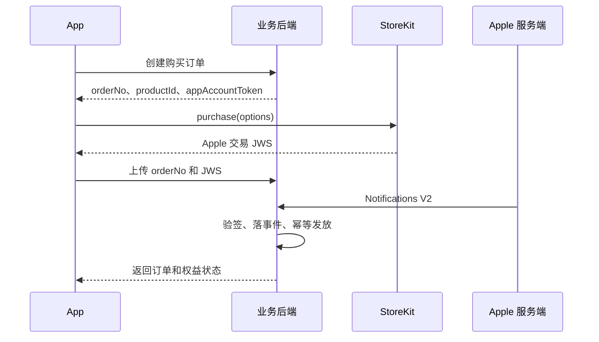

最近一次内购联调，测试给了一句反馈。后台里最近提交的订阅显示已完成，手机上却没有发生新的支付。

这句话很短，查起来却会经过订单、Apple 交易、服务端通知、订阅状态和权益发放。任何一层把“已处理”写成“支付完成”，页面最后都会给出一个很肯定、也很错误的答案。

这套订阅接入前后改过好几轮。最早的流程很顺，客户端拿到 StoreKit 交易，再把票据传给后端，后端验完就发权益。续费、弱网、重复通知、App 重装和 Sandbox 加进来以后，这条直线很快就散了。Apple 可能先通知后端，客户端也可能先上传交易。两边都可能重试，服务还会在最不合适的时候重启。

最后稳定下来的做法，是把每一步承认的事实分开保存。订单记录用户想买什么，Apple 交易证明商店发生了什么，订阅记录当前权益，发放记录业务已经给了什么。四者有关联，含义不能混用。

## 先把“完成”拆开

一笔订阅在系统里至少会经过下面几种状态。

| 状态 | 它能证明什么 |
| --- | --- |
| 订单已创建 | 用户发起了一次购买意图 |
| Apple 交易已验证 | 服务端收到一份合法、归属正确的 Apple 交易 |
| 业务发放已完成 | 套餐、额度或其他权益已经按幂等规则写入 |
| 当前权益有效 | 订阅此刻仍处于有效期或宽限期 |

管理后台如果只放一个 `Completed`，历史交易恢复也可能被展示成一次新付款。过期交易已经处理完，业务状态确实可以是完成，但它没有带来新的有效权益。页面至少要同时展示交易号、交易原因、支付状态、发放状态和当前权益状态。

HTTP 状态也一样。`200` 只说明接口正常返回，业务结果仍要看响应中的 `success`、错误码和订单状态。我们曾经遇到客户端日志写着上传成功，后端返回的业务码却明确表示 Apple 交易无效。排查时如果只搜 HTTP 码，方向一开始就错了。

## 购买前先建订单

用户点下购买按钮后，客户端先向后端创建订单。后端返回自己的订单号、Apple Product ID 和一个稳定的 `appAccountToken`。客户端核对商品以后，才调用 StoreKit。



这一步解决了一个很现实的问题。Apple 通知到达时，后端需要知道它属于哪个业务用户和哪次购买。StoreKit 2 允许客户端在购买选项里传入 UUID 类型的 `appAccountToken`。Apple 会把同一个值放进交易信息和续费信息，后端便能把商店交易与自己的用户关联起来。这个行为可以在 Apple 的 [appAccountToken 文档](https://developer.apple.com/documentation/storekit/product/purchaseoption/appaccounttoken%28_%3A%29)中确认。

```swift
let result = try await product.purchase(options: [
    .appAccountToken(accountToken)
])
```

这个 token 应由后端生成并长期绑定用户。客户端临时生成一个 UUID，看起来也能完成购买，通知到达后却很难稳定找回业务账号。

订单还承担另一项工作。它把一次点击变成可查询的业务对象。用户取消时，订单可以停在取消状态。StoreKit 返回 `pending` 时，订单继续保持打开。客户端上传超时后，可以拿同一个订单号和同一份 JWS 重试，无需再次发起购买。

## 同一笔交易会从两条路回来

初次购买通常有两条回传路线。

客户端拿到 `VerificationResult.jwsRepresentation` 后立即上传，用户可以很快看到权益。Apple 的服务端通知独立到达，App 被杀掉、网络中断或用户在另一台设备操作时，它仍能更新订阅。

两条路线没有可靠的先后顺序。通知可能先到，客户端上传也可能先到。它们甚至会在两台后端实例上同时处理。这里不能靠“先查一下有没有”来防重，两次请求完全可能一起查到没有，然后各发一份权益。

我最后保留了三种标识。

| 标识 | 用途 |
| --- | --- |
| `orderNo` | 识别业务侧的一次购买意图 |
| `transactionId` | 识别 Apple 的一笔购买或续费交易，作为发放幂等依据 |
| `originalTransactionId` | 识别一条自动续费订阅链 |

Apple 也建议服务端保存 `originalTransactionId` 来唯一识别自动续费订阅。每次续费会有新的 `transactionId`，同一订阅链继续使用原始交易标识。相关字段可以在 [JWSTransactionDecodedPayload](https://developer.apple.com/documentation/appstoreserverapi/jwstransactiondecodedpayload) 和 [originalTransactionId](https://developer.apple.com/documentation/appstoreserverapi/originaltransactionid) 的说明里查到。

数据库要用唯一约束守住结果。支付事件可以按来源分别保存，权益发放则按 Apple `transactionId` 或更细的业务幂等键限制一次。这样既保留了客户端上传和 Apple 通知的完整审计记录，也不会发两次套餐额度。

## 通知入口先保存，再慢慢处理

Apple 服务端通知适合做成很薄的入口。后端收到 `signedPayload` 后，先保存原始通知和通知 UUID，随后返回成功，再交给异步 worker 验签和处理。

业务处理可能要查订单、更新订阅、发额度，还可能碰到数据库锁冲突或 Apple 验证服务暂时不可用。把这些操作全部塞进通知请求，接口更容易超时，Apple 也会继续重发。

V2 通知发送失败后，Apple 会再试五次，时间间隔依次为 1、12、24、48 和 72 小时。后端也可以通过 Get Notification History 拉取 Apple 曾尝试发送的通知。Apple 的 [通知响应说明](https://developer.apple.com/documentation/appstoreservernotifications/responding-to-app-store-server-notifications) 和 [通知历史接口](https://developer.apple.com/documentation/appstoreserverapi/get-notification-history) 给出了重试与查询规则。

我们给支付事件加了独立状态。`RECEIVED` 表示已经持久化，`PROCESSING` 表示某个 worker 正在处理，临时故障进入 `RETRY_WAIT`，最终成功才是 `SUCCEEDED`。验签失败、账号冲突等永久错误会停止重试。网络、数据库和证书在线检查失败可以稍后再试。

多实例部署时还要加数据库租约。worker 领取事件时做一次带条件的原子更新，写入租约到期时间。另一台实例领取失败就退出。进程中途挂掉，租约过期后其他实例继续处理。Redis 锁能减少同时执行，支付结果仍要由数据库唯一约束兜住。

## 旧 JWS 只能重试旧购买

联调里最费时间的一次问题来自客户端缓存。用户新建了订单，客户端随后上传一份之前保存的 JWS。后端验签没有通过，Apple Server API 里也找不到这次所谓的新交易。沿着原始交易链查询后，能看到的最后一笔交易早已过期。

客户端恢复逻辑把“手里还有一份签名字符串”理解成“这次购买可以继续”。JWS 只能证明它里面那笔交易，不能代表用户刚刚又买了一次。

同一份 JWS 可以在一种情况下重传。客户端已经通过 `product.purchase()` 得到这笔交易，只是上传后端时超时，此时继续使用原订单号和原 JWS。客户端若创建了新订单，或者 Apple 没有产生新交易，就应重新走购买流程。

StoreKit 已经提供了常规恢复所需的信息。App 启动时监听 `Transaction.updates`，检查 `Transaction.unfinished` 和 `Transaction.currentEntitlements`，可以接住 App 未运行期间发生的交易。Apple 的 [Transaction 文档](https://developer.apple.com/documentation/storekit/transaction) 对这几个入口有完整说明。

`AppStore.sync()` 适合作为用户主动点击的恢复入口。它会要求 App Store 重新同步交易，并且可能弹出账号验证。Apple 明确要求只在用户主动操作时调用。正常启动不需要自动执行，详见 [AppStore.sync 文档](https://developer.apple.com/documentation/storekit/appstore/sync%28%29)。

恢复购买解决设备上的 StoreKit 状态同步。后端仍要验签、匹配用户，并根据 Apple 当前状态恢复已有权益。它不该绕过订单约束，更不能把过期交易包装成新付款。

## 续费要生成新的业务订单

自动续费由 Apple 发起。客户端通常不会创建这张订单，服务端通知里却会出现新的 `transactionId`。如果后端一直更新最初那张购买订单，账单列表会只剩一行，后续很难解释哪次扣款发了哪份权益。

更清楚的做法是每个续费周期生成一张续费订单。它关联同一个 `originalTransactionId`，保存本期的 `transactionId`、开始时间、到期时间和 Apple 商品。初次购买订单来自用户点击，续费订单来自经过验证的 Apple 交易。

Apple 的 `transactionReason` 会区分用户发起的 `PURCHASE` 和系统发起的 `RENEWAL`。升级会立即产生一笔 `PURCHASE`，降级会在续费日产生 `RENEWAL`。Apple 对这个字段的说明见 [transactionReason 文档](https://developer.apple.com/documentation/appstoreserverapi/transactionreason)。

套餐切换时间也应交给 Apple 的事实字段。高等级升级通常立即生效，降级到下次续费日生效。同等级套餐在时长不同时也会等到下次续费。后端记录待生效商品和时间，客户端继续展示当前有效套餐。具体规则取决于订阅组等级和时长配置，Apple 在 [订阅计费说明](https://developer.apple.com/documentation/storekit/handling-subscriptions-billing) 中列出了升级、降级和 cross-grade 的生效方式。

## 权益发放和支付状态分开

Apple 交易验签通过以后，后端还要把订阅和额度写进自己的数据库。这一段需要本地事务。

我们的处理顺序是先把订单更新为 Apple 交易已确认，再在同一个可恢复流程里更新订阅、写发放记录，最后把发放状态设为成功。任何一步抛错，事件保留为可重试状态。重试时先检查发放幂等键，已经写过就只补齐后面的状态。

发放规则也要写成业务合同。月付首期什么时候发，年付是一次给全年额度还是每月给，升级补差额还是再发一整份，退款是否追回，订阅停止后剩余额度何时清理，都不能藏在一句“支付成功后发放”里。

这类规则经常比 StoreKit 接口本身更耗时间。Apple 能告诉你交易、到期和续费状态，自己的额度如何计算仍由产品和后端负责。

## Sandbox 的五分钟很容易骗人

Sandbox 会压缩订阅周期。默认设置下，一个月订阅每五分钟续费一次，最多自动续费十二次，第十三次会关闭自动续费。几分钟内看到订阅从有效走到过期，通常是测试时钟在正常工作。Apple 在 [Sandbox 账号设置说明](https://developer.apple.com/help/app-store-connect/test-in-app-purchases/manage-sandbox-apple-account-settings/) 中列出了不同续费速度。

这个机制很适合测续费、扣款失败和过期，也会制造很多误判。后台列表若只写“月订阅已过期”，测试会觉得系统提前停了服务。页面应明确显示 `Sandbox`、Apple 交易时间和到期时间。

Sandbox 还可以模拟购买中断。用户可能需要先接受新条款或更新付款方式，StoreKit 会返回 `pending`。这类状态要保留订单并继续监听交易，不能当作取消。

## 我现在怎样验收订阅

一套订阅功能能买成功，只完成了最短的路径。我现在会把下面这些场景逐个留下测试证据。

| 场景 | 可见结果 |
| --- | --- |
| 用户取消 | 订单取消，不产生 Apple 交易，不发权益 |
| 购买进入 pending | 订单保持打开，后续交易能被监听并继续处理 |
| 客户端上传超时 | 同一订单和同一 JWS 重试，只发一次权益 |
| Apple 通知先到 | 服务端匹配订单并完成发放，客户端查询到结果 |
| 客户端与通知同时到 | 两条支付事件都可审计，业务发放只有一次 |
| 新订单上传旧 JWS | 后端拒绝，不激活过期订阅 |
| 自动续费 | 生成新的续费订单，关联原订阅链，发放本期权益 |
| 服务重启 | 未完成事件能重新领取并继续处理 |
| Sandbox 快速续费 | 多个周期按交易号分别处理，最后正确过期 |

服务端测试可以覆盖状态机、事务回滚、唯一约束和重复事件。Apple 真签名、设备账号、Sandbox 通知与续费仍要在真实环境里走一遍。本地测试全绿，只能证明自己的代码在夹具下成立。

我现在更愿意把内购看成一组持续到达的商店事实。后端要保存这些事实，把它们绑定到自己的订单，再用幂等事务更新权益。页面最后展示什么，也必须来自同一组清楚的状态。测试再说“已完成”时，我们才知道究竟完成了哪一步。
