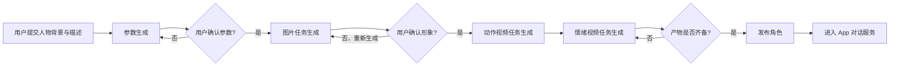
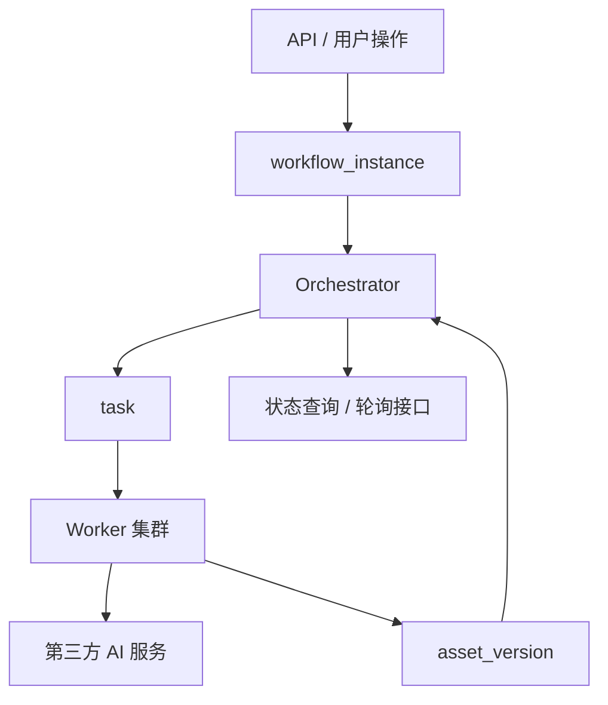
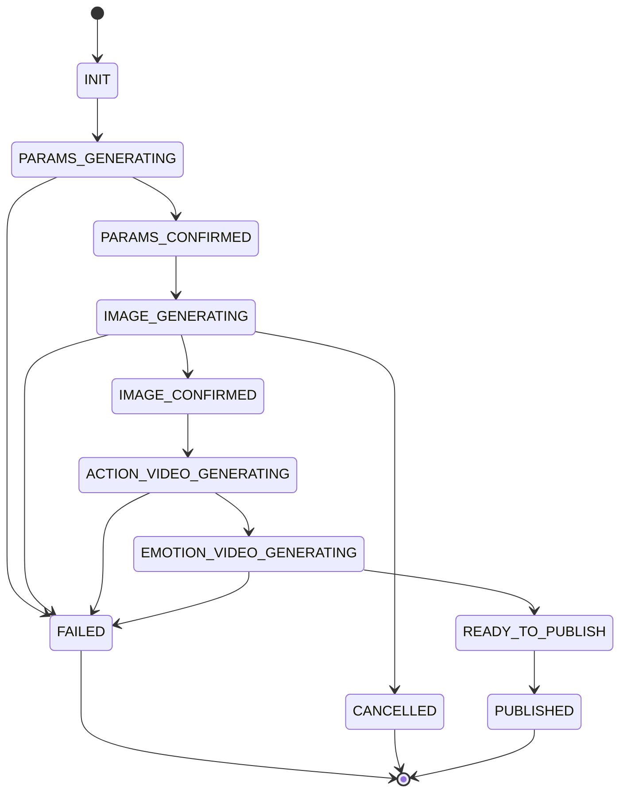

很多人一提到“工作流系统”，第一反应就是通用编排引擎、节点拖拽、动态流程定义。但真实业务里，框架不是默认答案，很多时候反而是额外复杂度。

我最近半年做了一个**虚拟角色生成工作流**。它的业务链路很长，但流程并不复杂：

1. 用户输入人物背景与描述
2. AI 生成固定参数描述，用户确认
3. 生成人物正身图、侧身图
4. 用户可反复调整形象，重新生成
5. 生成交互动作视频，例如进入、离开等
6. 生成 8 种情绪视频，例如开心、难过、生气等
7. 用户确认发布，虚拟角色进入手机 App，对外提供对话能力

这个系统最大的特点是：**阶段固定，但每个阶段都耗时、异步、可能失败，而且用户还会中途回退。**

所以它的核心问题不是“怎么定义任意流程”，而是：

- 如何拆任务
- 如何推进状态
- 如何处理异常退出
- 如何恢复卡死任务
- 如何定义终态，防止流程结束后继续被错误推进

所以这篇文章不讲通用工作流引擎，而是复盘一个**固定业务流程下的任务系统**，重点只看三件事：怎么运行、怎么恢复、怎么结束。



---

## 一、为什么我没有选工作流框架

这类业务很容易让人条件反射地想到工作流引擎，但我最后没有上框架，而是自己定义数据结构和推进逻辑。原因不是“想造轮子”，而是算过账之后，没必要。

### 1. 流程是固定的，变化的是参数，不是拓扑

用户可以重复生图、删除某个节点产物、重新触发某个阶段，但整个业务主链路是稳定的：

```text
参数确认 → 图片生成 → 图片确认 → 动作视频生成 → 情绪视频生成 → 发布
```

这意味着我们真正需要的是：

- 固定阶段定义
- 阶段间前置约束
- 局部回退与重跑
- 阶段结果版本隔离

而不是：

- 任意节点拖拽
- 任意条件分支
- 动态流程编排 DSL

### 2. 业务真正难的地方不在“编排”，而在“异常”

这套系统的复杂度主要来自下面这些情况：

- 第三方生成服务超时
- Worker 进程异常退出
- 任务执行到一半服务重启
- 用户在旧任务还没结束时重新生成
- 某个情绪视频失败，其他情绪已经成功
- 发布后流程是否还允许回退

换句话说，**这个系统真正难的不是把流程画出来，而是处理那些没有正常结束的任务。**

### 3. 轻量自定义结构更容易贴合业务

如果流程固定，自定义状态结构通常更合适：

- 数据模型更贴合业务对象
- 状态推进逻辑更容易理解
- 排障时不需要跨一层通用引擎抽象
- 业务变化时改表结构和状态机即可

在这类场景下，通用框架不一定带来收益，反而容易把问题从“业务复杂”升级成“业务复杂 + 框架复杂”。对固定流程系统来说，这通常不是优化，而是偏航。

---

## 二、系统真正要解决的问题

表面上看，这是一个“AI 生成”系统；本质上，它是一个**长链路异步任务系统**。

它有几个鲜明特点：

| 特征 | 说明 |
|------|------|
| **链路长** | 一次角色生成包含图片、动作视频、情绪视频等多个阶段 |
| **耗时长** | 单个任务可能持续几十秒到数分钟 |
| **依赖强** | 后一阶段必须依赖前一阶段的有效产物 |
| **用户可回退** | 用户可以在图片阶段反复修改形象 |
| **外部依赖不稳定** | 生成服务可能超时、失败、结果延迟返回 |
| **产物多版本** | 新一轮生图不能被旧结果覆盖 |

这决定了系统不能按传统同步接口去设计。  
它本质上是一个“**状态推进系统**”：单次任务能不能跑完当然重要，但比这更重要的是，**系统在异常场景下能不能把状态说对。**

---

## 三、核心设计原则

在落实现之前，我先定了几条原则。后面几乎所有实现细节，都是从这几条原则往下推出来的。

### 原则 1：固定流程，动态参数

流程拓扑保持稳定，变化只发生在输入参数、任务版本和阶段结果上。

### 原则 2：任务终态不等于流程终态

某个情绪视频任务失败，并不代表整个角色生成流程失败。  
任务系统和工作流实例必须分层建模。混在一起，后面所有恢复逻辑都会变得别扭。

### 原则 3：状态推进必须以持久化为准

流程推进不是看某段代码“跑完了”，而是看：

- 任务结果是否已持久化
- 产物是否已入库
- 当前阶段是否满足推进条件

只有满足这些条件，工作流状态才允许前进。否则“看起来跑完了”，其实只是把脏状态往后推。

### 原则 4：允许失败，但不允许状态失真

AI 任务失败是常态，系统必须接受失败；  
真正不能接受的是状态失真：

- 任务其实失败了，前端却显示成功
- 旧版本结果写回新流程
- 已取消的流程继续被推进
- 已发布的角色被旧任务覆盖

---

## 四、整体架构：工作流实例、任务、产物三层分离

这套系统没有引入复杂框架，而是先把对象边界切清楚：

```text
workflow_instance  →  表示一个角色生成流程实例
task               →  表示某个阶段下的执行单元
asset_version      →  表示图片/视频等阶段产物及其版本
```



可以理解成：

- `workflow_instance` 负责描述“这个角色当前走到哪一步了”
- `task` 负责描述“当前有哪些事正在执行”
- `asset_version` 负责描述“这一轮生成到底产出了什么”

### 1. `workflow_instance`

它是整个业务的主对象。核心字段可以类似这样：

```json
{
  "workflowId": "wf_123",
  "characterId": "char_456",
  "stage": "IMAGE_GENERATING",
  "status": "RUNNING",
  "currentVersion": 3,
  "terminatedReason": null,
  "createdAt": "2026-03-05T10:00:00Z",
  "updatedAt": "2026-03-05T10:10:00Z"
}
```

关键字段有两个：

- `stage`：当前所处阶段
- `currentVersion`：当前有效版本

版本号是整个系统稳定性的关键。用户每次重新生图，本质上都应该进入一个新的版本空间。没有这层隔离，旧结果迟早会污染新流程。

### 2. `task`

任务对象描述的是可调度、可执行、可恢复的最小单元：

```json
{
  "taskId": "task_001",
  "workflowId": "wf_123",
  "version": 3,
  "stage": "EMOTION_VIDEO_GENERATING",
  "taskType": "GENERATE_EMOTION_VIDEO",
  "status": "PENDING",
  "retryCount": 0,
  "payload": {
    "emotion": "happy"
  },
  "workerId": null,
  "heartbeatAt": null,
  "result": null,
  "errorCode": null
}
```

一个工作流里会存在很多任务，例如：

- 生成正身图
- 生成侧身图
- 生成进入动作视频
- 生成离开动作视频
- 生成开心情绪视频
- 生成愤怒情绪视频

这些任务必须能独立失败、独立重试、独立回收。否则任务一粗，恢复成本就会直线上升。

### 3. `asset_version`

这层用来管理产物与版本映射，例如：

- 第 2 版人物图
- 第 3 版动作视频
- 第 3 版情绪视频集合

如果没有独立的产物版本层，最容易出现的问题就是：**旧任务晚返回，把新一轮结果覆盖掉。**

---

## 五、状态机设计：任务状态和流程状态必须分开

这是整个系统最关键的部分。

### 任务状态

任务状态我只保留最核心的一组：

| 状态 | 含义 |
|------|------|
| `PENDING` | 已创建，等待调度 |
| `RUNNING` | 已被 Worker 抢占并执行 |
| `SUCCESS` | 执行成功，结果已持久化 |
| `FAILED` | 执行失败，且不可自动重试 |
| `TIMEOUT` | 超时未完成，等待恢复或重试 |
| `CANCELLED` | 被版本切换或用户操作取消 |

这里有一个实践判断：  
**终态一定要足够少。**  
状态太多会让排障和恢复逻辑急剧复杂化。

### 工作流状态

工作流状态则更贴近业务阶段：

```text
INIT
PARAMS_GENERATING
PARAMS_CONFIRMED
IMAGE_GENERATING
IMAGE_CONFIRMED
ACTION_VIDEO_GENERATING
EMOTION_VIDEO_GENERATING
READY_TO_PUBLISH
PUBLISHED
FAILED
CANCELLED
```



### 为什么一定要分层

因为任务失败和流程失败不是一回事。

例如：

- “开心”情绪视频任务失败
- “生气”“难过”等其他视频已成功

此时：

- 这个任务是 `FAILED`
- 但工作流不一定整体失败
- 可能只是进入“部分失败，允许补跑”的业务状态

如果你把两层状态混在一起，系统很快就会出现下面的问题：

- 一个局部任务失败导致整条流程被误判结束
- 前端不知道当前是“整体失败”还是“局部失败”
- 恢复逻辑只能整条重跑，成本非常高

---

## 六、任务运行机制：谁创建、谁消费、谁推进

这套系统没有引入复杂调度器，但链路必须极其清晰。谁创建、谁执行、谁推进，不能含糊。

### 1. 创建任务

当用户确认某个阶段后，系统不会立即同步执行，而是：

1. 校验当前工作流状态是否合法
2. 生成对应阶段任务
3. 将任务写入数据库
4. 更新工作流状态为对应的进行中阶段

例如用户确认人物参数后：

- 创建“正身图生成任务”
- 创建“侧身图生成任务”
- 工作流进入 `IMAGE_GENERATING`

### 2. 消费任务

Worker 负责扫描并抢占可执行任务：

```text
PENDING → 抢占成功 → RUNNING → 执行 → SUCCESS / FAILED / TIMEOUT
```

这里有两个必须做到的点：

- 抢占要幂等，避免同一任务被多个 Worker 同时消费
- 执行要带心跳，避免 Worker 崩溃后任务永久卡在 `RUNNING`

### 3. 推进流程

任务完成后，不是直接“写成功”就结束，而是由 Orchestrator 判断当前阶段是否真的满足推进条件。

例如在图片阶段：

- 正身图成功
- 侧身图成功
- 相关产物入库完成

只有这三个条件都满足，工作流才从 `IMAGE_GENERATING` 进入 `IMAGE_CONFIRMED` 或“待用户确认”状态。

这里有一个很重要的原则：

> 流程推进的依据不是“某个函数返回了”，而是“状态被持久化确认了”。

---

## 七、前端为什么用轮询，而不是一开始就上推送

这套系统前期我选择了轮询，而不是直接上 WebSocket 或消息推送，原因很务实：这个阶段真正缺的不是“实时炫技”，而是“状态可信”。

### 1. 问题的本质不是实时性，而是状态可见性

这个场景里，用户最关心的是：

- 现在在哪个阶段
- 还要等多久
- 是正在执行还是卡住了
- 哪些产物已经出来了

这些诉求，轮询已经可以满足。

### 2. 轮询接口应该返回什么

不能只返回一个“处理中”，而应该返回结构化状态：

```json
{
  "workflowStatus": "RUNNING",
  "stage": "EMOTION_VIDEO_GENERATING",
  "progress": 72,
  "version": 3,
  "completedAssets": ["front_image", "side_image", "action_enter"],
  "runningTasks": 3,
  "failedTasks": 1,
  "message": "正在生成情绪视频"
}
```

这样前端可以明确展示：

- 当前所处阶段
- 当前版本
- 已完成产物
- 是否存在失败任务

### 3. 轮询的两个注意点

- 不要高频无脑轮询，建议按阶段动态调整间隔
- 终态后必须停止轮询

否则前端会不断打一个已经结束的流程，浪费资源，也更容易放大状态不一致问题。

---

## 八、恢复机制：系统最值钱的部分

这个系统最值钱的部分，不是“能创建任务”，而是“任务没正常结束时怎么办”。

### 1. Worker 异常退出

最典型的问题是：

- 任务已经被抢占
- Worker 执行到一半宕机
- 任务状态一直停留在 `RUNNING`

解决方法很直接：心跳 + 超时回收。

- Worker 执行中定期更新 `heartbeatAt`
- 调度器扫描超过阈值未续租的任务
- 将其标记为 `TIMEOUT`
- 由恢复逻辑决定是重试还是失败终止

### 2. 第三方服务超时或延迟返回

AI 生成服务并不总是稳定，有些任务是“提交后异步完成”，这类场景需要：

- 提交任务后记录外部请求 ID
- 通过轮询或回调查询外部状态
- 超过最长等待时间则标记为超时
- 晚到结果必须校验版本与终态，不能直接写回

最后这一点尤其重要。  
很多系统不是死于超时，而是死于**超时之后的晚到结果回写**。前面白做都不要紧，写错状态才真的致命。

### 3. 用户重新生成

这是虚拟角色场景里最容易出事的一类操作。

用户在第 2 版图片还没完全结束时，又发起了第 3 版重新生成。  
此时系统必须做到：

- `currentVersion` 切换为新版本
- 旧版本未完成任务批量标记为 `CANCELLED`
- 所有晚到结果在写回时先校验版本
- 只有当前有效版本的产物才允许进入展示和发布链路

如果没有版本隔离，这类系统几乎一定会出现串图、串视频、串状态的问题。这不是概率问题，是时间问题。

### 4. 局部失败与局部重试

情绪视频通常是并行生成的，这意味着：

- 某几个情绪可能成功
- 某几个情绪可能失败

这时没必要把整条工作流打回重跑。更合理的做法是：

- 保留已成功任务的结果
- 对失败任务单独重试
- 工作流保持在当前阶段，不提前进入终态

这能显著降低成本，也减少用户等待时间。长链路系统的恢复一定要偏向“局部修复”，而不是“整条重跑”。

---

## 九、终态设计：不是一个字段，而是一层保护

很多系统把终态理解成“成功/失败/取消”几个枚举值，但在长链路任务系统里，终态真正的意义是：

**一旦进入终态，系统必须阻止后续错误动作继续发生。**

### 1. 我关心的三种终态

| 终态 | 含义 |
|------|------|
| `PUBLISHED` | 角色已完成发布，资产已进入 App 服务链路 |
| `FAILED` | 工作流在当前版本下无法继续推进 |
| `CANCELLED` | 用户主动取消或被新版本替代 |

### 2. 终态后的限制

一旦工作流进入终态，系统必须保证：

- 旧任务结果不能再推进流程
- 前端停止轮询
- 调度器不再创建新任务
- 发布后的角色不能被旧版本产物覆盖

如果这层保护没有做好，终态就只是一个“好看的枚举值”，而不是保护机制。

### 3. 终态不是都不可逆

这里还要区分两种情况：

- **业务终态**
- **技术终态**

例如 `FAILED` 可能是技术终态，但业务上可能允许用户点击“重新生成”，从而开启一个新版本。  
这不是“从失败回退”，而是“以新版本重开一条新链路”。

这个区分很重要。  
否则系统会在“回退旧流程”和“启动新流程”之间混乱不清，最后你会发现自己根本说不清一条状态到底属于谁。

---

## 十、第一版踩过的坑

真正让系统成熟的，不是第一版设计图，而是线上踩坑之后的修正。

### 1. 任务粒度过粗

一开始我把“情绪视频生成”当成一个大任务。结果其中一个情绪失败，整个阶段就要重跑，既浪费资源，也拉长等待时间。

后面改成按情绪拆任务，系统才真正具备局部恢复能力。

### 2. 没有版本隔离

这几乎是最危险的问题。用户重新生图后，旧任务晚返回，结果把新版本展示结果覆盖了。

后来我把 `version` 放进：

- 工作流实例
- 任务
- 产物
- 状态查询接口

整个系统才稳定下来。

### 3. 只看任务成功，不看产物落库

早期有过这样的 bug：

- 任务执行成功
- 但资源还没完全写入存储或数据库
- 前端已经看到“完成”

这会直接导致“状态成功但资源不可用”。  
后面改成“任务成功 + 产物入库完成”双条件，流程推进才算有效。

### 4. 缺少卡死任务回收

如果没有心跳和超时扫描，队列里很快就会堆积大量伪 `RUNNING` 任务。  
这些任务不结束、不重试、不失败，看起来最安静，实际上最危险。

---

## 十一、后续优化方向

这类系统真正难的，不是把第一版做出来，而是后续如何把它做得更稳、更快、更省。

### 1. 从轮询升级到事件通知

前期轮询足够实用，但当任务量和用户规模上来后，可以进一步演进为：

- 状态变化事件推送
- 长任务关键节点通知
- App 内消息提醒

这样可以减少空轮询，也让用户感知更自然。

### 2. 阶段化资源池

图片生成和视频生成的资源模型完全不同。  
后续可以按阶段拆 Worker 池：

- 图片 Worker
- 动作视频 Worker
- 情绪视频 Worker

避免轻任务被重任务拖垮。

### 3. 优先级与限流

当任务量上来后，不同阶段和不同用户的优先级一定不一样。  
可以引入：

- 角色创建优先级
- 付费用户优先级
- 重试任务限流
- 单用户并发控制

### 4. 可观测性

任务系统没有可观测性，排障会非常痛苦。后续重点应该补齐：

- 各阶段平均耗时
- 各类型任务失败率
- 超时任务数量
- 队列堆积情况
- 单角色生成总耗时

### 5. 成本治理

这类 AI 生成链路里，重试和重复生成很容易放大成本。  
后续应该持续回答：

- 一个角色的平均生成成本是多少
- 哪个阶段最贵
- 哪类失败最容易触发重复扣费
- 哪些产物可以复用而不是重算

---

## 十二、写在最后

这个系统做下来，我最深的感受是：

**固定流程系统，重点不在编排能力，而在状态控制能力。**

真正难的从来不是“创建一个任务”，而是：

- 任务没有正常结束怎么办
- 用户反复回退怎么办
- 旧结果晚到怎么办
- 流程已经结束后，如何阻止系统继续犯错

如果把这些问题处理清楚，一个不依赖通用工作流框架的轻量任务系统，同样可以支撑复杂的 AI 生成业务。

一句话总结：

> 长链路 AI 业务的核心问题，不是生成，而是恢复。

而恢复的前提，是你先把状态、版本、终态和异常处理设计清楚。框架能帮你省一部分代码，但替你做不了这些判断。
