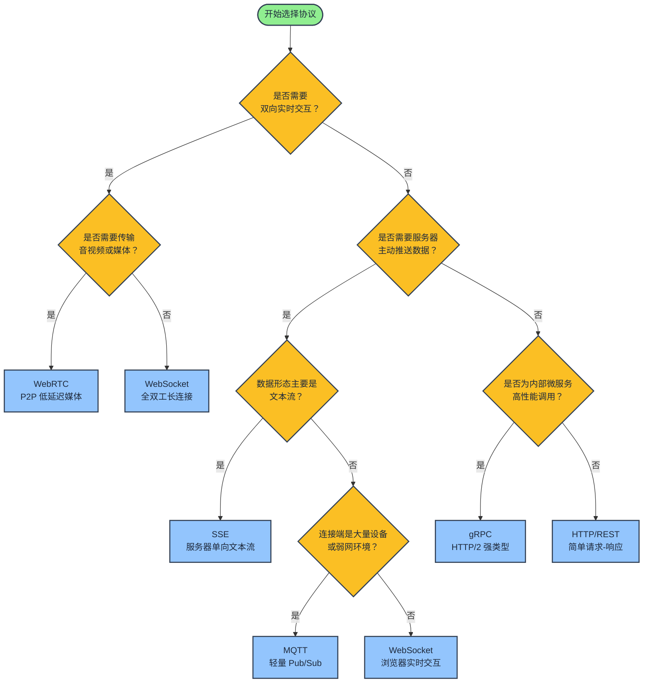
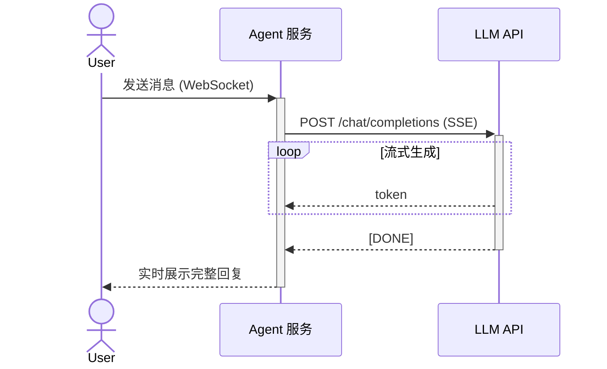
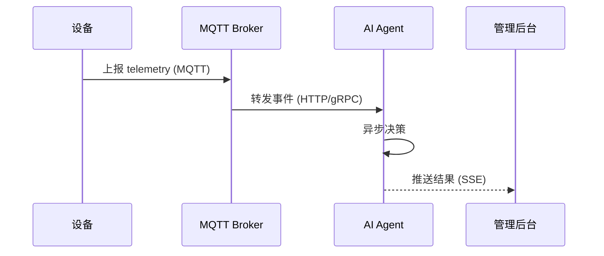
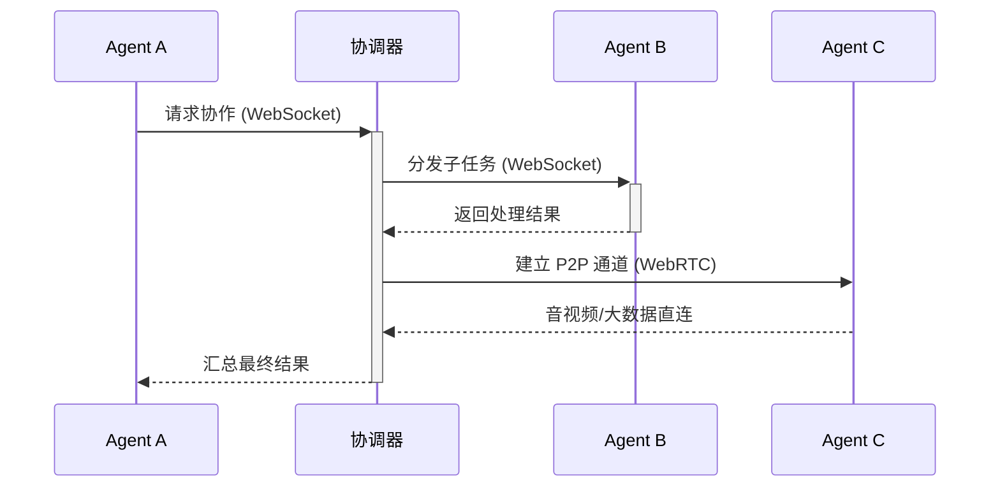

# AI Agent 通信协议选型指南

AI Agent 不再是单机跑一次的脚本，而是需要**持续感知、协同决策、实时反馈**的自治系统。agent 与外部世界、agent 与 agent、agent 与用户之间的通信方式，直接决定了系统的响应速度、扩展能力和可靠性。

这篇文章把 AI Agent 场景里最常见的通信协议放在一起对比：HTTP、SSE、WebSocket、WebRTC、MQTT，并补充 gRPC 的适用边界。目标不是告诉你"哪个最好"，而是帮你建立一张**决策地图**。

---

## 一、先放结论：协议速查表

| 协议 | 方向 | 连接方式 | 实时性 | 最佳场景 | 主要短板 |
|------|------|---------|--------|---------|---------|
| HTTP/REST | 请求-响应 | 短连接 | 低 | 单次推理、工具调用、状态查询 | 头部开销大、无法主动推送 |
| SSE | 服务端 → 客户端 | 长连接（单向） | 中 | LLM 流式输出、服务器推送 | 只有服务端能推，客户端回复需另开请求 |
| WebSocket | 全双工 | 长连接 | 高 | 实时对话、多轮协商、协作 agent | 连接状态复杂、需要心跳和重连 |
| WebRTC | P2P | 点对点 | 极高 | 语音/视频 agent、低延迟媒体流 | NAT 穿透复杂、信令需额外设计 |
| MQTT | 发布-订阅 | 长连接（轻量） | 中 | IoT agent、传感器上报、指令下发 | 传输数据量有限、不适合大负载 |
| gRPC | 请求-响应 / 流 | HTTP/2 长连接 | 高 | 内部微服务间高性能调用 | 浏览器支持弱、调试门槛高 |

---

## 二、HTTP/REST：最朴素的起点

几乎每个 agent 都是从 HTTP 调用开始的：接收一个请求，调用 LLM，返回结果。

```
客户端          Agent 服务          LLM API
  |                |                  |
  |--- POST /run -->|                  |
  |                |--- POST /v1/chat/completions -->|
  |                |<---- JSON response ------------|
  |<-- 结果 --------|                  |
```

**适合的场景：**

- 一次性任务：总结文档、生成代码、分类判断
- 工具调用（Tool Use）：agent 调用搜索引擎、数据库、计算器等外部 API
- 状态查询：获取 agent 当前任务进度、历史记录

**在 AI Agent 里的局限：**

1. **无法流式输出**：用户要等待整段回复生成完才能看到第一个字，体验差。
2. **无法主动推送**：agent 执行了 5 分钟，客户端只能轮询，不能被动通知。
3. **每次请求都带完整头部**：高并发时长连接复用率低。

**优化方向：** 配合 SSE 或 WebSocket 使用，HTTP 只负责"触发任务"和"最终状态"。

---

## 三、SSE：LLM 流式输出的标准答案

SSE（Server-Sent Events）是让服务器向浏览器**单向推送文本流**的协议。它基于 HTTP，天然支持：

- 浏览器 `EventSource` API
- 自动重连
- 逐字/逐句输出

```
客户端                Agent / LLM
  |                       |
  |--- POST /chat -------->|
  |<-- data: {"token":"你好"} |
  |<-- data: {"token":"，"}   |
  |<-- data: {"token":"世界"} |
  |<-- data: [DONE]         |
```

OpenAI、Claude、Gemini 的流式 API 本质上都是 SSE。

**适合的场景：**

- LLM 的流式 token 输出（typing effect）
- 服务器向客户端推送进度、日志、状态更新
- 简单订阅类推送，不需要客户端频繁回传数据

**局限性：**

- **单向通道**：客户端想回传数据，必须再发一个 HTTP 请求。
- **二进制支持弱**：主要是文本流，传文件/音频要另想办法。
- **连接管理**：浏览器对同一域名的 SSE 连接数有限制。

---

## 四、WebSocket：实时协作的核心

当 agent 需要**持续双向对话**时，SSE 就不够用了。WebSocket 提供全双工、低延迟、有状态的持久连接。

```
客户端                      Agent
  |                          |
  |------- WebSocket handshake ------->|
  |<------ 连接建立 -------------------|
  |--- "帮我订一张明天去北京的机票" --->|
  |<-- "出发时间是上午还是下午？" -------|
  |--- "上午" ------------------------->|
  |<-- "已查到 3 个航班，请选择..." -----|
```

**适合的场景：**

- 多轮实时对话 agent
- 多人/多 agent 协作白板、代码编辑器
- 需要频繁状态同步的交互：游戏 NPC、实时控制面板

**需要额外处理的问题：**

- **连接状态机**：连接、断开、重连、心跳、超时
- **消息顺序与去重**：网络抖动时消息可能乱序或重复
- **水平扩展**：多个服务器实例时，共享 WebSocket 会话需要 Redis 等中间件
- **鉴权**：握手阶段就要完成 token 校验

---

## 五、WebRTC：低延迟点对点通信

WebRTC 最初为浏览器视频通话设计，但它也是**两个 agent 直接通信**的利器，无需经过服务器中转数据。

```
Agent A          信令服务器          Agent B
  |                  |                  |
  |<---- 交换 SDP / ICE 候选 ----------->|
  |                  |                  |
  |<========= P2P 数据通道 ==============>|
```

**适合的场景：**

- 语音/视频 AI agent（实时语音助手、视频会议 agent）
- 两个 edge agent 本地协商，减少云端延迟
- 对隐私敏感的数据交换：先 P2P 协商，再决定是否上云

**关键组件：**

- **SDP（Session Description Protocol）**：描述媒体能力
- **ICE（Interactive Connectivity Establishment）**：处理 NAT 穿透
- **DataChannel**：除了音视频，还能传任意二进制数据

**局限性：**

- **信令层需要自己实现**：WebRTC 只负责媒体/数据传输，如何发现对方、交换 SDP 要另搭服务。
- **NAT 打洞不一定成功**：企业防火墙、对称 NAT 下可能 fallback 到 TURN 中继，增加成本。
- **调试复杂**：网络质量、编解码、回声消除都是坑。

---

## 六、MQTT：IoT 与轻量 agent 的 pub/sub

MQTT 是发布-订阅模式的轻量级协议，设计目标就是低带宽、不稳定网络下的设备通信。

```
          +---------+
传感器 --->|  Broker |<--- AI Agent
摄像头 --->|  (broker) |<--- 控制端
门锁   --->+---------+
```

**适合的场景：**

- 物理世界 agent：智能家居、工业机器人、车载 agent
- 大量设备上报 telemetry：温度、位置、电量
- 指令下发：打开灯、调整空调、重启设备
- 移动端 agent 在弱网环境下保活

**MQTT 的核心概念：**

- **Topic**：消息通道，如 `home/livingroom/temperature`
- **QoS**：服务质量等级
  - QoS 0：最多一次（适合高频可丢数据）
  - QoS 1：至少一次（需要幂等处理）
  - QoS 2：恰好一次（高开销，控制指令用）
- **Last Will**：设备异常断线时自动发布遗言

**局限性：**

- 不适合传输大 payload（如图片、长文本）
- 请求-响应模式需要额外约定（如 MQTT 5 的 Response Topic）

---

## 七、gRPC：内部微服务的高性能调用

gRPC 严格来说不是浏览器-facing 的协议，但在 AI Agent 的后端架构里很常见：一个 agent 编排服务调用 embedding 服务、向量数据库、模型推理服务。

```proto
service AgentService {
  rpc RunTask(TaskRequest) returns (TaskResponse);
  rpc StreamTokens(TaskRequest) returns (stream TokenResponse);
}
```

**适合的场景：**

- 内部微服务间调用
- 多语言服务统一接口（Python 推理 + Go 网关 + Node 业务）
- 需要强类型 schema 和双向流

**为什么不直接暴露给终端用户：**

- 浏览器原生不支持 gRPC（需要 gRPC-Web 转换层）
- 调试不如 HTTP/JSON 直观

---

## 八、选型决策框架

面对一个具体场景，可以从四个维度切入：



### 维度 1：谁主动说话？

- 客户端主动问，服务器答 → HTTP / gRPC
- 服务器主动推，客户端听 → SSE / MQTT
- 两边随时说 → WebSocket / WebRTC

### 维度 2：实时性要求

| 延迟要求 | 协议 |
|---------|------|
| 秒级/可等待 | HTTP |
| 百毫秒级 | SSE、MQTT |
| 十毫秒级 | WebSocket |
| 毫秒级 | WebRTC |

### 维度 3：连接环境

- 浏览器 ↔ 服务器：HTTP、SSE、WebSocket
- 设备 ↔ 云端：MQTT、HTTP
- 服务 ↔ 服务：gRPC、HTTP
- 端侧 ↔ 端侧：WebRTC

### 维度 4：数据形态

- 文本流：SSE、WebSocket
- 二进制/媒体：WebRTC、WebSocket
- 小Telemetry：MQTT
- 结构化请求：HTTP、gRPC

---

## 九、典型架构组合

### 组合 A：聊天型 Agent



WebSocket 维持多轮对话上下文，SSE 把 LLM 的流式输出转发给用户。

### 组合 B：IoT + AI



设备通过 MQTT 上报状态，agent 异步决策后把结果推给后台。

### 组合 C：多 agent 协作



协调器负责任务分发，复杂子任务通过 WebRTC 点对点完成。

---

## 十、总结

没有"最好的协议"，只有"最贴合当前约束的组合"。

- **HTTP**：简单、通用，但不够实时。
- **SSE**：LLM 流式输出的默认选择。
- **WebSocket**：实时对话和协作的基石。
- **WebRTC**：需要低延迟点对点或音视频时的利器。
- **MQTT**：物理设备和弱网环境下的首选。
- **gRPC**：后端服务间的高效调用。

实际项目中，往往是多种协议并存：HTTP 负责触发，SSE 负责流式输出，WebSocket 负责持续交互，MQTT 负责设备接入。理解每种协议的设计取舍，才能在 agent 架构里把它们放在正确的位置。
