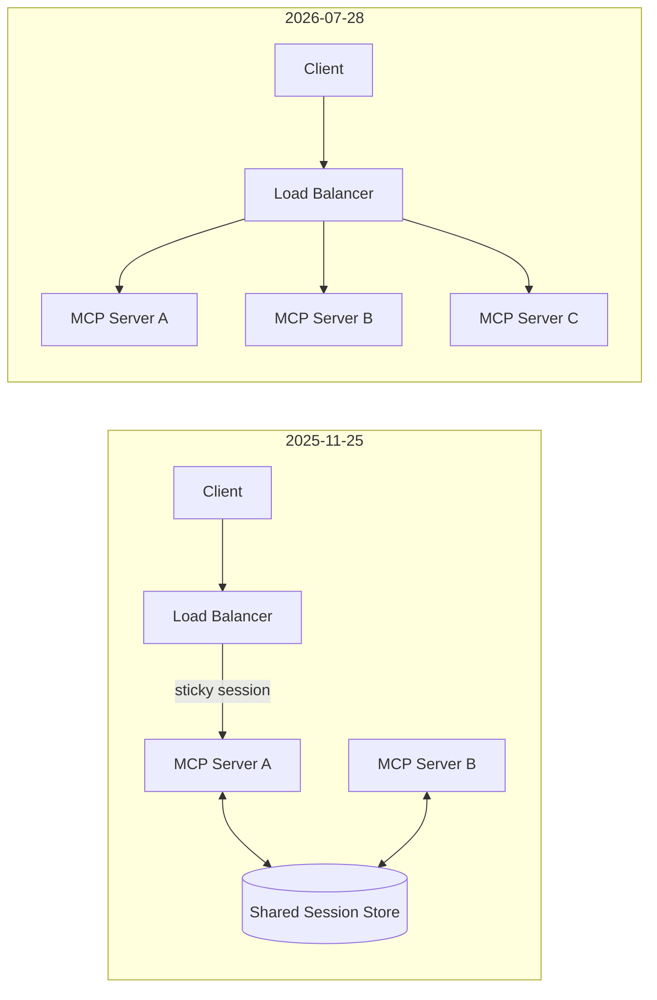
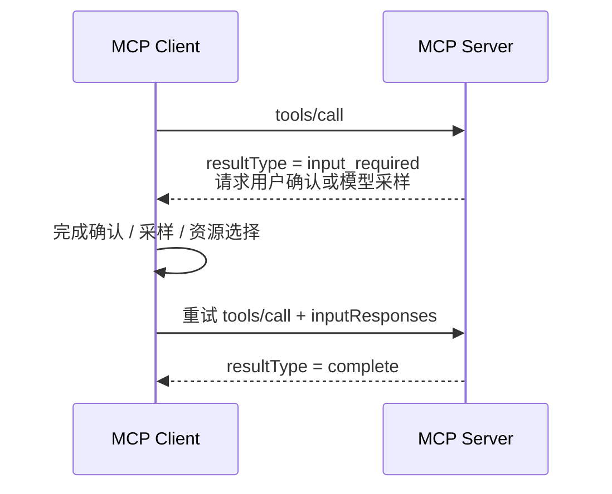

如果只把 MCP 理解成“用 JSON-RPC 暴露 `tools/list` 和 `tools/call`”，`2026-07-28` 看起来像一次字段调整。但从生产架构看，这其实是 MCP 发布以来最重要的一次重构：协议核心不再依赖握手、会话和固定连接，远程 MCP Server 终于能更自然地放到普通 HTTP 基础设施后面。

官方在 2026 年 7 月 28 日发布了稳定版。MCP 版本号使用 `YYYY-MM-DD`，表示最近一次发生不兼容变更的日期；因此这里的准确版本是 `2026-07-28`，不是 `2026-07-08`。版本发布状态可在 [MCP 官方 Release](https://github.com/modelcontextprotocol/modelcontextprotocol/releases/tag/2026-07-28)和[版本机制说明](https://modelcontextprotocol.io/docs/learn/versioning)中核对。

## 先说结论

- 最大变化不是新增某个 Tool 能力，而是 MCP 核心变成了 **stateless、sessionless**：`initialize`、`initialized` 和 `Mcp-Session-Id` 退出新版本。
- 服务器能力发现改由 `server/discover` 完成；协议版本、客户端身份和能力随请求携带，任何实例都可以处理请求。
- Roots、Sampling、Elicitation 等“服务器主动问客户端”的流程，改为 **Multi Round-Trip Requests（MRTR）**：服务器返回 `input_required`，客户端补齐输入后重试原请求。
- 长期任务进入官方 Tasks 扩展；列表结果带缓存语义；Roots、Sampling、Logging 和旧 HTTP+SSE 进入弃用路径。
- 这是有 breaking changes 的新协议时代。迁移不能只改版本字符串，必须同时检查状态保存、通知、重试、鉴权和 SDK 支持。

完整事实清单以 [MCP 2026-07-28 官方 Changelog](https://modelcontextprotocol.io/specification/2026-07-28/changelog)为准。下面重点解释这些变化为什么会影响 Agent 系统设计。

## 为什么先把会话拿掉

在 `2025-11-25` 中，远程客户端通常先调用 `initialize`，服务器返回会话信息，后续请求再携带 `Mcp-Session-Id`。这让同一个客户端的请求需要回到持有该会话的实例，或者要求所有实例共享会话存储。



新版本移除了协议级会话和 `Mcp-Session-Id`。每个请求都是自描述的，负载均衡器可以把它交给任意实例。服务器不再为了 MCP 协议本身维护连接状态，网关也更容易按标准 HTTP 头做路由、限流和可观测性。

但 **sessionless 不等于业务没有状态**。审批流程、分页游标、长任务上下文仍然存在，只是状态要显式化：由服务器签发不可伪造的 handle，再通过普通 Tool 参数或 `requestState` 在后续请求中传回。

```json
{
  "name": "continue_import",
  "arguments": {
    "jobHandle": "job_7F3K...",
    "approved": true
  }
}
```

这会迫使实现者区分两件以前容易混在一起的事：连接状态属于基础设施，任务状态属于应用。后者必须有租户绑定、过期时间、权限校验和重放保护，不能把一段可猜测的 ID 当作授权凭证。

## 请求为什么能交给任意实例

以前在 `initialize` 阶段交换一次的协议版本和能力，现在放进每次请求的 `_meta`：

```json
{
  "jsonrpc": "2.0",
  "id": 42,
  "method": "tools/call",
  "params": {
    "name": "search",
    "arguments": { "query": "MCP" },
    "_meta": {
      "io.modelcontextprotocol/protocolVersion": "2026-07-28",
      "io.modelcontextprotocol/clientInfo": {
        "name": "agent-host",
        "version": "2.4.0"
      },
      "io.modelcontextprotocol/clientCapabilities": {}
    }
  }
}
```

Streamable HTTP 请求还需要标准化的 `MCP-Protocol-Version`、`Mcp-Method` 和必要时的 `Mcp-Name` 头。这样基础设施不解析 JSON body，也能知道当前请求在调用什么。

这带来三个直接收益：

1. 请求可以被普通 round-robin 负载均衡；
2. tracing、审计和限流可以按 MCP method 或 tool name 细分；
3. 单个请求包含完成校验所需的信息，不再依赖“之前在这条连接上发生过什么”。

代价也很明确：身份与能力元数据会重复传输，服务器必须在每次请求上完成版本和 capability 校验。不要为了省事缓存一次校验结果并重新引入隐式会话。

## `server/discover` 替代了什么

`server/discover` 用于查询服务器支持的协议版本、能力和身份。客户端可以先发现再选择版本，也可以在 stdio 场景把它作为新旧协议时代的探针。

```text
Client
  ├─ server/discover 成功
  │    └─ 选择双方支持的最高版本
  └─ MethodNotFound
       └─ 回退到旧版 initialize 流程
```

这意味着一个迁移期客户端通常需要同时理解两种生命周期：

| 协议时代 | 建连入口 | 状态方式 |
|---|---|---|
| `2025-11-25` 及更早 | `initialize` → `initialized` | 可选协议会话 |
| `2026-07-28` | `server/discover` 或随请求协商 | 请求自描述，无协议会话 |

官方 TypeScript SDK v2 的[迁移说明](https://github.com/modelcontextprotocol/typescript-sdk/blob/main/docs/migration/support-2026-07-28.md)特别强调：支持新 schema 不代表默认就发送新版本报文，`2026-07-28` 仍需要显式启用版本协商。升级 SDK 后要抓取一次真实 wire message，不能只看依赖版本号判断迁移完成。

## MRTR 为什么取代服务器主动请求

旧模型允许服务器向客户端发起 `roots/list`、`sampling/createMessage` 或 `elicitation/create`。这在双向持久连接上自然，但放到无状态 HTTP 请求里会制造反向调用、连接归属和恢复问题。

`2026-07-28` 引入 Multi Round-Trip Requests：服务器发现输入不足时，不再主动开一个反向请求，而是在当前响应中返回 `input_required`。客户端执行所需动作，再带着 `inputResponses` 重试原请求。



因此所有结果新增必需的 `resultType`：普通结果为 `complete`，中间结果为 `input_required`。客户端读取旧协议结果时，如果字段不存在，应按 `complete` 处理。

这套模式更适合无状态基础设施，也让“为什么任务暂停”出现在原请求的响应里。但应用必须重新考虑幂等性：第二次发送的是原请求的继续执行，不应把已完成的副作用再做一遍。服务器需要用 `requestState` 或业务幂等键识别执行阶段。

## 通知流被重新划分

新版本移除了用于建立服务器通知通道的 HTTP GET，也移除了 `resources/subscribe` 和 `resources/unsubscribe`。工具、Prompt、资源列表等变更统一通过一个长生命周期的 `subscriptions/listen` POST 响应流订阅。

这里最容易实现错的是把所有通知都塞进该流：

- `toolsListChanged`、`resourcesListChanged` 等跨请求变化走 `subscriptions/listen`；
- `notifications/progress`、`notifications/message` 等属于某个请求的通知，仍走该请求自己的 response stream；
- `notifications/message` 只有在请求 `_meta` 明确给出 log level 时才能发送。

与此同时，SSE 的 `Last-Event-ID` 和消息重投被移除。响应流中断意味着当前 in-flight request 丢失，客户端必须使用新的 request ID 重新发起请求。是否可以安全重试，取决于 Tool 自己的幂等契约，而不是传输层替你保证。

## Tasks 成为扩展，而不是核心不断膨胀

Tasks 从实验性核心能力移动到官方 `io.modelcontextprotocol/tasks` 扩展。新版用 `tasks/get` 轮询状态，以 `tasks/update` 提交客户端输入，不再使用阻塞式 `tasks/result`，也移除了 `tasks/list`。

这个变化背后的方向比 API 名字更重要：MCP 核心只保留普遍互操作所需的最小语义，长任务、MCP Apps 等能力通过 Extensions 演进。客户端和服务器通过 capabilities 的 `extensions` 字段协商，不支持扩展的一方不需要理解它的报文。

对于 Agent 平台，建议把能力拆成三层：

```text
Core MCP
  ├─ Tool / Resource / Prompt 基础互操作
  ├─ 官方扩展：Tasks、MCP Apps
  └─ 私有扩展：组织内部的可选能力
```

私有扩展不能成为基本 Tool 调用的隐形前置条件，否则名义上兼容 MCP，实际上仍只能被自家 Host 使用。

## 缓存终于成为协议语义

`tools/list`、`prompts/list`、`resources/list`、`resources/read` 等结果新增 `ttlMs` 和 `cacheScope`：

- `ttlMs` 告诉客户端结果可以新鲜多久；
- `cacheScope: public` 允许共享缓存，`private` 只允许私有缓存；
- 列表变更通知负责主动失效，TTL 负责通知丢失或未订阅时的兜底。

服务器还应该以确定性顺序返回 tools。顺序稳定不仅方便 diff，也能提高 LLM prompt cache 的命中率。

不要给与用户权限相关的 Tool 列表标记 `public`。缓存键至少应该包含服务器身份、协议版本、租户或授权范围、请求参数和 schema 版本。

## 哪些能力已经不建议新项目采用

`2026-07-28` 建立了正式的 Active、Deprecated、Removed 生命周期和至少 12 个月的弃用窗口。进入 Deprecated 不等于立刻不能用，但新实现不应该再围绕它们设计。

| 已弃用能力 | 新项目优先考虑 |
|---|---|
| Roots | Tool 参数、Resource URI 或服务器配置 |
| Sampling | 直接集成模型提供商 API |
| MCP Logging | stdio 的 `stderr` 或 OpenTelemetry |
| HTTP+SSE transport | Streamable HTTP |
| OAuth Dynamic Client Registration | Client ID Metadata Documents |

这里体现了 MCP 边界的收缩：协议专注“Host 如何调用外部能力”，不再试图规定 Host 内部如何选择模型、管理工作区和记录日志。

## 鉴权和 Schema 还有哪些关键变化

授权响应建议携带 RFC 9207 的 `iss`，客户端必须验证收到的 issuer 与之前记录的一致；持久化 client credentials 时必须按 issuer 隔离，不能把一个 Authorization Server 签发的凭证拿到另一个服务上重用。

Tool 的 `inputSchema`、`outputSchema` 放宽到完整 JSON Schema 2020-12，`structuredContent` 可以是任意 JSON 值。这提升了表达力，也增加了实现责任：需要限制 `$ref` 解析深度、组合关键字规模和 schema 总大小，避免恶意 schema 消耗 CPU 或内存。

## 生产迁移应该怎么拆

不要以“全量切换协议版本”为一个任务。更稳妥的顺序是：

1. **盘点依赖**：列出会话状态、server-initiated request、resource subscription、SSE 恢复、Roots、Sampling、Logging 和动态客户端注册的使用点。
2. **升级但不切流量**：选择明确支持 `2026-07-28` 的 SDK，保留旧协议路径，记录实际协商结果。
3. **状态显式化**：把 session 中的业务状态迁移为有权限边界和过期策略的 handle 或 `requestState`。
4. **实现双时代协商**：新客户端先尝试 `server/discover`，必要时回退 `initialize`；服务端按版本选择 codec 和生命周期。
5. **重写反向调用**：把 sampling、elicitation 等流程改成 MRTR，并给副作用操作增加幂等键。
6. **重做通知和重试**：区分 subscription stream 与 request stream；模拟中途断流，验证新的 request ID 和重复执行保护。
7. **验证基础设施**：取消 sticky session 前，确认没有隐式进程内状态；按 `Mcp-Method`、`Mcp-Name` 建立限流、追踪和审计。
8. **跑兼容性测试**：至少覆盖新 Client/新 Server、新 Client/旧 Server、旧 Client/新 Server 三种组合。

迁移完成的证据不是“服务启动成功”，而是协议协商、实际 wire message、无 sticky session 的多实例请求、断流重试和旧版本降级都通过。

## 我的判断

`2026-07-28` 把 MCP 从“适合桌面 Host 与本地 Server 长连接”的协议，推进成更适合远程、多租户和横向扩展的 Agent 基础设施。最有价值的变化不是减少一个 header，而是把隐式连接状态改成显式请求状态：系统更容易路由、缓存、追踪和恢复，错误边界也更清楚。

代价是迁移复杂度真实存在。正在运行 `2025-11-25` 的系统不需要为了追版本立即重写；但新建远程 MCP 服务时，不应再把 sticky session、server-initiated request 或旧 HTTP+SSE 当作默认架构。先让客户端和服务端具备双版本协商能力，再逐步切换流量，比一次性替换更可靠。

## 官方资料

- [MCP 2026-07-28 Key Changes](https://modelcontextprotocol.io/specification/2026-07-28/changelog)
- [MCP 2026-07-28 Stable Release](https://github.com/modelcontextprotocol/modelcontextprotocol/releases/tag/2026-07-28)
- [MCP Stateless 设计 SEP-2575](https://modelcontextprotocol.io/seps/2575-stateless-mcp)
- [TypeScript SDK：Supporting protocol revision 2026-07-28](https://github.com/modelcontextprotocol/typescript-sdk/blob/main/docs/migration/support-2026-07-28.md)
- [MCP Versioning](https://modelcontextprotocol.io/docs/learn/versioning)
