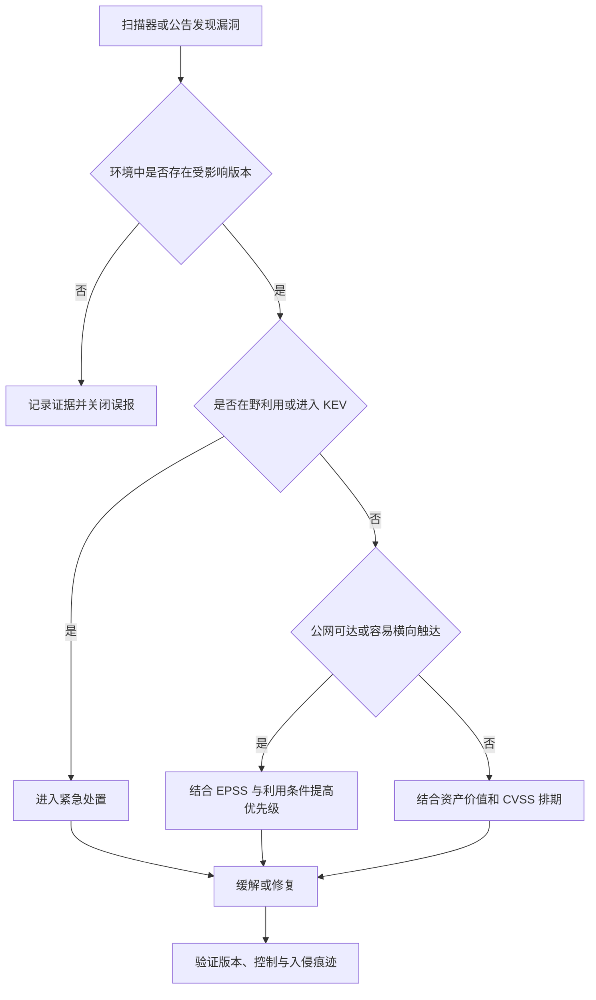

安全扫描报告里最容易制造焦虑的，是一整页红色的 `Critical`。

我见过两种很典型的处理方式：

1. 按 CVSS 从 10.0 往下修；
2. 谁在群里喊得最急，就先修谁。

它们都比完全不处理好，但离真正的风险排序还差一张地图。因为 **CVE 是身份证，CVSS 是严重度，EPSS 是近期观察到利用活动的概率，KEV 是已经在野外出现过的证据**。它们回答的不是同一个问题。

---

## 1. 先看一张表

| 信息 | 回答的问题 | 不代表什么 |
|------|------------|------------|
| CVE | 这是哪一个公开漏洞？ | 不代表严重度，也不代表你一定受影响 |
| CWE | 这属于哪一类弱点？ | 不代表某个具体产品和版本 |
| CVSS | 成功利用后通常有多严重、利用条件如何？ | 不等于你公司的实际风险 |
| EPSS | 未来 30 天观察到在野利用活动的概率有多高？ | 不代表业务影响，也不是完整风险分 |
| CISA KEV | 是否已有可靠证据表明它正被实际利用？ | 不代表所有未入选漏洞都安全 |
| 资产上下文 | 漏洞在我这里能否触达、影响什么？ | 不能被公共数据库替代 |

一句话记忆：

```text
CVE 负责“叫得出名字”，CVSS 负责“理论上有多重”，
EPSS 负责“近期多可能被打”，KEV 负责“已经有人在打”。
```

---

## 2. CVE：漏洞的统一身份证

CVE 的目标很克制：给公开披露的安全漏洞一个统一标识，让厂商公告、扫描器、补丁系统和研究报告能讨论同一件事。

一个典型编号长这样：

```text
CVE-2026-12345
│   │    └── 当年的序列号，不表示严重度
│   └─────── 编号中的年份
└─────────── CVE 前缀
```

根据 [CVE Program 的记录流程](https://www.cve.org/about/Process)，漏洞从发现、报告、申请 ID，到补充受影响产品、版本、描述和公开参考资料后，才形成可用的 CVE Record。

这里有几个容易误解的点：

- 编号中的年份不一定等于漏洞最早出现的年份；
- 序列号越大，不代表漏洞越新或越危险；
- `RESERVED` 表示编号已预留，细节可能还没公开；
- 有 CVE 不等于你的环境受影响，最终仍要核对产品、版本和配置；
- 没有 CVE 也不等于没有风险，内部系统和新披露问题可能尚未获得编号。

CVE 解决的是“大家怎么指向同一个漏洞”，不负责告诉你“今天先修哪个”。

---

## 3. CVSS：严重度，不是企业风险

CVSS（Common Vulnerability Scoring System）用一组标准指标描述漏洞特征，并给出 0 到 10 的分数。

在 CVSS v4.0 中，信息被分成四组：

- **Base**：攻击向量、复杂度、权限、用户交互以及对机密性、完整性、可用性的影响；
- **Threat**：利用成熟度等随时间变化的威胁信息；
- **Environmental**：放到特定组织环境后的调整；
- **Supplemental**：自动化、安全性、恢复难度等补充信息。

平时最常见的是 Base Score。它适合表达漏洞自身的严重特征，却不知道你公司的实际情况。

例如，同一个 9.8 分漏洞：

- 在一台公网暴露、保存客户数据的生产服务器上，可能需要立刻停机处理；
- 在一台已下线、网络隔离、功能未启用的测试机上，优先级会低很多。

所以这句很重要：

> **CVSS 是 severity，不是 risk。**

CVSS 高分应该引起注意，但不能代替资产价值、可达性、补偿控制和真实威胁情报。

---

## 4. EPSS：未来 30 天观察到利用活动的概率

EPSS（Exploit Prediction Scoring System）是 FIRST 维护的数据模型。它每天为已发布的 CVE 估计一个概率：**未来 30 天内观察到针对该漏洞的利用活动的可能性。** 它不判断每次尝试是否成功，也不预测某一家具体企业会不会被攻破。

EPSS 通常给出两个值：

- **probability**：0 到 1 的概率，例如 `0.153` 表示 15.3%；
- **percentile**：它在全部 CVE 中的相对排名。

概率和百分位不能混着读。一个 10% 的概率看起来不高，但在所有漏洞里可能已经处于很靠前的位置。

EPSS 的价值在于回答：

```text
如果修复资源有限，哪些漏洞更可能很快遇到真实攻击？
```

但它不回答：

- 这个漏洞打到你身上会损失多少；
- 你的资产是否暴露；
- 你是否已经有隔离或其他补偿控制；
- 漏洞利用一定会成功。

[FIRST 的 EPSS User Guide](https://www.first.org/epss/user-guide)明确提醒：EPSS 只覆盖风险里的 threat 部分，不应当被当成完整风险分。

---

## 5. KEV：已经被实际利用的强信号

CISA 的 Known Exploited Vulnerabilities Catalog，简称 KEV，收录有可靠证据表明已经在野利用的漏洞。

和预测模型相比，KEV 给的是更直接的事实信号：

```text
不是“可能有人会打”，而是“已经观察到有人在打”。
```

如果一个漏洞同时满足下面几项，通常应该进入最高优先级：

- 位于 KEV；
- 资产面向公网；
- 不需要登录或用户交互；
- 影响核心身份、网关、邮件、远程访问等入口；
- 已有公开利用方式或批量扫描活动；
- 组织内部没有有效的补偿控制。

CISA 也建议组织把 KEV 作为漏洞管理优先级的重要输入。但 KEV 不是完整名单：新攻击可能还没被收录，定向攻击也未必留下足够公开证据。

---

## 6. N-day：公开之后，危险往往才开始扩散

当漏洞已经公开或被厂商掌握，它就进入了常说的 N-day 阶段。这里的 N 表示防守方已经有多少天可以了解和应对它；正式补丁可能已经出现，也可能仍在开发。

很多人潜意识里觉得：

```text
0-day 很危险，N-day 已经有补丁，所以没那么危险。
```

现实经常相反。漏洞公开后，攻击者可以分析补丁差异、复现问题并把利用方式自动化；而大量企业仍然卡在测试、变更窗口、下游依赖和设备重启上。

这就是 patch gap：

```text
补丁可用 ≠ 补丁已部署 ≠ 系统已确认安全
```

0-day 更稀缺，N-day 更容易规模化。对大多数普通团队来说，真正频繁造成事故的，往往是“明明有补丁但一直没装”的已知漏洞。

---

## 7. 真正的修复顺序怎么排

我更推荐把公共评分和自己的资产上下文放到同一条决策链里。



### 第一步：确认“存在”

- 产品和组件是否真的安装；
- 版本是否落在受影响范围；
- 漏洞功能是否启用；
- 扫描器是否把打包但未加载的依赖也算了进去。

这一层能过滤大量误报。

### 第二步：确认“可达”

- 是否直接暴露公网；
- 是否需要先登录；
- 是否需要用户打开文件或点击链接；
- 攻击者是否能从已失陷的普通终端访问它；
- 网关、WAF、网络分段是否真的能拦住路径。

漏洞存在，但攻击路径不通，风险会下降；路径一旦被打开，优先级也要随之变化。

### 第三步：确认“正在被打”

依次检查：

- 厂商公告是否写明 active exploitation；
- 是否进入 CISA KEV；
- EPSS 概率和百分位是否快速上升；
- 内部日志是否已有扫描、探测或利用迹象。

真实利用证据应当优先于预测分数。

### 第四步：确认“打中后会怎样”

- 能否读取客户数据；
- 能否修改交易、发布内容或权限；
- 是否会导致核心业务中断；
- 是否能拿到云凭证、代码仓库或身份系统；
- 是否存在可用备份和快速恢复方案。

同一个漏洞放在官网静态节点和核心身份服务器上，后果完全不同。

### 第五步：选择处置方式

处置不只有“打补丁”一个按钮：

- 升级到修复版本；
- 关闭有问题的功能；
- 将服务撤出公网；
- 增加访问控制或网络隔离；
- 轮换可能泄露的凭证；
- 临时提高检测和审计级别；
- 在无法安全修复时替换或下线产品。

临时缓解要有过期时间，正式修复要有验证证据。

---

## 8. 一个更接近现实的例子

假设扫描器同时报出两个漏洞：

| 条件 | 漏洞 A | 漏洞 B |
|------|--------|--------|
| CVSS | 9.8 | 7.5 |
| 资产 | 隔离测试环境 | 公网 VPN 网关 |
| 功能状态 | 漏洞功能未启用 | 默认启用 |
| KEV | 否 | 是 |
| EPSS | 较低 | 较高 |
| 业务影响 | 可快速重建 | 身份入口和内网通道 |

只按 CVSS，漏洞 A 排在前面；放进真实环境，漏洞 B 显然更急。

这不是说 CVSS 没用，而是公共严重度必须和下面这几个量一起看：

```text
优先级 ≈ 利用证据 × 可达性 × 资产价值 × 影响
```

这不是数学公式，只是一个防止自己被单一分数带跑的检查框架。

---

## 9. 看一份漏洞公告，我会检查什么

可以直接照着这张清单看：

### 身份

- CVE 编号是什么；
- 公告来自厂商、CVE CNA 还是二手转载；
- 记录是 Published、Reserved 还是 Rejected。

### 影响

- 受影响产品和准确版本；
- 需要什么攻击前提；
- 成功后影响机密性、完整性还是可用性；
- 是否会影响后续系统。

### 威胁

- 是否已有在野利用；
- 是否进入 KEV；
- EPSS 概率和百分位；
- 是否已有公开利用方式。

### 自身环境

- 资产是否存在且可达；
- 承载什么数据和业务；
- 当前有哪些补偿控制；
- 是否已经出现异常行为。

### 处置

- 修复版本或 workaround；
- 是否需要重启或停机；
- 回滚方案；
- 修复后的验证方式；
- 是否需要排查既有入侵。

---

## 10. 最后

漏洞管理最危险的习惯，是把一个方便展示的数字当成全部事实。

以后再看到一条漏洞预警，可以按这个顺序问：

```text
它是谁（CVE）？
理论上多严重（CVSS）？
近期多可能被利用（EPSS）？
是否已经有人在打（KEV）？
在我的环境里能不能打到、打中会怎样？
```

前四个答案来自公共情报，最后一个答案只能来自你自己的资产、网络和业务。

### 参考资料

- [CVE Program：CVE Record Lifecycle](https://www.cve.org/about/Process)
- [FIRST：CVSS v4.0 Specification](https://www.first.org/cvss/v4.0/specification-document)
- [FIRST：EPSS Frequently Asked Questions](https://www.first.org/epss/faq)
- [FIRST：EPSS User Guide](https://www.first.org/epss/user-guide)
- [CISA：Known Exploited Vulnerabilities Catalog](https://www.cisa.gov/known-exploited-vulnerabilities-catalog)
