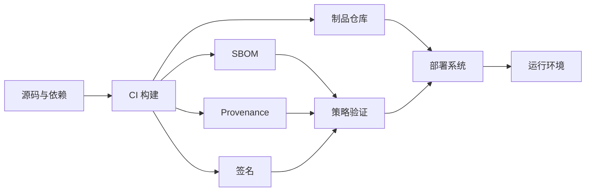

很多团队把供应链安全理解成“CI 里跑一个依赖扫描”。扫描当然需要，但它只能回答某些组件是否命中过已知漏洞，回答不了这个二进制是谁构建的、用了哪份源码、构建过程有没有被替换，以及部署时拿到的是不是原来的制品。

## 先说结论

- SBOM 是成分清单，不是安全结论；它必须和漏洞、可利用性、资产暴露与 VEX 一起使用。
- 构建产物要能追溯到源码、构建器和参数，这正是 Provenance 解决的问题。
- 签名只证明某个身份签过，验证端还要检查身份、仓库、工作流和策略。
- 最有效的发布门禁发生在制品进入环境之前，而不是事故后再查日志。

## 先画完整链路



任何一段都可能被替换：

- 恶意依赖或被接管的包；
- 未固定版本的构建工具；
- CI 凭证泄漏；
- 构建脚本下载未校验文件；
- 仓库中的 tag 被覆盖；
- 部署绕过正式流水线。

## SBOM：先知道制品里有什么

SBOM 至少应包含：

- 组件名称和版本；
- 包管理器或 PURL；
- 直接与间接依赖关系；
- 文件或组件哈希；
- 许可证；
- 生成工具与时间；
- 对应制品身份。

生成后要和制品一起保存。只在开发机导出一份 JSON、没有绑定具体镜像 digest，后续很难证明它描述的是哪个版本。

## 漏洞扫描之后还要判断可达性

一个依赖命中 CVE，不等于应用一定可利用。排序时继续结合：

- 受影响版本范围；
- 代码路径是否可达；
- 运行时是否启用相关功能；
- 资产是否暴露；
- EPSS 与 KEV；
- 是否存在补丁或可行缓解；
- VEX 对“受影响 / 不受影响”的机器可读声明。

“扫描为零”也不代表没有供应链风险，未知漏洞和构建系统被篡改不会自动出现在 CVE 列表里。

## Provenance：证明制品从哪里来

SLSA 把 Provenance 定义为可验证的信息，用来追踪制品在哪里、何时、如何被生产。

一份有效的构建 Provenance 应能关联：

- 源码仓库与不可变 revision；
- 构建工作流身份；
- 构建平台；
- 输入参数和依赖；
- 输出制品 digest；
- 生成时间。

Provenance 应由构建平台生成，而不是让项目脚本自己声明“我很可信”。

## 签名与验证策略

部署端至少验证：

```text
制品 digest 未变化
签名身份属于允许的组织
签名来自允许的仓库与工作流
Provenance 指向批准的源码 revision
构建过程满足最低策略
SBOM 已生成并通过风险门禁
```

不要只验证“存在一个有效签名”。任何拿到其他有效身份的人都可能签出不符合本项目策略的制品。

## 依赖进入仓库之前

- 启用 Lockfile 并在 CI 使用冻结安装；
- 限制新依赖的审批人；
- 检查包名相似攻击和维护者变化；
- 优先依赖活跃、来源明确的项目；
- 私有仓库防止 Dependency Confusion；
- Renovate、Dependabot 等更新 PR 必须经过测试；
- 安装脚本和生命周期脚本按需禁用或隔离。

## CI/CD 最小权限

- PR 构建默认拿不到生产凭证；
- Fork 贡献不能直接运行高权限工作流；
- 使用短期身份代替长期云密钥；
- 构建与发布拆分权限；
- Runner 隔离，不复用被不可信代码污染的工作区；
- Release tag、环境和审批规则受保护；
- 日志自动脱敏。

## 发布门禁

可以从下面的最小策略开始：

1. 制品使用 digest；
2. SBOM 与 Provenance 存在；
3. 签名身份和源码仓库匹配；
4. Critical 漏洞必须有修复、缓解或批准的例外；
5. 已进入 KEV 且资产暴露的漏洞禁止发布；
6. 例外包含负责人、理由和过期时间；
7. 部署系统拒绝未经过正式流水线的制品。

供应链安全不是买一个扫描工具，而是让每个进入生产的制品都能回答三个问题：**里面有什么、从哪里来、为什么允许它运行。**

延伸阅读：

- [SLSA v1.2 Specification](https://slsa.dev/spec/v1.2/)
- [SLSA：Provenance](https://slsa.dev/spec/v1.2/provenance)
